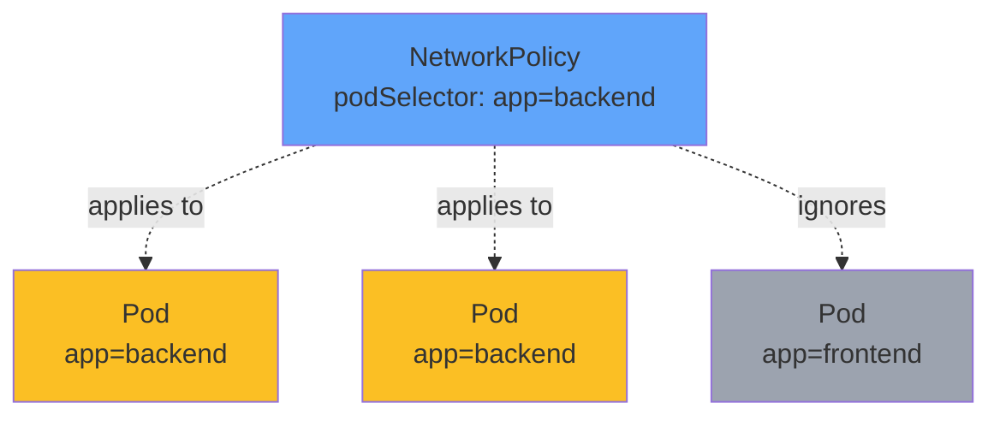

# Pod Selector (Policy Target)

```mermaid
graph TB
    NP[<carbon-network-overlay/> NetworkPolicy<br/>podSelector: app=backend]

    NP -.->|applies to| POD1[<carbon-container-software/> Pod<br/>app=backend]
    NP -.->|applies to| POD2[<carbon-container-software/> Pod<br/>app=backend]
    NP -.->|ignores| POD3[<carbon-container-software/> Pod<br/>app=frontend]

    style NP fill:#60a5fa
    style POD1 fill:#fbbf24
    style POD2 fill:#fbbf24
    style POD3 fill:#9ca3af
```

### `spec.podSelector` chooses which Pods the policy protects

Empty {} = all Pods in namespace

