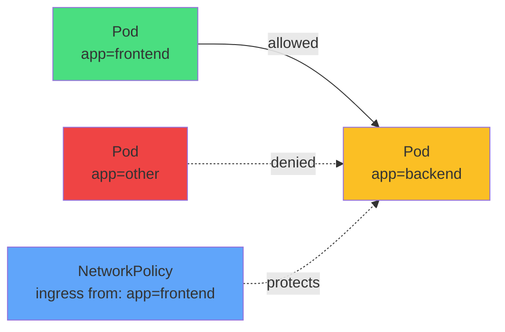

# Ingress Rules (Incoming Traffic)



<div class="mt-8 text-center">

### `spec.ingress` controls who can connect TO the protected Pods

```yaml
ingress:
- from:
  - podSelector:
      matchLabels:
        app: frontend
  ports:
  - port: 8080
    protocol: TCP
```

</div>
