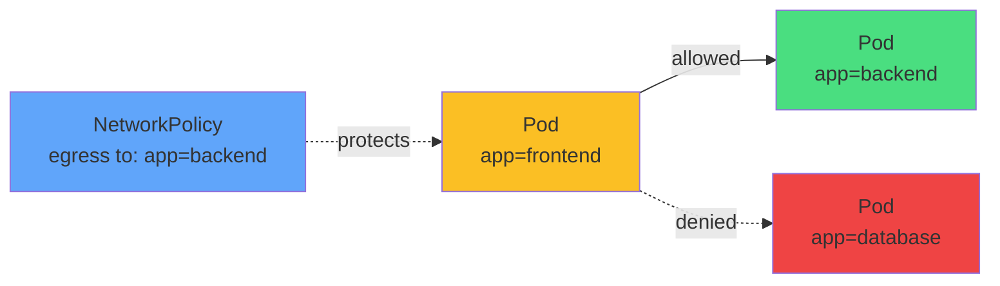

# Egress Rules (Outgoing Traffic)

```mermaid
graph LR
    SOURCE[<carbon-container-software/> Pod<br/>app=frontend] -->|allowed| TARGET1[<carbon-container-software/> Pod<br/>app=backend]
    SOURCE -.->|denied| TARGET2[<carbon-container-software/> Pod<br/>app=database]

    NP[<carbon-network-overlay/> NetworkPolicy<br/>egress to: app=backend]
    NP -.->|protects| SOURCE

    style SOURCE fill:#fbbf24
    style TARGET1 fill:#4ade80
    style TARGET2 fill:#ef4444
    style NP fill:#60a5fa
```

### `spec.egress` controls where protected Pods can connect TO

Don't forget to allow DNS for egress policies!

