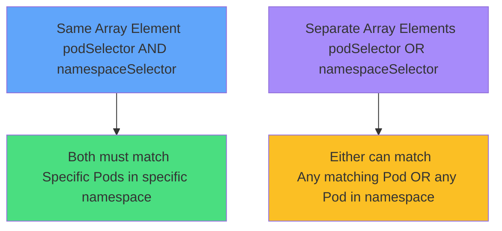

# Selector Combinations

```mermaid
graph TB
    AND[<carbon-network-overlay/> Same Array Element<br/>podSelector AND namespaceSelector]
    OR[<carbon-network-overlay/> Separate Array Elements<br/>podSelector OR namespaceSelector]

    AND --> ANDMATCH[<carbon-checkmark-filled/> Both must match<br/>Specific Pods in specific namespace]
    OR --> ORMATCH[<carbon-checkmark-filled/> Either can match<br/>Any matching Pod OR any Pod in namespace]

    style AND fill:#60a5fa
    style OR fill:#a78bfa
    style ANDMATCH fill:#4ade80
    style ORMATCH fill:#fbbf24
```

### AND: `[{podSelector: {}, namespaceSelector: {}}]`
### OR: `[{podSelector: {}}, {namespaceSelector: {}}]`

