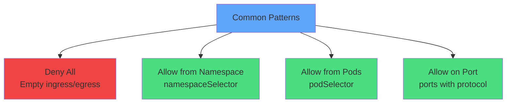

# Common Patterns

```mermaid
graph TB
    PATTERNS[<carbon-network-overlay/> Common Patterns]

    PATTERNS --> DENY[<carbon-close-filled/> Deny All<br/>Empty ingress/egress]
    PATTERNS --> ALLOW_NS[<carbon-checkmark-filled/> Allow from Namespace<br/>namespaceSelector]
    PATTERNS --> ALLOW_POD[<carbon-checkmark-filled/> Allow from Pods<br/>podSelector]
    PATTERNS --> ALLOW_PORT[<carbon-checkmark-filled/> Allow on Port<br/>ports with protocol]

    style PATTERNS fill:#60a5fa
    style DENY fill:#ef4444
    style ALLOW_NS fill:#4ade80
    style ALLOW_POD fill:#4ade80
    style ALLOW_PORT fill:#4ade80
```

Know these patterns for quick implementation

