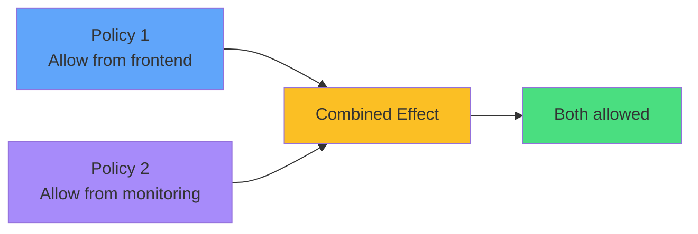

# Policies Are Additive

```mermaid
graph LR
    POLICY1[<carbon-network-overlay/> Policy 1<br/>Allow from frontend] --> COMBINED[<carbon-category-add/> Combined Effect]
    POLICY2[<carbon-network-overlay/> Policy 2<br/>Allow from monitoring] --> COMBINED

    COMBINED --> RESULT[<carbon-checkmark-filled/> Both allowed]

    style POLICY1 fill:#60a5fa
    style POLICY2 fill:#a78bfa
    style COMBINED fill:#fbbf24
    style RESULT fill:#4ade80
```

### Multiple policies targeting same Pods = UNION of all allow rules

Cannot create "deny" rules, only "allow" rules

