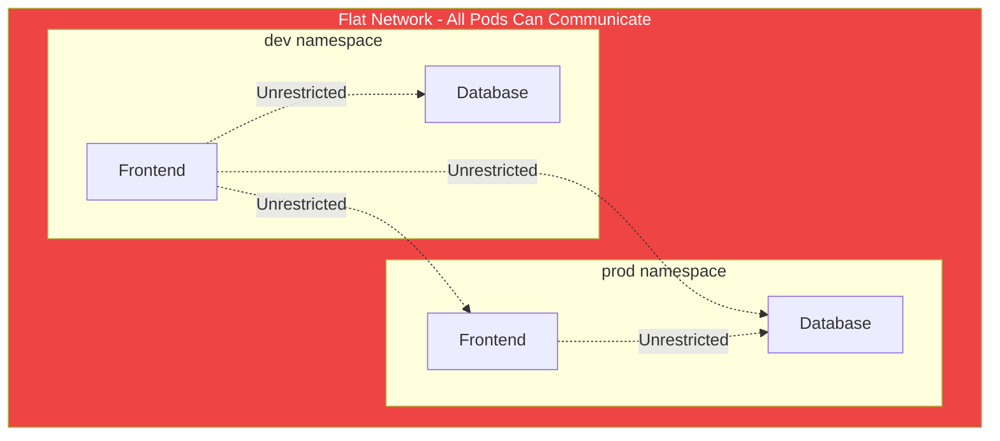
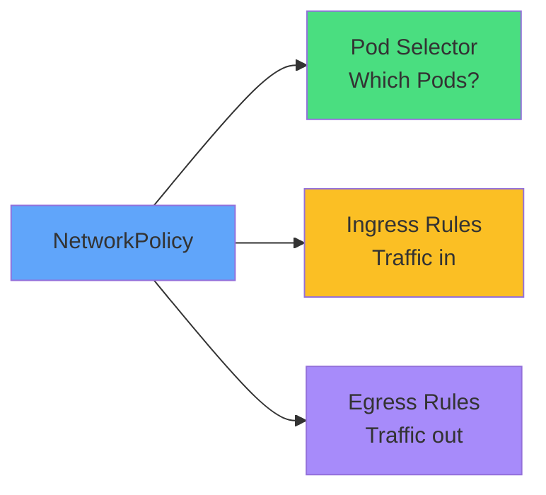
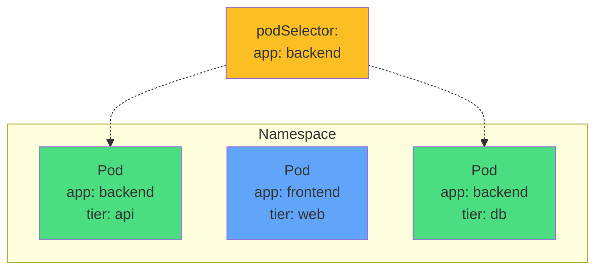
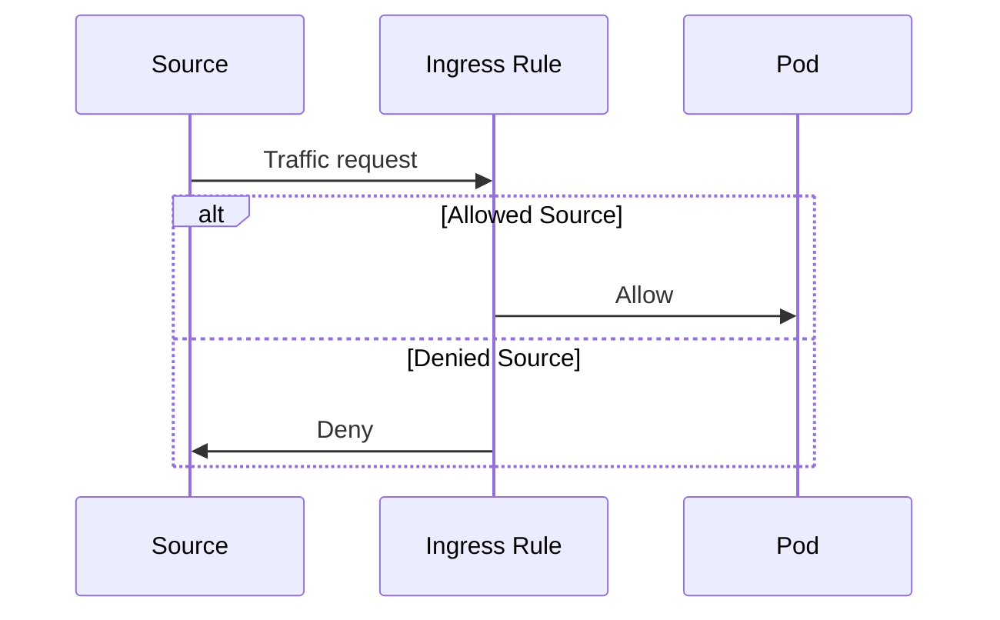
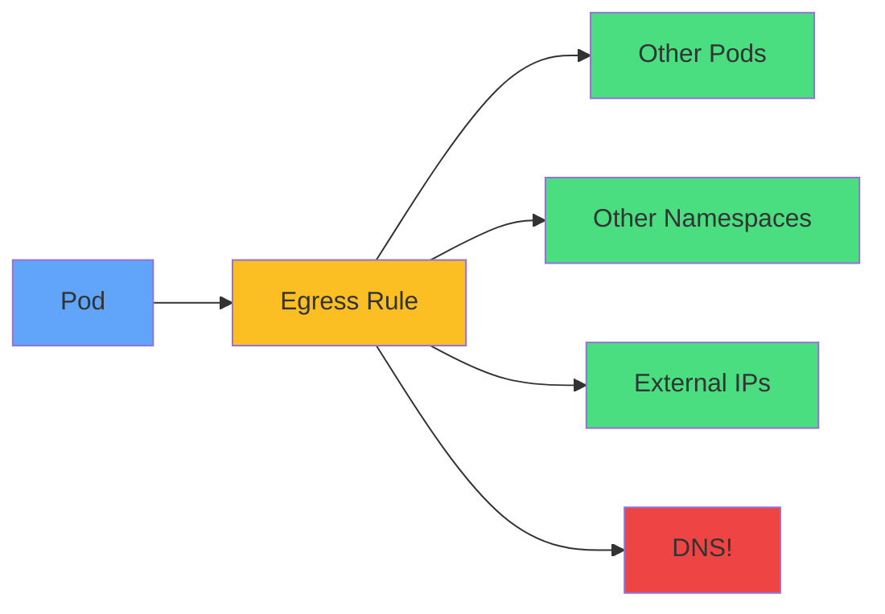
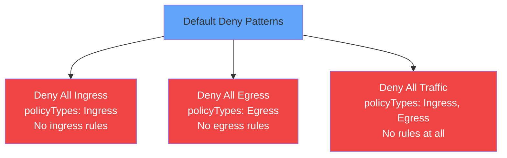
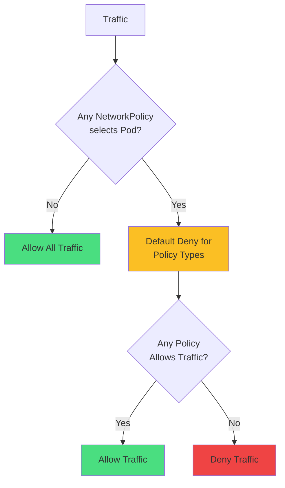
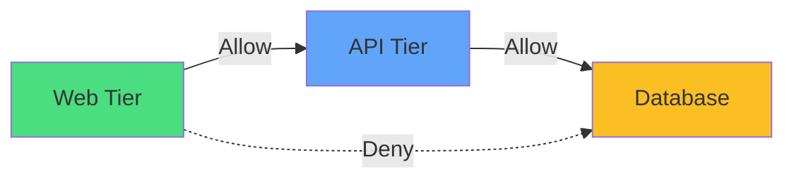
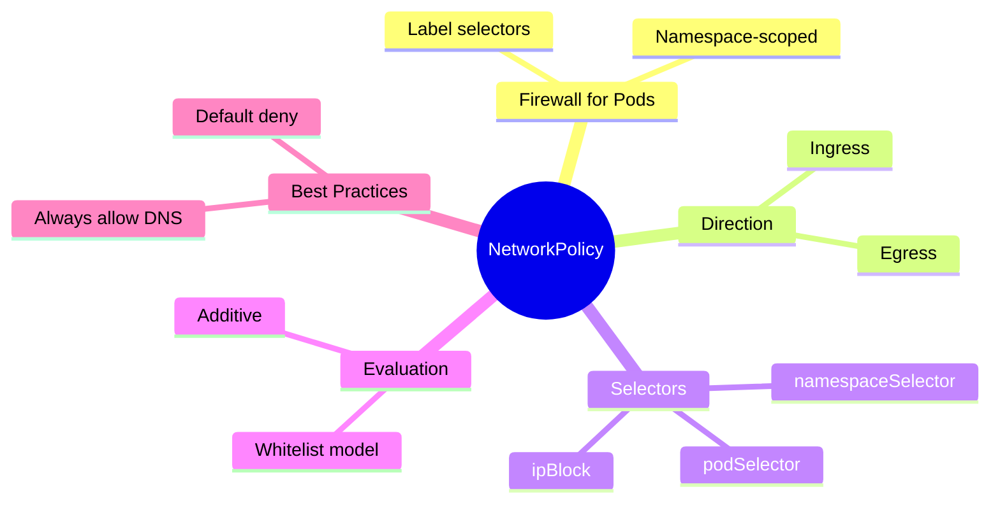

# Network Policy

<div class="abs-br m-6 flex gap-2">
  <carbon-network-3 class="text-6xl text-blue-400" />
</div>

<div v-click class="mt-8 text-xl opacity-80">
Controlling network traffic flow between Pods
</div>

---
layout: center
---

# The Problem - Flat Networking

<div v-click="1">



</div>

<div class="grid grid-cols-2 gap-4 mt-8 text-sm">
<div v-click="2">
<carbon-unlocked class="inline-block text-3xl text-red-400" /> No network segregation
</div>
<div v-click="3">
<carbon-network-3 class="inline-block text-3xl text-red-400" /> No external controls
</div>
<div v-click="4">
<carbon-warning class="inline-block text-3xl text-red-400" /> Cannot isolate workloads
</div>
<div v-click="5">
<carbon-security class="inline-block text-3xl text-red-400" /> No zero-trust
</div>
</div>

<div v-click="6" class="mt-6 text-center text-lg">
<carbon-network-3 class="inline-block text-3xl text-green-400" /> NetworkPolicy provides firewall rules for Pods
</div>

---
layout: center
---

# NetworkPolicy Overview

<div v-click="1">



</div>

<div class="grid grid-cols-2 gap-6 mt-8">
<div v-click="2">
<carbon-tag class="text-4xl text-blue-400 mb-2" />
<strong>Namespace-scoped</strong><br/>
<span class="text-sm opacity-80">Applied within namespace</span>
</div>
<div v-click="3">
<carbon-rule class="text-4xl text-green-400 mb-2" />
<strong>Additive</strong><br/>
<span class="text-sm opacity-80">Multiple policies combine</span>
</div>
</div>

<div class="grid grid-cols-2 gap-6 mt-6">
<div v-click="4">
<carbon-checkmark class="text-4xl text-purple-400 mb-2" />
<strong>Whitelist model</strong><br/>
<span class="text-sm opacity-80">Deny by default, allow explicitly</span>
</div>
<div v-click="5">
<carbon-network-3 class="text-4xl text-yellow-400 mb-2" />
<strong>CNI dependent</strong><br/>
<span class="text-sm opacity-80">Requires supporting plugin</span>
</div>
</div>

---
layout: center
---

# Policy Structure

<div v-click="1" class="mb-4">

```yaml
apiVersion: networking.k8s.io/v1
kind: NetworkPolicy
metadata:
  name: api-policy
spec:
  podSelector:
    matchLabels:
      app: api
  policyTypes:
  - Ingress
  - Egress
  ingress:
  - from: [...]
    ports: [...]
  egress:
  - to: [...]
    ports: [...]
```

</div>

<div class="grid grid-cols-2 gap-4 text-sm">
<div v-click="2">
<carbon-tag class="inline-block text-2xl text-blue-400" /> <strong>podSelector:</strong> Which Pods to apply to
</div>
<div v-click="3">
<carbon-rule class="inline-block text-2xl text-green-400" /> <strong>policyTypes:</strong> Ingress, Egress, or both
</div>
<div v-click="4">
<carbon-arrow-down class="inline-block text-2xl text-yellow-400" /> <strong>ingress:</strong> Incoming traffic rules
</div>
<div v-click="5">
<carbon-arrow-up class="inline-block text-2xl text-purple-400" /> <strong>egress:</strong> Outgoing traffic rules
</div>
</div>

<div v-click="6" class="mt-6 text-center text-sm text-red-400">
<carbon-warning class="inline-block text-2xl" /> Empty rules = deny all for that direction!
</div>

---
layout: center
---

# Pod Selectors

<div v-click="1">



</div>

<div v-click="2" class="mt-8 text-center text-lg">
Select Pods by labels within the namespace
</div>

<div class="grid grid-cols-2 gap-6 mt-6">
<div v-click="3" class="text-center">
<carbon-tag class="text-4xl text-green-400 mb-2" />
<strong>matchLabels</strong><br/>
<span class="text-sm opacity-80">app: backend</span>
</div>
<div v-click="4" class="text-center">
<carbon-rule class="text-4xl text-blue-400 mb-2" />
<strong>Empty {}</strong><br/>
<span class="text-sm opacity-80">All Pods in namespace</span>
</div>
</div>

---
layout: center
---

# Ingress Rules

<div v-click="1">



</div>

<div v-click="2" class="mt-8 text-center text-lg">
Control traffic coming INTO selected Pods
</div>

<div class="grid grid-cols-3 gap-4 mt-6 text-xs">
<div v-click="3" class="text-center">
<carbon-tag class="text-3xl text-green-400 mb-2" />
<strong>podSelector</strong><br/>
From specific Pods<br/>
<span class="opacity-60">Same namespace</span>
</div>
<div v-click="4" class="text-center">
<carbon-partition-auto class="text-3xl text-blue-400 mb-2" />
<strong>namespaceSelector</strong><br/>
From other namespaces<br/>
<span class="opacity-60">Label-based</span>
</div>
<div v-click="5" class="text-center">
<carbon-network-3 class="text-3xl text-purple-400 mb-2" />
<strong>ipBlock</strong><br/>
From IP ranges<br/>
<span class="opacity-60">CIDR notation</span>
</div>
</div>

<div v-click="6" class="mt-6 text-center text-sm">
<carbon-rule class="inline-block text-2xl text-yellow-400" /> Combine sources: OR (separate items) | AND (same item)
</div>

---
layout: center
---

# Egress Rules

<div v-click="1">



</div>

<div v-click="2" class="mt-8 text-center text-lg">
Control traffic LEAVING selected Pods
</div>

<div class="grid grid-cols-3 gap-4 mt-6 text-xs">
<div v-click="3">
<carbon-tag class="inline-block text-2xl text-green-400" /> podSelector
</div>
<div v-click="4">
<carbon-partition-auto class="inline-block text-2xl text-blue-400" /> namespaceSelector
</div>
<div v-click="5">
<carbon-network-3 class="inline-block text-2xl text-purple-400" /> ipBlock
</div>
</div>

<div v-click="6" class="mt-8 text-center text-2xl text-red-400">
<carbon-warning class="inline-block text-3xl" /> CRITICAL
</div>

<div v-click="7" class="text-center text-lg mt-4">
Must explicitly allow DNS (UDP port 53 to kube-system)!
</div>

---
layout: center
---

# Default Deny Policies

<div v-click="1">



</div>

<div v-click="2" class="mt-8 text-center text-lg">
Best practice: deny all, then explicitly allow
</div>

<div class="grid grid-cols-3 gap-4 mt-6 text-sm">
<div v-click="3" class="text-center">
<carbon-arrow-down class="text-4xl text-red-400 mb-2" />
<strong>Deny ingress</strong><br/>
Block incoming
</div>
<div v-click="4" class="text-center">
<carbon-arrow-up class="text-4xl text-red-400 mb-2" />
<strong>Deny egress</strong><br/>
Block outgoing
</div>
<div v-click="5" class="text-center">
<carbon-close class="text-4xl text-red-400 mb-2" />
<strong>Deny all</strong><br/>
Complete isolation
</div>
</div>

<div v-click="6" class="mt-6 text-center text-sm opacity-80">
Layer additional policies to selectively allow traffic
</div>

---
layout: center
---

# Policy Evaluation

<div v-click="1">



</div>

<div v-click="2" class="mt-8 text-center text-lg">
Policies are additive - combine to allow traffic
</div>

<div class="grid grid-cols-2 gap-6 mt-6 text-sm">
<div v-click="3">
<carbon-checkmark class="text-3xl text-green-400 mb-2" />
<strong>Any policy allows = traffic flows</strong>
</div>
<div v-click="4">
<carbon-close class="text-3xl text-red-400 mb-2" />
<strong>No explicit deny possible</strong>
</div>
</div>

<div v-click="5" class="mt-6 text-center text-sm opacity-80">
Like RBAC: whitelist approach, enumerate allowed paths
</div>

---
layout: center
---

# Common Patterns

<div v-click="1">



</div>

<div class="grid grid-cols-2 gap-6 mt-8">
<div v-click="2">
<carbon-layers class="text-4xl text-blue-400 mb-2" />
<strong>Three-tier security</strong><br/>
<span class="text-sm opacity-80">Web → API → Database only</span>
</div>
<div v-click="3">
<carbon-partition-auto class="text-4xl text-green-400 mb-2" />
<strong>Namespace isolation</strong><br/>
<span class="text-sm opacity-80">Traffic within namespace only</span>
</div>
<div v-click="4">
<carbon-network-3 class="text-4xl text-purple-400 mb-2" />
<strong>External API access</strong><br/>
<span class="text-sm opacity-80">Egress to specific IPs only</span>
</div>
<div v-click="5">
<carbon-unlocked class="text-4xl text-yellow-400 mb-2" />
<strong>Public services</strong><br/>
<span class="text-sm opacity-80">Allow ingress, restrict egress</span>
</div>
</div>

---
layout: center
---

# Best Practices

<div class="grid grid-cols-2 gap-6 mt-4">
<div v-click="1">
<carbon-rule class="text-4xl text-red-400 mb-2" />
<strong>Start with default deny</strong><br/>
<span class="text-sm opacity-80">Block all, then allow</span>
</div>
<div v-click="2">
<carbon-network-3 class="text-4xl text-blue-400 mb-2" />
<strong>Always include DNS</strong><br/>
<span class="text-sm opacity-80">UDP 53 to kube-system</span>
</div>
<div v-click="3">
<carbon-tag class="text-4xl text-green-400 mb-2" />
<strong>Use namespace labels</strong><br/>
<span class="text-sm opacity-80">For cross-namespace rules</span>
</div>
<div v-click="4">
<carbon-document class="text-4xl text-purple-400 mb-2" />
<strong>Document topology</strong><br/>
<span class="text-sm opacity-80">Alongside your policies</span>
</div>
<div v-click="5">
<carbon-network-3 class="text-4xl text-yellow-400 mb-2" />
<strong>Test connectivity</strong><br/>
<span class="text-sm opacity-80">After applying policies</span>
</div>
<div v-click="6">
<carbon-text-font class="text-4xl text-orange-400 mb-2" />
<strong>Descriptive names</strong><br/>
<span class="text-sm opacity-80">Indicate purpose clearly</span>
</div>
</div>

---
layout: center
---

# Summary

<div v-click="1">



</div>

---
layout: center
---

# Key Takeaways

<div class="grid grid-cols-2 gap-6 mt-6">
<div v-click="1">
<carbon-network-3 class="text-4xl text-blue-400 mb-2" />
<strong>Pod-level firewall</strong><br/>
<span class="text-sm opacity-80">Control ingress and egress traffic</span>
</div>
<div v-click="2">
<carbon-rule class="text-4xl text-green-400 mb-2" />
<strong>Additive policies</strong><br/>
<span class="text-sm opacity-80">Multiple policies combine to allow</span>
</div>
<div v-click="3">
<carbon-tag class="text-4xl text-purple-400 mb-2" />
<strong>Label-based selection</strong><br/>
<span class="text-sm opacity-80">Pods, namespaces, IP blocks</span>
</div>
<div v-click="4">
<carbon-warning class="text-4xl text-red-400 mb-2" />
<strong>Don't forget DNS!</strong><br/>
<span class="text-sm opacity-80">Egress requires explicit DNS allow</span>
</div>
</div>

<div v-click="5" class="mt-8 text-center text-lg">
<carbon-education class="inline-block text-3xl text-blue-400" /> CKAD supplementary - practice writing YAML!
</div>
