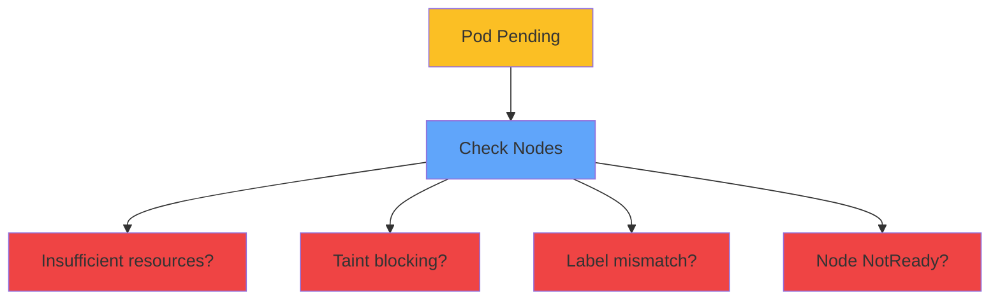

# Node Troubleshooting Focus

```mermaid
graph TB
    POD[<carbon-time/> Pod Pending] --> CHECK[<carbon-search/> Check Nodes]

    CHECK --> CAPACITY[<carbon-chart-area/> Insufficient resources?]
    CHECK --> TAINT[<carbon-warning-alt/> Taint blocking?]
    CHECK --> SELECTOR[<carbon-tag/> Label mismatch?]
    CHECK --> STATUS[<carbon-status/> Node NotReady?]

    style POD fill:#fbbf24
    style CHECK fill:#60a5fa
    style CAPACITY fill:#ef4444
    style TAINT fill:#ef4444
    style SELECTOR fill:#ef4444
    style STATUS fill:#ef4444
```

Node operations appear in troubleshooting scenarios

