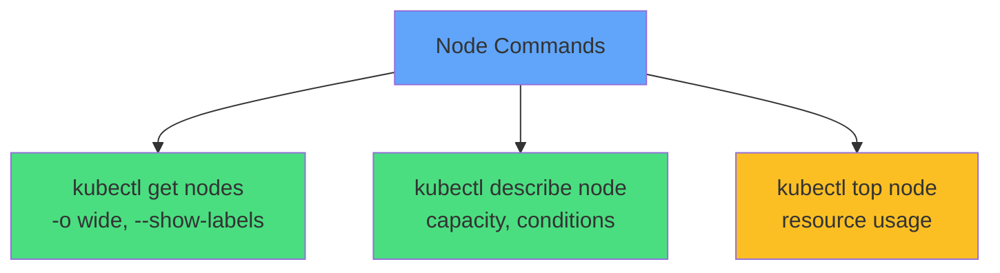

# Essential Node Commands

```mermaid
graph TB
    CMDS[<carbon-terminal/> Node Commands]

    CMDS --> GET[kubectl get nodes<br/>-o wide, --show-labels]
    CMDS --> DESCRIBE[kubectl describe node<br/>capacity, conditions]
    CMDS --> TOP[kubectl top node<br/>resource usage]

    style CMDS fill:#60a5fa
    style GET fill:#4ade80
    style DESCRIBE fill:#4ade80
    style TOP fill:#fbbf24
```

### Get nodes: Status, roles, age
### Describe: Detailed capacity and conditions
### Top: Current resource usage (requires metrics-server)

