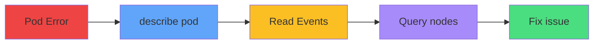

# Troubleshooting Workflow

```mermaid
graph LR
    ERROR[<carbon-warning-alt/> Pod Error] --> DESC[<carbon-search/> describe pod] --> READ[<carbon-view/> Read Events] --> NODE[<carbon-terminal/> Query nodes] --> FIX[<carbon-edit/> Fix issue]

    style ERROR fill:#ef4444
    style DESC fill:#60a5fa
    style READ fill:#fbbf24
    style NODE fill:#a78bfa
    style FIX fill:#4ade80
```

### Systematic approach saves time

1. Check Pod events for error message
2. Query nodes based on error type
3. Fix configuration or node state
4. Verify Pod schedules

