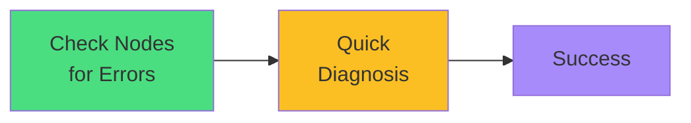

# Exam Mindset

<carbon-lightbulb class="text-yellow-400 text-4xl inline-block" />

### Node commands for troubleshooting, not administration
### Check nodes when Pods won't schedule
### describe node shows capacity and conditions
### Follow systematic workflow: Pod → Node → Fix

