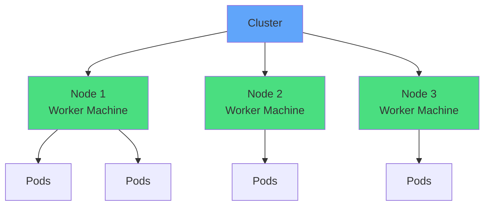
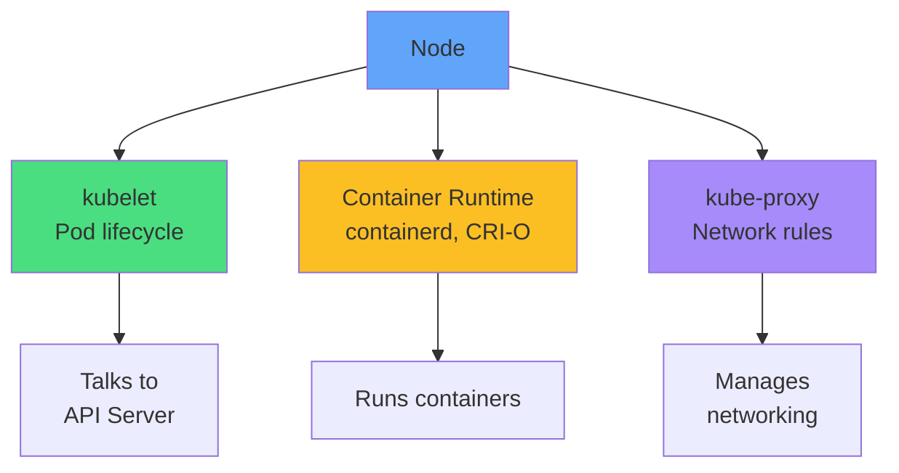
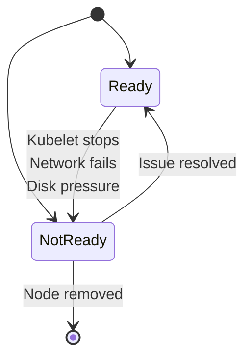
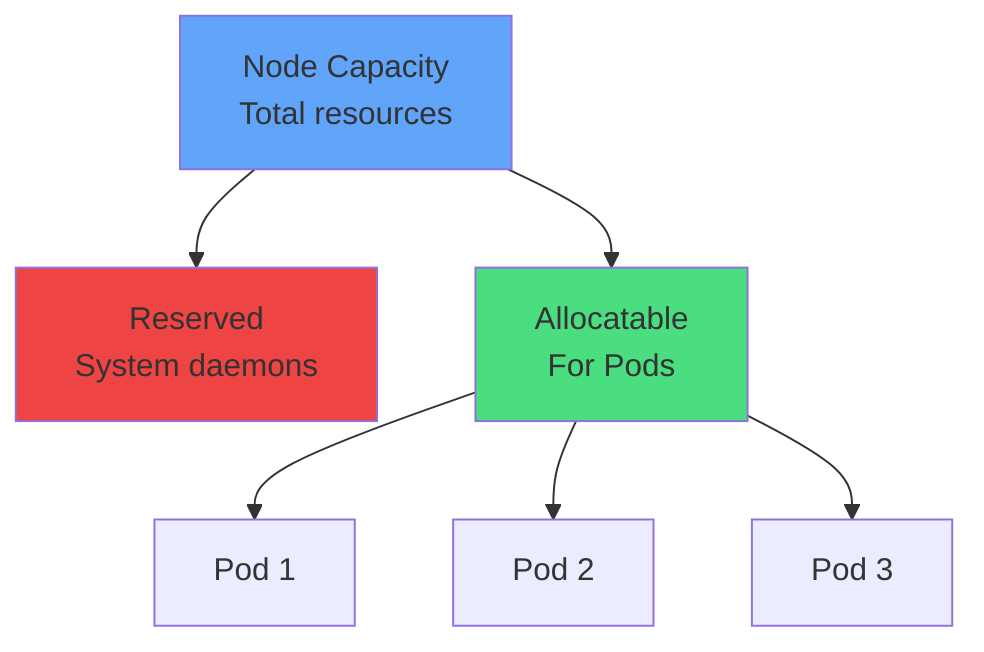
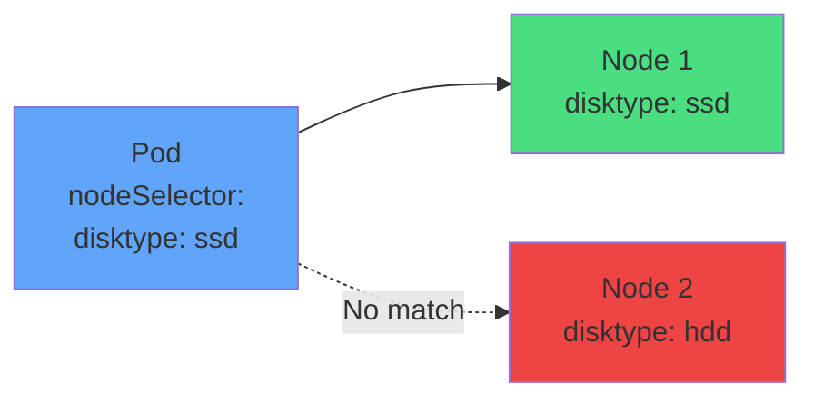
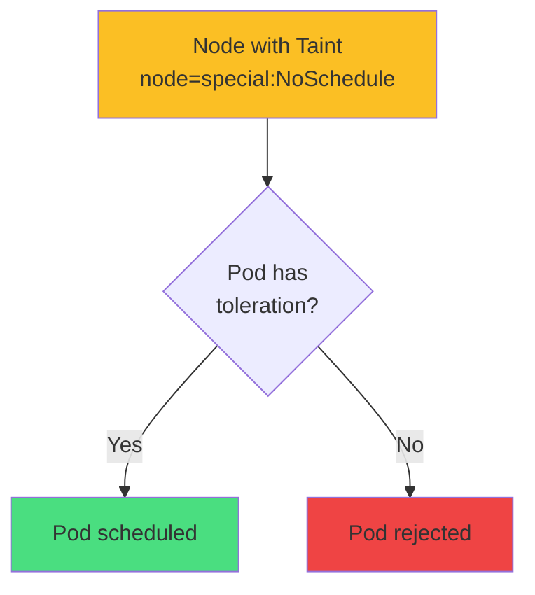
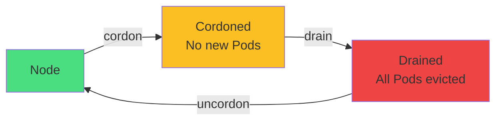
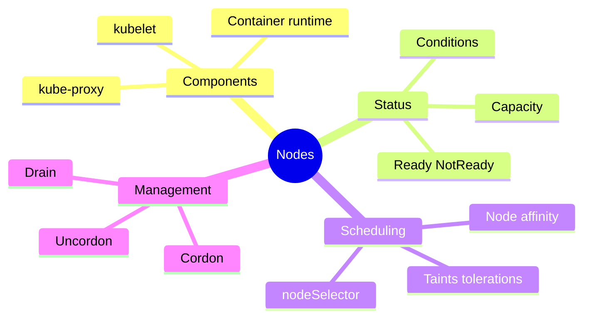

# Understanding Nodes

<div class="abs-br m-6 flex gap-2">
  <carbon-server class="text-6xl text-blue-400" />
</div>

<div v-click class="mt-8 text-xl opacity-80">
The worker machines that run your containers
</div>

---
layout: center
---

# What is a Node?

<div v-click="1">



</div>

<div v-click="2" class="mt-8 text-center text-lg">
Physical or virtual machines that run containerized workloads
</div>

<div class="grid grid-cols-2 gap-6 mt-6 text-sm">
<div v-click="3">
<carbon-server class="text-4xl text-blue-400 mb-2" />
<strong>Worker nodes</strong><br/>
Run application Pods
</div>
<div v-click="4">
<carbon-cloud-services class="text-4xl text-purple-400 mb-2" />
<strong>Control plane</strong><br/>
Manages the cluster
</div>
</div>

<div v-click="5" class="mt-6 text-center text-sm opacity-80">
Nodes are the compute resources of your cluster
</div>

---
layout: center
---

# Node Components

<div v-click="1">



</div>

<div class="grid grid-cols-3 gap-4 mt-8 text-sm">
<div v-click="2">
<carbon-application class="text-3xl text-green-400 mb-2" />
<strong>kubelet</strong><br/>
Manages Pods
</div>
<div v-click="3">
<carbon-container-software class="text-3xl text-yellow-400 mb-2" />
<strong>Container runtime</strong><br/>
Runs containers
</div>
<div v-click="4">
<carbon-network-3 class="text-3xl text-purple-400 mb-2" />
<strong>kube-proxy</strong><br/>
Network routing
</div>
</div>

---
layout: center
---

# Node Status

<div v-click="1" class="text-sm">

```bash
kubectl get nodes
# Shows: Ready or NotReady
```

</div>

<div v-click="2">



</div>

<div class="grid grid-cols-2 gap-6 mt-8 text-sm">
<div v-click="3">
<carbon-checkmark class="text-4xl text-green-400 mb-2" />
<strong>Ready</strong><br/>
Accepting workloads
</div>
<div v-click="4">
<carbon-close class="text-4xl text-red-400 mb-2" />
<strong>NotReady</strong><br/>
Cannot run Pods
</div>
</div>

---
layout: center
---

# Node Conditions

<div v-click="1" class="text-sm mb-4">

```bash
kubectl describe node <node-name>
```

</div>

<div class="text-xs">

| Condition | Meaning |
|-----------|---------|
| <span v-click="2">Ready</span> | <span v-click="2">Node is healthy and ready for Pods</span> |
| <span v-click="3">DiskPressure</span> | <span v-click="3">Disk capacity low</span> |
| <span v-click="4">MemoryPressure</span> | <span v-click="4">Memory capacity low</span> |
| <span v-click="5">PIDPressure</span> | <span v-click="5">Too many processes</span> |
| <span v-click="6">NetworkUnavailable</span> | <span v-click="6">Network not configured</span> |

</div>

<div v-click="7" class="mt-8 text-center text-sm">
<carbon-information class="inline-block text-2xl text-blue-400" /> Conditions provide health insights
</div>

---
layout: center
---

# Node Capacity and Allocatable

<div v-click="1">



</div>

<div class="grid grid-cols-2 gap-6 mt-8 text-sm">
<div v-click="2">
<carbon-server class="text-4xl text-blue-400 mb-2" />
<strong>Capacity</strong><br/>
Total node resources
</div>
<div v-click="3">
<carbon-application class="text-4xl text-green-400 mb-2" />
<strong>Allocatable</strong><br/>
Available for Pods
</div>
</div>

<div v-click="4" class="mt-6 text-center text-sm opacity-80">
Allocatable = Capacity - Reserved for system
</div>

---
layout: center
---

# Node Selectors

<div v-click="1">

```yaml
apiVersion: v1
kind: Pod
spec:
  nodeSelector:
    disktype: ssd
    gpu: "true"
  containers:
  - name: app
    image: myapp
```

</div>

<div v-click="2" class="mt-8 text-center text-lg">
Schedule Pods to specific nodes using labels
</div>

<div v-click="3" class="mt-6">



</div>

<div v-click="4" class="mt-6 text-center text-sm opacity-80">
Simple key-value label matching
</div>

---
layout: center
---

# Node Affinity

<div v-click="1" class="text-xs">

```yaml
spec:
  affinity:
    nodeAffinity:
      requiredDuringSchedulingIgnoredDuringExecution:
        nodeSelectorTerms:
        - matchExpressions:
          - key: kubernetes.io/arch
            operator: In
            values:
            - amd64
            - arm64
```

</div>

<div v-click="2" class="mt-8 text-center text-lg">
More expressive than nodeSelector
</div>

<div class="grid grid-cols-2 gap-6 mt-6 text-sm">
<div v-click="3">
<carbon-rule class="text-4xl text-red-400 mb-2" />
<strong>Required</strong><br/>
Must match
</div>
<div v-click="4">
<carbon-information class="text-4xl text-blue-400 mb-2" />
<strong>Preferred</strong><br/>
Try to match
</div>
</div>

<div v-click="5" class="mt-6 text-center text-xs">
Operators: In, NotIn, Exists, DoesNotExist, Gt, Lt
</div>

---
layout: center
---

# Taints and Tolerations

<div v-click="1">



</div>

<div v-click="2" class="mt-8 text-center text-lg">
Nodes repel Pods unless Pods tolerate the taint
</div>

<div class="grid grid-cols-2 gap-6 mt-6 text-sm">
<div v-click="3">
<carbon-warning class="text-4xl text-yellow-400 mb-2" />
<strong>Taint</strong><br/>
Applied to node
</div>
<div v-click="4">
<carbon-checkmark class="text-4xl text-green-400 mb-2" />
<strong>Toleration</strong><br/>
Added to Pod
</div>
</div>

---
layout: center
---

# Taint Effects

<div class="grid grid-cols-3 gap-6 mt-6">
<div v-click="1">
<carbon-close class="text-4xl text-red-400 mb-2" />
<strong>NoSchedule</strong><br/>
<span class="text-sm opacity-80">Don't schedule new Pods</span>
</div>
<div v-click="2">
<carbon-warning class="text-4xl text-yellow-400 mb-2" />
<strong>PreferNoSchedule</strong><br/>
<span class="text-sm opacity-80">Try not to schedule</span>
</div>
<div v-click="3">
<carbon-delete class="text-4xl text-purple-400 mb-2" />
<strong>NoExecute</strong><br/>
<span class="text-sm opacity-80">Evict existing Pods</span>
</div>
</div>

<div v-click="4" class="mt-8">

```bash
# Add taint
kubectl taint nodes node1 key=value:NoSchedule

# Remove taint
kubectl taint nodes node1 key=value:NoSchedule-
```

</div>

<div v-click="5" class="mt-6 text-center text-sm">
<carbon-information class="inline-block text-2xl text-blue-400" /> NoExecute evicts Pods without matching toleration
</div>

---
layout: center
---

# Cordon and Drain

<div v-click="1">



</div>

<div v-click="2" class="mt-8">

```bash
# Mark node as unschedulable
kubectl cordon <node-name>

# Evict all Pods and mark unschedulable
kubectl drain <node-name> --ignore-daemonsets

# Mark node as schedulable again
kubectl uncordon <node-name>
```

</div>

<div v-click="3" class="mt-6 text-center text-sm">
<carbon-tools class="inline-block text-2xl text-yellow-400" /> Used for maintenance
</div>

---
layout: center
---

# Node Management Best Practices

<div class="grid grid-cols-2 gap-6 mt-6">
<div v-click="1">
<carbon-tag class="text-4xl text-blue-400 mb-2" />
<strong>Label nodes</strong><br/>
<span class="text-sm opacity-80">For scheduling and organization</span>
</div>
<div v-click="2">
<carbon-chart-line class="text-4xl text-green-400 mb-2" />
<strong>Monitor capacity</strong><br/>
<span class="text-sm opacity-80">Watch resource usage</span>
</div>
<div v-click="3">
<carbon-warning class="text-4xl text-yellow-400 mb-2" />
<strong>Use taints wisely</strong><br/>
<span class="text-sm opacity-80">Dedicated nodes for special workloads</span>
</div>
<div v-click="4">
<carbon-tools class="text-4xl text-purple-400 mb-2" />
<strong>Drain before maintenance</strong><br/>
<span class="text-sm opacity-80">Graceful Pod eviction</span>
</div>
</div>

---
layout: center
---

# Summary

<div v-click="1">



</div>

---
layout: center
---

# Key Takeaways

<div class="grid grid-cols-2 gap-6 mt-6">
<div v-click="1">
<carbon-server class="text-4xl text-blue-400 mb-2" />
<strong>Nodes are workers</strong><br/>
<span class="text-sm opacity-80">Run your containerized workloads</span>
</div>
<div v-click="2">
<carbon-tag class="text-4xl text-green-400 mb-2" />
<strong>Use labels</strong><br/>
<span class="text-sm opacity-80">For flexible scheduling</span>
</div>
<div v-click="3">
<carbon-warning class="text-4xl text-purple-400 mb-2" />
<strong>Taints control placement</strong><br/>
<span class="text-sm opacity-80">Dedicated or restricted nodes</span>
</div>
<div v-click="4">
<carbon-tools class="text-4xl text-yellow-400 mb-2" />
<strong>Drain for maintenance</strong><br/>
<span class="text-sm opacity-80">Graceful workload migration</span>
</div>
</div>

<div v-click="5" class="mt-8 text-center text-lg">
<carbon-information class="inline-block text-3xl text-blue-400" /> Understand node management for CKAD!
</div>
