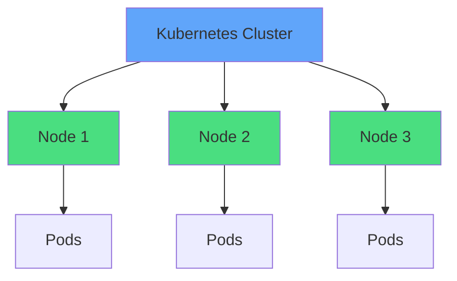
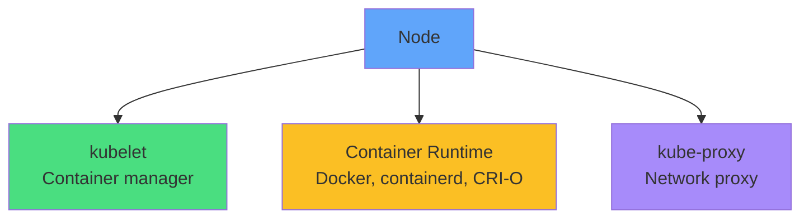
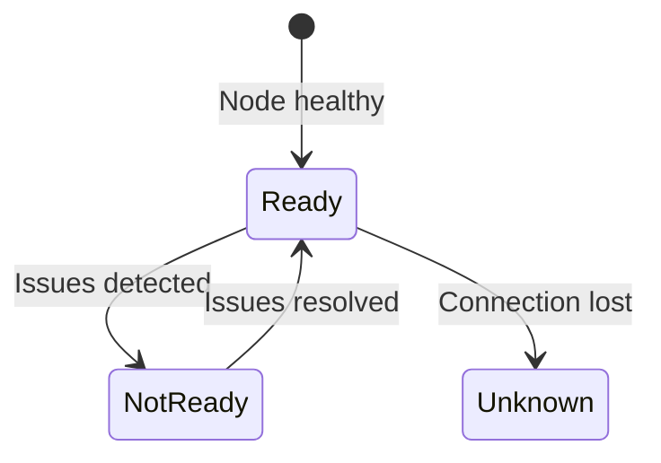
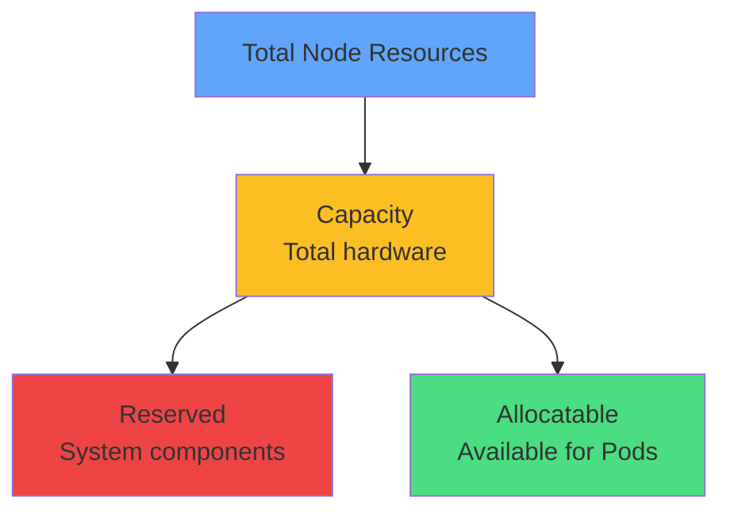
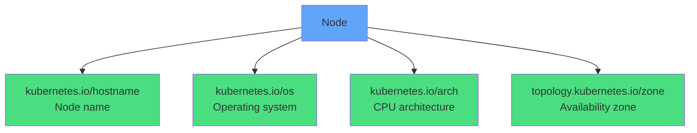
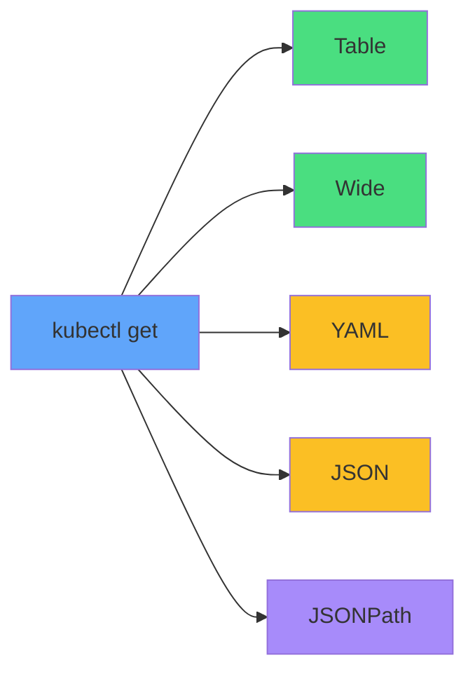
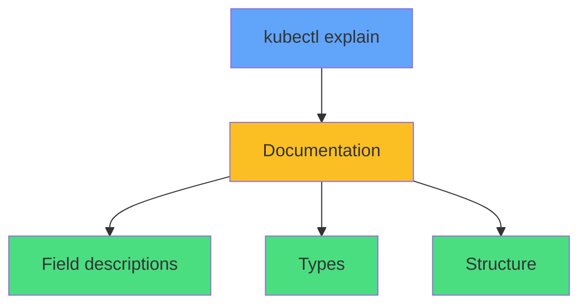
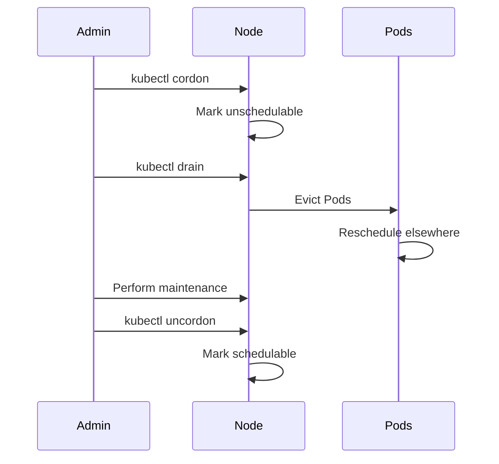
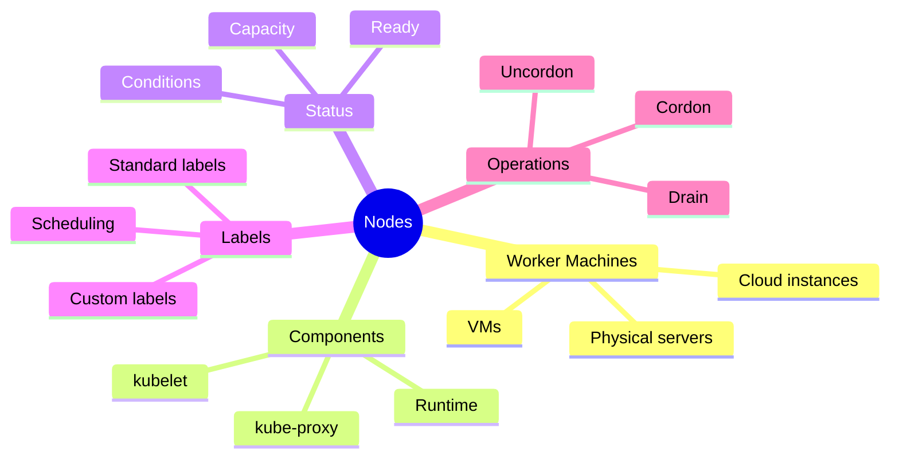

# Examining Nodes

<div class="abs-br m-6 flex gap-2">
  <carbon-kubernetes class="text-6xl text-blue-400" />
</div>

<div v-click class="mt-8 text-xl opacity-80">
Understanding the machines that run your containers
</div>

---
layout: center
---

# What Are Nodes?

<div v-click="1">



</div>

<div v-click="2" class="mt-8 text-center text-lg">
Worker machines that run containers
</div>

<div class="grid grid-cols-3 gap-4 mt-6 text-sm">
<div v-click="3" class="text-center">
<carbon-container-software class="text-4xl text-green-400 mb-2" />
<strong>Physical servers</strong>
</div>
<div v-click="4" class="text-center">
<carbon-virtual-machine class="text-4xl text-blue-400 mb-2" />
<strong>Virtual machines</strong>
</div>
<div v-click="5" class="text-center">
<carbon-cloud class="text-4xl text-purple-400 mb-2" />
<strong>Cloud instances</strong>
</div>
</div>

---
layout: center
---

# Node Components

<div v-click="1">



</div>

<div class="grid grid-cols-3 gap-6 mt-8 text-sm">
<div v-click="2" class="text-center">
<carbon-settings class="text-4xl text-green-400 mb-2" />
<strong>kubelet</strong><br/>
Manages containers
</div>
<div v-click="3" class="text-center">
<carbon-container-software class="text-4xl text-yellow-400 mb-2" />
<strong>Runtime</strong><br/>
Runs containers
</div>
<div v-click="4" class="text-center">
<carbon-network-3 class="text-4xl text-purple-400 mb-2" />
<strong>kube-proxy</strong><br/>
Network routing
</div>
</div>

<div v-click="5" class="mt-8 text-center text-sm opacity-80">
Kubernetes stores node information queryable via kubectl
</div>

---
layout: center
---

# Basic Node Commands

<div v-click="1" class="mb-6">

```bash
kubectl get nodes
kubectl get nodes -o wide
kubectl describe nodes
kubectl describe node <name>
```

</div>

<div class="grid grid-cols-2 gap-6 mt-8">
<div v-click="2">
<carbon-list class="text-4xl text-blue-400 mb-2" />
<strong>get nodes</strong><br/>
<span class="text-sm opacity-80">List all nodes with status</span>
</div>
<div v-click="3">
<carbon-view class="text-4xl text-green-400 mb-2" />
<strong>get nodes -o wide</strong><br/>
<span class="text-sm opacity-80">Extended information</span>
</div>
<div v-click="4">
<carbon-document class="text-4xl text-purple-400 mb-2" />
<strong>describe nodes</strong><br/>
<span class="text-sm opacity-80">Detailed info for all</span>
</div>
<div v-click="5">
<carbon-view class="text-4xl text-yellow-400 mb-2" />
<strong>describe node</strong><br/>
<span class="text-sm opacity-80">Details for specific node</span>
</div>
</div>

---
layout: center
---

# Node Status & Conditions

<div v-click="1">



</div>

<div class="grid grid-cols-2 gap-4 mt-8 text-sm">
<div v-click="2">
<carbon-checkmark class="inline-block text-3xl text-green-400" /> <strong>Ready:</strong> Healthy, can accept Pods
</div>
<div v-click="3">
<carbon-dashboard class="inline-block text-3xl text-yellow-400" /> <strong>MemoryPressure:</strong> Low on memory
</div>
<div v-click="4">
<carbon-data-volume class="inline-block text-3xl text-yellow-400" /> <strong>DiskPressure:</strong> Low on disk space
</div>
<div v-click="5">
<carbon-activity class="inline-block text-3xl text-yellow-400" /> <strong>PIDPressure:</strong> Too many processes
</div>
<div v-click="6">
<carbon-network-3 class="inline-block text-3xl text-red-400" /> <strong>NetworkUnavailable:</strong> Network not configured
</div>
</div>

<div v-click="7" class="mt-8 text-center text-sm">
<carbon-terminal class="inline-block text-2xl text-blue-400" /> kubectl describe node &lt;name&gt; | grep Conditions -A 5
</div>

---
layout: center
---

# Node Capacity vs Allocatable

<div v-click="1">



</div>

<div v-click="2" class="mt-6 mb-4">

```yaml
Capacity:
  cpu: 4
  memory: 16Gi
Allocatable:
  cpu: 3800m
  memory: 15Gi
```

</div>

<div class="grid grid-cols-2 gap-6 mt-6">
<div v-click="3" class="text-center">
<carbon-dashboard class="text-4xl text-yellow-400 mb-2" />
<strong>Capacity</strong><br/>
<span class="text-sm opacity-80">Total node resources</span>
</div>
<div v-click="4" class="text-center">
<carbon-checkmark class="text-4xl text-green-400 mb-2" />
<strong>Allocatable</strong><br/>
<span class="text-sm opacity-80">Available for Pods</span>
</div>
</div>

<div v-click="5" class="mt-6 text-center text-sm text-yellow-400">
<carbon-warning class="inline-block text-2xl" /> Pods can only use allocatable resources!
</div>

---
layout: center
---

# Node Labels

<div v-click="1">



</div>

<div v-click="2" class="mt-8 text-center text-lg">
Key-value pairs providing node metadata
</div>

<div class="grid grid-cols-2 gap-4 mt-6 text-xs">
<div v-click="3">
<carbon-terminal class="inline-block text-2xl text-blue-400" /> kubectl get nodes --show-labels
</div>
<div v-click="4">
<carbon-terminal class="inline-block text-2xl text-green-400" /> kubectl get nodes -L os,arch
</div>
</div>

<div v-click="5" class="mt-8 text-center text-sm opacity-80">
Labels used for Pod scheduling with nodeSelector or affinity
</div>

---
layout: center
---

# Output Formatting

<div v-click="1" class="mb-6 text-sm">

```bash
kubectl get nodes           # Table (default)
kubectl get nodes -o wide   # Extended table
kubectl get nodes -o yaml   # YAML format
kubectl get nodes -o json   # JSON format
kubectl get nodes -o name   # Just names
```

</div>

<div v-click="2" class="mb-6">



</div>

<div v-click="3" class="text-sm">

```bash
# JSONPath for specific fields
kubectl get node <name> -o jsonpath='{.status.capacity.cpu}'
kubectl get node <name> -o jsonpath='{.status.nodeInfo.containerRuntimeVersion}'
```

</div>

<div v-click="4" class="mt-6 text-center text-sm opacity-80">
Useful for scripting and automation
</div>

---
layout: center
---

# kubectl explain

<div v-click="1" class="mb-6">

```bash
kubectl explain node
kubectl explain node.status
kubectl explain node.status.capacity
```

</div>

<div v-click="2">



</div>

<div class="grid grid-cols-2 gap-6 mt-8">
<div v-click="3">
<carbon-document class="text-4xl text-blue-400 mb-2" />
<strong>Works offline</strong><br/>
<span class="text-sm opacity-80">No internet needed</span>
</div>
<div v-click="4">
<carbon-education class="text-4xl text-green-400 mb-2" />
<strong>CKAD essential</strong><br/>
<span class="text-sm opacity-80">Understand resource structure</span>
</div>
</div>

---
layout: center
---

# Common Node Operations

<div class="grid grid-cols-2 gap-6 mt-6">
<div v-click="1">
<carbon-tag class="text-4xl text-blue-400 mb-2" />
<strong>Label a node</strong><br/>
<span class="text-xs opacity-80">kubectl label node &lt;name&gt; key=value</span>
</div>
<div v-click="2">
<carbon-rule class="text-4xl text-yellow-400 mb-2" />
<strong>Taint a node</strong><br/>
<span class="text-xs opacity-80">kubectl taint node &lt;name&gt; key=value:NoSchedule</span>
</div>
<div v-click="3">
<carbon-close class="text-4xl text-red-400 mb-2" />
<strong>Cordon</strong><br/>
<span class="text-xs opacity-80">kubectl cordon &lt;name&gt; - Mark unschedulable</span>
</div>
<div v-click="4">
<carbon-arrow-down class="text-4xl text-orange-400 mb-2" />
<strong>Drain</strong><br/>
<span class="text-xs opacity-80">kubectl drain &lt;name&gt; - Evict Pods</span>
</div>
<div v-click="5">
<carbon-checkmark class="text-4xl text-green-400 mb-2" />
<strong>Uncordon</strong><br/>
<span class="text-xs opacity-80">kubectl uncordon &lt;name&gt; - Re-enable</span>
</div>
</div>

<div v-click="6" class="mt-8 text-center text-lg">
Essential for node maintenance operations
</div>

---
layout: center
---

# Node Maintenance Flow

<div v-click="1">



</div>

<div v-click="2" class="mt-6 text-center text-sm">
<carbon-idea class="inline-block text-2xl text-blue-400" /> Safe pattern for node updates and repairs
</div>

---
layout: center
---

# Summary

<div v-click="1">



</div>

---
layout: center
---

# Key Takeaways

<div class="grid grid-cols-2 gap-6 mt-6">
<div v-click="1">
<carbon-kubernetes class="text-4xl text-blue-400 mb-2" />
<strong>Worker machines</strong><br/>
<span class="text-sm opacity-80">Run containers in cluster</span>
</div>
<div v-click="2">
<carbon-dashboard class="text-4xl text-green-400 mb-2" />
<strong>Capacity vs allocatable</strong><br/>
<span class="text-sm opacity-80">Understand resource limits</span>
</div>
<div v-click="3">
<carbon-tag class="text-4xl text-purple-400 mb-2" />
<strong>Labels</strong><br/>
<span class="text-sm opacity-80">Metadata for scheduling</span>
</div>
<div v-click="4">
<carbon-terminal class="text-4xl text-yellow-400 mb-2" />
<strong>kubectl commands</strong><br/>
<span class="text-sm opacity-80">get, describe, explain</span>
</div>
</div>

<div v-click="5" class="mt-8 text-center text-lg">
<carbon-education class="inline-block text-3xl text-blue-400" /> CKAD focus: Query nodes, understand capacity, troubleshoot!
</div>
