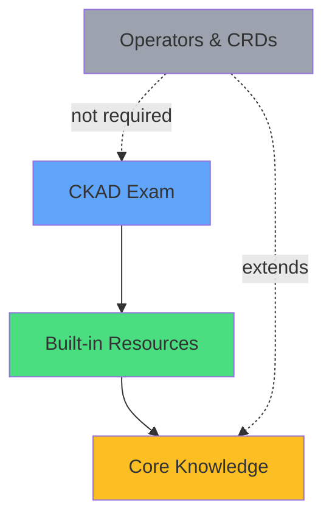

# Well Beyond Exam Scope

```mermaid
graph TB
    CKAD[<carbon-certificate/> CKAD Exam] --> BUILTIN[<carbon-cube/> Built-in Resources]

    OPERATORS[<carbon-bot/> Operators & CRDs] -.->|not required| CKAD

    BUILTIN --> FUNDAMENTALS[<carbon-education/> Core Knowledge]
    OPERATORS -.->|extends| FUNDAMENTALS

    style CKAD fill:#60a5fa
    style BUILTIN fill:#4ade80
    style OPERATORS fill:#9ca3af
    style FUNDAMENTALS fill:#fbbf24
```

Operators are advanced - NOT tested on CKAD 
Focus on Pods, Deployments, Services, etc.

