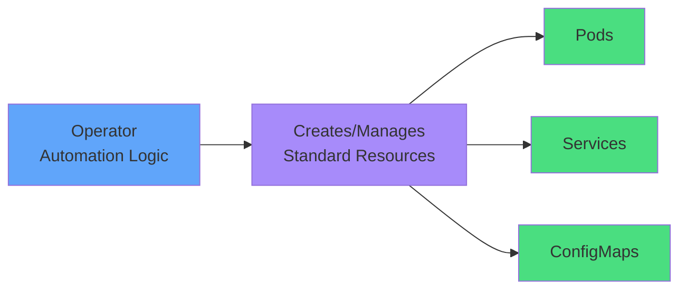

# What Operators Do

```mermaid
graph LR
    OPERATOR[<carbon-bot/> Operator<br/>Automation Logic] --> CREATES[<carbon-cube/> Creates/Manages<br/>Standard Resources]

    CREATES --> POD[<carbon-container-software/> Pods]
    CREATES --> SVC[<carbon-network-3/> Services]
    CREATES --> CONFIG[<carbon-settings/> ConfigMaps]

    style OPERATOR fill:#60a5fa
    style CREATES fill:#a78bfa
    style POD fill:#4ade80
    style SVC fill:#4ade80
    style CONFIG fill:#4ade80
```

### Operators automate operations you'd do manually

They use the same kubectl/YAML skills you learn for CKAD

