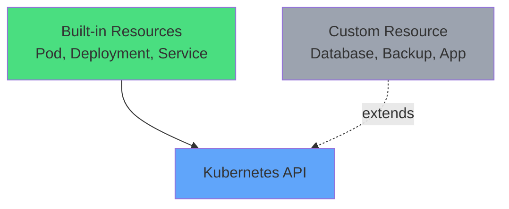

# Custom Resource Definitions (CRDs)

```mermaid
graph TB
    BUILTIN[<carbon-cube/> Built-in Resources<br/>Pod, Deployment, Service] --> API[<carbon-api/> Kubernetes API]

    CRD[<carbon-bot/> Custom Resource<br/>Database, Backup, App] -.->|extends| API

    style BUILTIN fill:#4ade80
    style API fill:#60a5fa
    style CRD fill:#9ca3af
```

### CRDs extend Kubernetes with new types

For CKAD, focus on built-in types only

