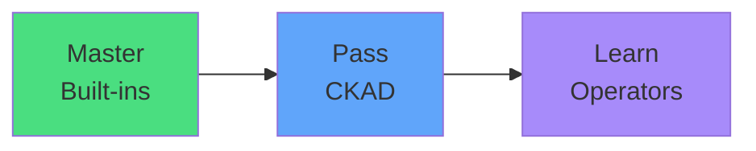

# Exam Mindset

<carbon-lightbulb class="text-yellow-400 text-4xl inline-block" />

### Focus 100% on built-in Kubernetes resources
### Operators are advanced patterns for later
### Your CKAD skills apply to Operator-managed environments
### Don't spend any exam prep time on Operators

