# Kubernetes Operators

<div class="abs-br m-6 flex gap-2">
  <carbon-settings class="text-6xl text-blue-400" />
</div>

<div v-click class="mt-8 text-xl opacity-80">
Extending Kubernetes with application-specific intelligence
</div>

<div v-click class="mt-4 text-sm text-yellow-400">
Advanced - Beyond CKAD (CRDs are CKAD-relevant)
</div>

---
layout: center
---

# The Operational Complexity Challenge

<div v-click="1">

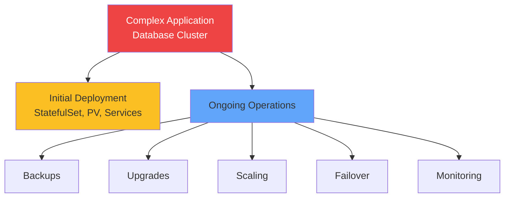

</div>

<div v-click="2" class="mt-8 text-center text-lg">
Standard Kubernetes handles deployment, not operations
</div>

<div v-click="3" class="mt-4 text-center text-xl">
<carbon-settings class="inline-block text-3xl text-green-400" /> Operators encode operational knowledge
</div>

---
layout: center
---

# What is an Operator?

<div v-click="1">

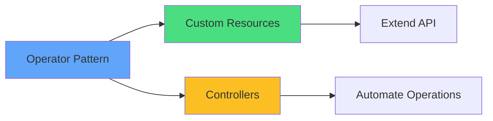

</div>

<div v-click="2" class="mt-8 text-center text-lg">
Software extensions to Kubernetes
</div>

<div class="grid grid-cols-2 gap-6 mt-6 text-sm">
<div v-click="3">
<carbon-api class="text-3xl text-blue-400 mb-2" />
<strong>Extends API</strong><br/>
Custom resource types
</div>
<div v-click="4">
<carbon-activity class="text-3xl text-green-400 mb-2" />
<strong>Runs continuously</strong><br/>
Watches for changes
</div>
<div v-click="5">
<carbon-settings class="text-3xl text-purple-400 mb-2" />
<strong>Encodes knowledge</strong><br/>
Operational logic in code
</div>
<div v-click="6">
<carbon-restart class="text-3xl text-yellow-400 mb-2" />
<strong>Self-healing</strong><br/>
Automatic reconciliation
</div>
</div>

---
layout: center
---

# Custom Resource Definitions (CRDs)

<div v-click="1" class="mb-4">

```yaml
apiVersion: apiextensions.k8s.io/v1
kind: CustomResourceDefinition
metadata:
  name: postgresclusters.db.example.com
spec:
  group: db.example.com
  names:
    kind: PostgresCluster
    plural: postgresclusters
  scope: Namespaced
```

</div>

<div v-click="2">

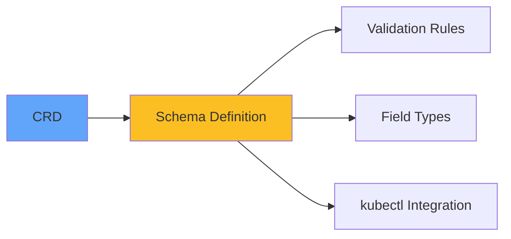

</div>

<div v-click="3" class="mt-6 text-center text-lg">
Extends Kubernetes API with new resource types
</div>

<div v-click="4" class="mt-4 text-center text-sm text-green-400">
<carbon-checkmark class="inline-block text-2xl" /> CKAD-relevant skill!
</div>

---
layout: center
---

# Creating Custom Resources

<div v-click="1" class="mb-6">

```yaml
apiVersion: db.example.com/v1
kind: PostgresCluster
metadata:
  name: my-database
spec:
  version: "14"
  replicas: 3
  storage: 100Gi
```

</div>

<div v-click="2">

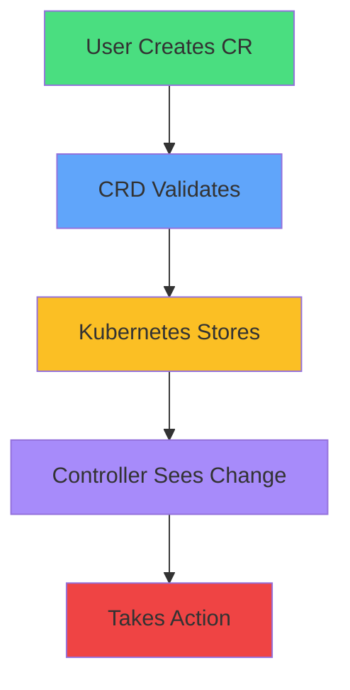

</div>

<div v-click="3" class="mt-6 text-center text-sm opacity-80">
After CRD is installed, create custom resources like built-in resources
</div>

---
layout: center
---

# Controllers

<div v-click="1">

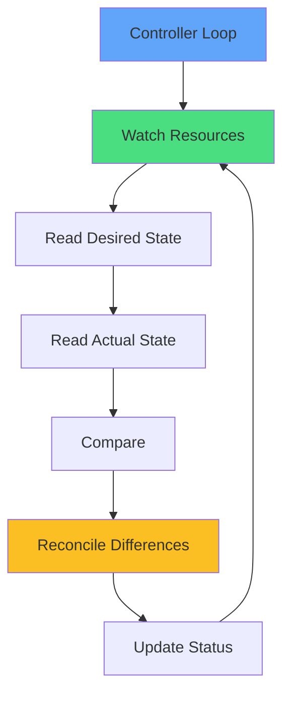

</div>

<div v-click="2" class="mt-8 text-center text-lg">
The "brains" of an Operator
</div>

<div class="grid grid-cols-2 gap-6 mt-6 text-sm">
<div v-click="3">
<carbon-view class="text-3xl text-blue-400 mb-2" />
<strong>Watch custom resources</strong><br/>
Detect changes
</div>
<div v-click="4">
<carbon-settings class="text-3xl text-green-400 mb-2" />
<strong>Reconcile state</strong><br/>
Make reality match desire
</div>
</div>

---
layout: center
---

# Operator Pattern in Action

<div v-click="1">

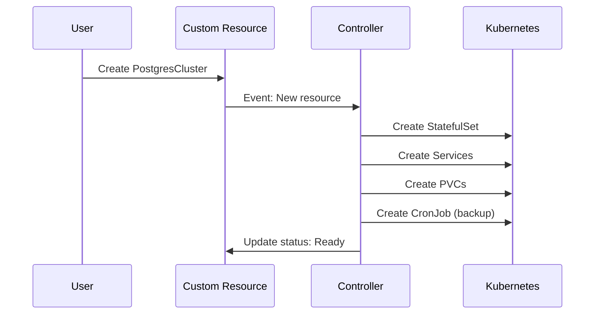

</div>

<div v-click="2" class="mt-6 text-center text-lg">
Declarative intent → automated operations
</div>

---
layout: center
---

# Operator Benefits

<div class="grid grid-cols-2 gap-6 mt-6">
<div v-click="1">
<carbon-settings class="text-4xl text-blue-400 mb-2" />
<strong>Application intelligence</strong><br/>
<span class="text-sm opacity-80">Understands app-specific needs</span>
</div>
<div v-click="2">
<carbon-rule class="text-4xl text-green-400 mb-2" />
<strong>Simplified management</strong><br/>
<span class="text-sm opacity-80">High-level abstractions</span>
</div>
<div v-click="3">
<carbon-restart class="text-4xl text-purple-400 mb-2" />
<strong>Self-healing</strong><br/>
<span class="text-sm opacity-80">Continuous reconciliation</span>
</div>
<div v-click="4">
<carbon-document class="text-4xl text-yellow-400 mb-2" />
<strong>Declarative operations</strong><br/>
<span class="text-sm opacity-80">Version control everything</span>
</div>
</div>

<div v-click="5" class="mt-8 text-center text-sm">
Example: Update version field → Operator handles entire upgrade safely
</div>

---
layout: center
---

# Common Operator Use Cases

<div v-click="1">

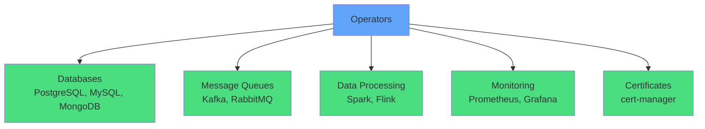

</div>

<div v-click="2" class="mt-8 text-center text-lg">
Most valuable for complex, stateful applications
</div>

<div v-click="3" class="mt-4 text-center text-sm opacity-80">
If your app needs ongoing operational tasks, an operator can help
</div>

---
layout: center
---

# Operator Maturity Levels

<div v-click="1">

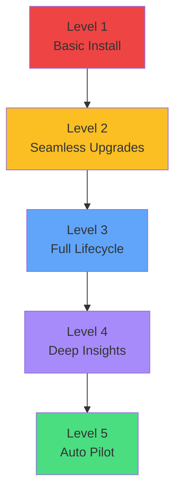

</div>

<div class="grid grid-cols-2 gap-4 mt-6 text-xs">
<div v-click="2">
<carbon-document class="inline-block text-2xl text-red-400" /> <strong>L1:</strong> Automated provisioning
</div>
<div v-click="3">
<carbon-arrow-up class="inline-block text-2xl text-yellow-400" /> <strong>L2:</strong> Automated upgrades
</div>
<div v-click="4">
<carbon-restart class="inline-block text-2xl text-blue-400" /> <strong>L3:</strong> Backup, restore, recovery
</div>
<div v-click="5">
<carbon-view class="inline-block text-2xl text-purple-400" /> <strong>L4:</strong> Performance tuning, insights
</div>
<div v-click="6">
<carbon-settings class="inline-block text-2xl text-green-400" /> <strong>L5:</strong> Full automation
</div>
</div>

<div v-click="7" class="mt-6 text-center text-sm opacity-80">
Most operators are Level 2-3
</div>

---
layout: center
---

# Operator Deployment

<div v-click="1">

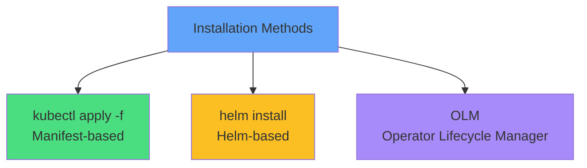

</div>

<div v-click="2" class="mt-8 text-center text-lg">
Typical operator structure
</div>

<div class="grid grid-cols-2 gap-4 mt-6 text-sm">
<div v-click="3">
<carbon-api class="inline-block text-2xl text-blue-400" /> CRD definitions
</div>
<div v-click="4">
<carbon-locked class="inline-block text-2xl text-green-400" /> RBAC resources
</div>
<div v-click="5">
<carbon-container-software class="inline-block text-2xl text-purple-400" /> Operator Deployment
</div>
<div v-click="6">
<carbon-rule class="inline-block text-2xl text-yellow-400" /> Validation webhooks
</div>
</div>

---
layout: center
---

# RBAC & Security

<div v-click="1" class="mb-4">

```yaml
apiVersion: rbac.authorization.k8s.io/v1
kind: ClusterRole
metadata:
  name: database-operator
rules:
- apiGroups: ["apps"]
  resources: ["statefulsets"]
  verbs: ["get", "list", "create", "update", "delete"]
- apiGroups: ["db.example.com"]
  resources: ["postgresclusters"]
  verbs: ["get", "list", "watch", "update"]
```

</div>

<div v-click="2" class="mt-6 text-center text-lg text-red-400">
<carbon-warning class="inline-block text-3xl" /> Operators have significant cluster privileges
</div>

<div class="grid grid-cols-2 gap-6 mt-6 text-sm">
<div v-click="3">
<carbon-user class="text-3xl text-blue-400 mb-2" />
<strong>ServiceAccounts</strong><br/>
Minimal permissions
</div>
<div v-click="4">
<carbon-security class="text-3xl text-yellow-400 mb-2" />
<strong>Review permissions</strong><br/>
Before installation
</div>
</div>

---
layout: center
---

# Building vs Using Operators

<div v-click="1">

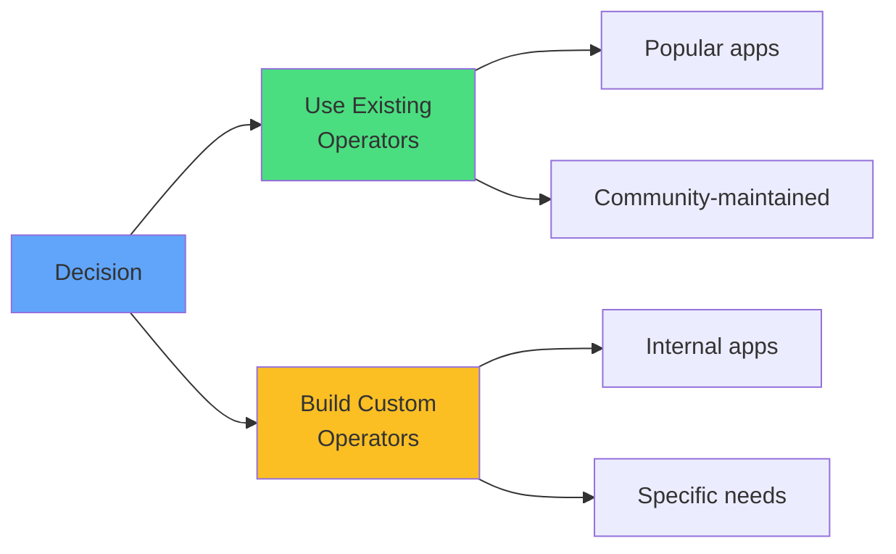

</div>

<div class="grid grid-cols-2 gap-6 mt-8">
<div v-click="2">
<carbon-download class="text-4xl text-green-400 mb-2" />
<strong>Use existing</strong><br/>
<span class="text-sm opacity-80">Databases, queues, monitoring</span>
</div>
<div v-click="3">
<carbon-edit class="text-4xl text-yellow-400 mb-2" />
<strong>Build custom</strong><br/>
<span class="text-sm opacity-80">Internal apps, unique logic</span>
</div>
</div>

<div v-click="4" class="mt-8 text-center text-sm opacity-80">
Tools: Operator SDK, Kubebuilder, KUDO
</div>

---
layout: center
---

# Operators and CKAD

<div v-click="1">

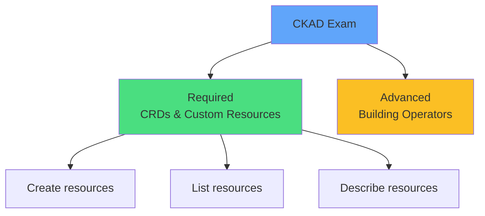

</div>

<div class="grid grid-cols-2 gap-6 mt-8">
<div v-click="2">
<carbon-checkmark class="text-4xl text-green-400 mb-2" />
<strong>CKAD Required</strong><br/>
<span class="text-sm opacity-80">Work with CRDs and custom resources</span>
</div>
<div v-click="3">
<carbon-close class="text-4xl text-red-400 mb-2" />
<strong>Beyond CKAD</strong><br/>
<span class="text-sm opacity-80">Building operators, complex development</span>
</div>
</div>

<div v-click="4" class="mt-8 text-center text-lg">
<carbon-education class="inline-block text-3xl text-blue-400" /> Focus: Be a user of operators, not a developer
</div>

---
layout: center
---

# Summary

<div v-click="1">

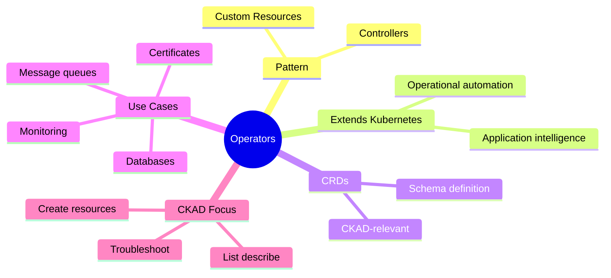

</div>

---
layout: center
---

# Key Takeaways

<div class="grid grid-cols-2 gap-6 mt-6">
<div v-click="1">
<carbon-settings class="text-4xl text-blue-400 mb-2" />
<strong>Operator pattern</strong><br/>
<span class="text-sm opacity-80">CRDs + Controllers = automation</span>
</div>
<div v-click="2">
<carbon-api class="text-4xl text-green-400 mb-2" />
<strong>Extends Kubernetes</strong><br/>
<span class="text-sm opacity-80">Application-specific intelligence</span>
</div>
<div v-click="3">
<carbon-document class="text-4xl text-purple-400 mb-2" />
<strong>CRDs are CKAD</strong><br/>
<span class="text-sm opacity-80">Practice creating custom resources</span>
</div>
<div v-click="4">
<carbon-education class="text-4xl text-yellow-400 mb-2" />
<strong>User, not builder</strong><br/>
<span class="text-sm opacity-80">Work with operators, don't build them</span>
</div>
</div>

<div v-click="5" class="mt-8 text-center text-lg">
Operators simplify complex application management <carbon-arrow-right class="inline-block text-2xl" />
</div>
