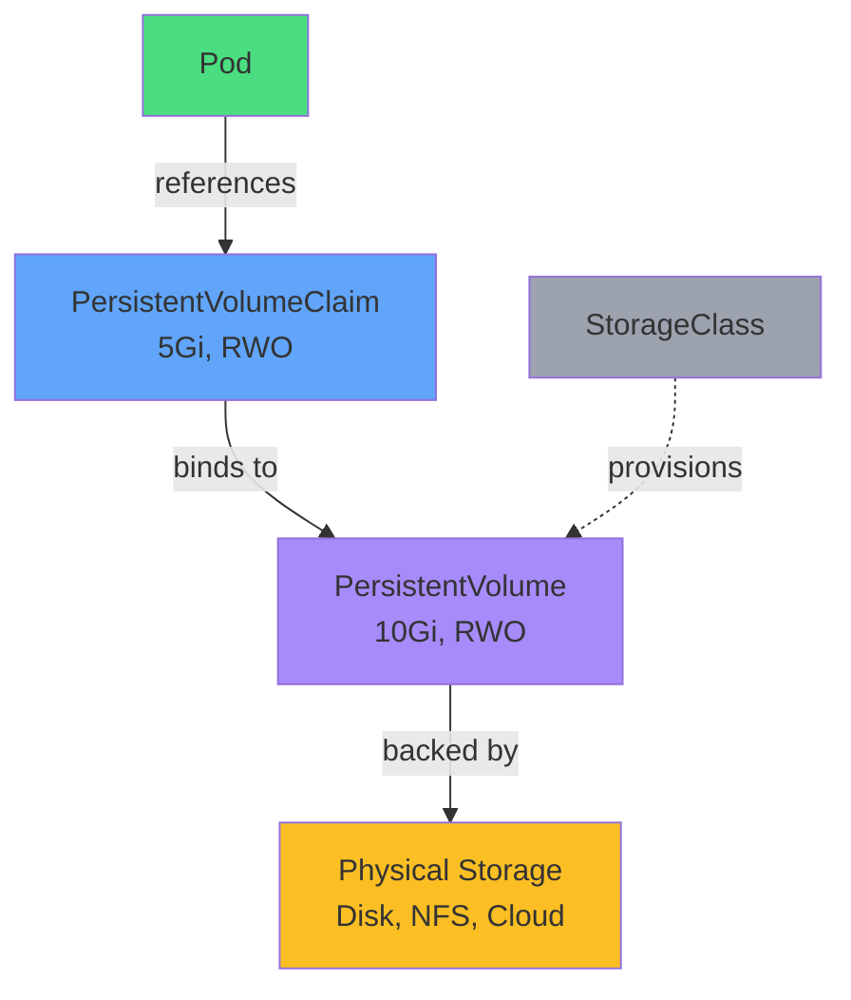

# Storage Architecture

```mermaid
graph TB
    POD[<carbon-container-software/> Pod] -->|references| PVC[<carbon-data-volume/> PersistentVolumeClaim<br/>5Gi, RWO]
    PVC -->|binds to| PV[<carbon-storage-pool/> PersistentVolume<br/>10Gi, RWO]
    PV -->|backed by| STORAGE[<carbon-server/> Physical Storage<br/>Disk, NFS, Cloud]

    SC[<carbon-settings/> StorageClass] -.->|provisions| PV

    style POD fill:#4ade80
    style PVC fill:#60a5fa
    style PV fill:#a78bfa
    style STORAGE fill:#fbbf24
    style SC fill:#9ca3af
```

Pod → PVC → PV → Physical Storage

