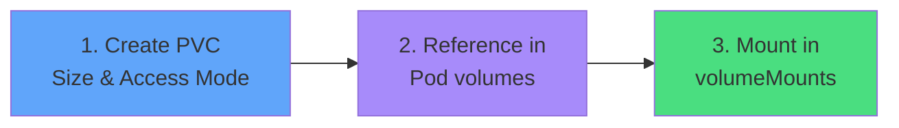

# Three-Step Process



<div class="mt-8 text-center">

### This workflow handles most storage scenarios

<div class="grid grid-cols-3 gap-4 mt-8 text-sm">
<div>

**PVC**
```yaml
resources:
  requests:
    storage: 5Gi
```

</div>
<div>

**volumes**
```yaml
persistentVolumeClaim:
  claimName: my-pvc
```

</div>
<div>

**volumeMounts**
```yaml
mountPath: /data
name: volume-name
```

</div>
</div>

</div>
