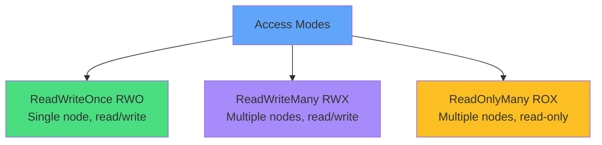

# Access Modes

```mermaid
graph TB
    MODES[<carbon-settings/> Access Modes]

    MODES --> RWO[<carbon-server/> ReadWriteOnce RWO<br/>Single node, read/write]
    MODES --> RWX[<carbon-network-3/> ReadWriteMany RWX<br/>Multiple nodes, read/write]
    MODES --> ROX[<carbon-view/> ReadOnlyMany ROX<br/>Multiple nodes, read-only]

    style MODES fill:#60a5fa
    style RWO fill:#4ade80
    style RWX fill:#a78bfa
    style ROX fill:#fbbf24
```

### Choose based on requirements

**RWO**
Most common
Single Pod write

**RWX**
Shared storage
Multiple Pods write

**ROX**
Read-only sharing
Multiple Pods read

