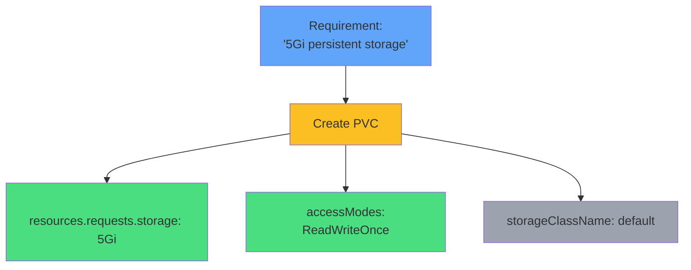

# PVC Creation

```mermaid
graph TB
    REQ[<carbon-document-tasks/> Requirement:<br/>'5Gi persistent storage'] --> PVC[<carbon-document/> Create PVC]

    PVC --> SIZE[<carbon-data-volume/> resources.requests.storage: 5Gi]
    PVC --> MODE[<carbon-settings/> accessModes: ReadWriteOnce]
    PVC --> SC[<carbon-storage-pool/> storageClassName: default]

    style REQ fill:#60a5fa
    style PVC fill:#fbbf24
    style SIZE fill:#4ade80
    style MODE fill:#4ade80
    style SC fill:#9ca3af
```

### Essential Fields
- `resources.requests.storage`: Size (1Gi, 5Gi, 10Gi)
- `accessModes`: [ReadWriteOnce] or [ReadWriteMany]
- `storageClassName`: Usually omit for default

