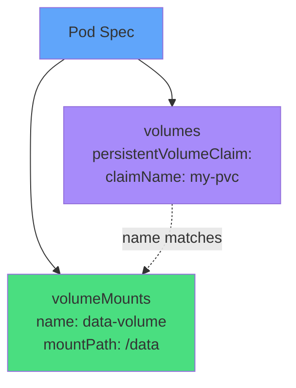

# Mounting in Pods

```mermaid
graph TB
    POD[<carbon-container-software/> Pod Spec]

    POD --> VOL[<carbon-folder/> volumes<br/>persistentVolumeClaim:<br/>claimName: my-pvc]
    POD --> MOUNT[<carbon-folder-add/> volumeMounts<br/>name: data-volume<br/>mountPath: /data]

    VOL -.->|name matches| MOUNT

    style POD fill:#60a5fa
    style VOL fill:#a78bfa
    style MOUNT fill:#4ade80
```

### Critical: Names must match

volumes[].name = volumeMounts[].name

