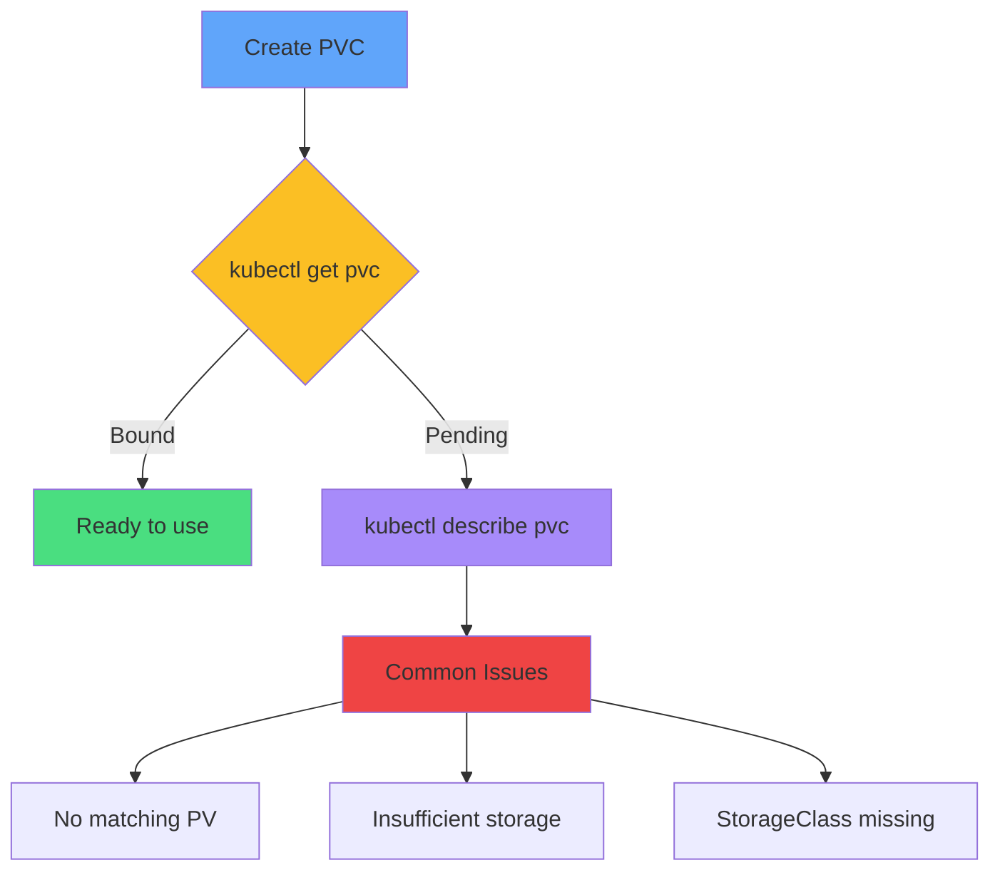

# PVC Status and Troubleshooting

```mermaid
graph TB
    CREATE[<carbon-data-volume/> Create PVC] --> CHECK{<carbon-decision-tree/> kubectl get pvc}

    CHECK -->|Bound| SUCCESS[<carbon-checkmark-filled/> Ready to use]
    CHECK -->|Pending| DEBUG[<carbon-search/> kubectl describe pvc]

    DEBUG --> ISSUES[<carbon-warning-alt/> Common Issues]
    ISSUES --> NO_PV[No matching PV]
    ISSUES --> NO_STORAGE[Insufficient storage]
    ISSUES --> NO_SC[StorageClass missing]

    style CREATE fill:#60a5fa
    style CHECK fill:#fbbf24
    style SUCCESS fill:#4ade80
    style DEBUG fill:#a78bfa
    style ISSUES fill:#ef4444
```

Always verify PVC is Bound before creating Pods

