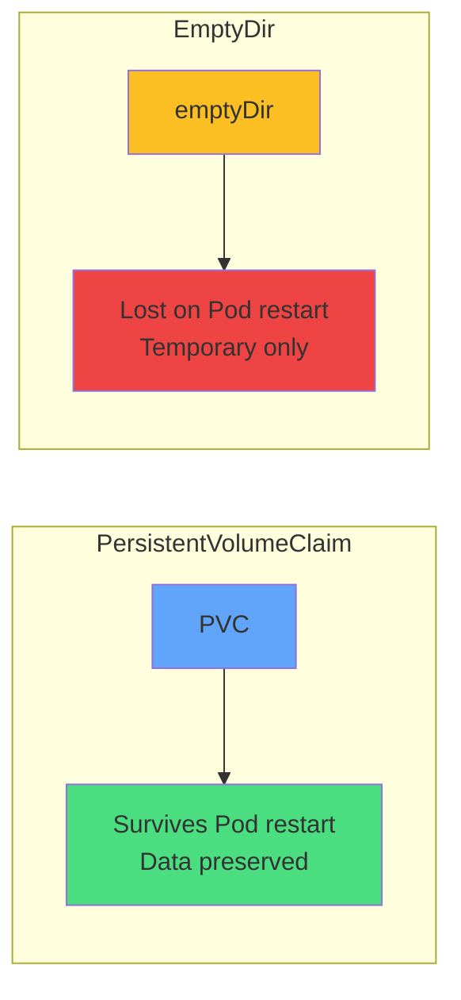

# Storage vs EmptyDir

### Choose based on persistence needs

**PersistentVolumeClaim**
<carbon-checkmark-filled class="text-2xl text-green-400" />

Databases, files, configs

**emptyDir**
<carbon-time class="text-2xl text-yellow-400" />

Cache, temp files, scratch space

