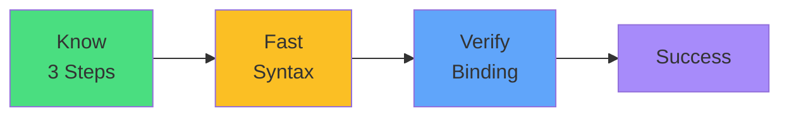

# Exam Mindset

<carbon-lightbulb class="text-yellow-400 text-4xl inline-block" />

### "Persistent storage" → 3-step process
### 1. Create PVC (size + accessMode)
### 2. Reference in Pod volumes
### 3. Mount in volumeMounts

