# PersistentVolumes

<div class="abs-br m-6 flex gap-2">
  <carbon-data-volume class="text-6xl text-blue-400" />
</div>

<div v-click class="mt-8 text-xl opacity-80">
Storage that survives Pods and containers
</div>

---
layout: center
---

# Storage in Kubernetes

<div v-click="1">

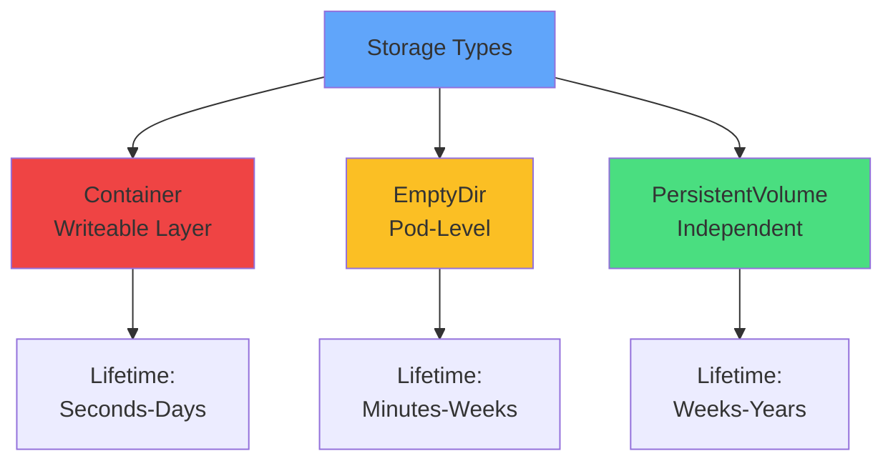

</div>

<div v-click="2" class="mt-8 text-center text-lg">
Different storage for different needs
</div>

---
layout: center
---

# Container Writeable Layer

<div v-click="1">

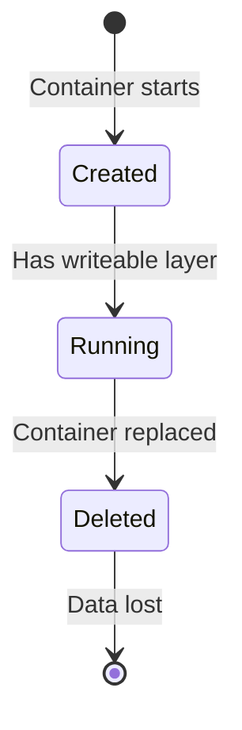

</div>

<div v-click="2" class="mt-8 text-center text-lg text-red-400">
<carbon-warning class="inline-block text-3xl" /> Data lifecycle = Container lifecycle
</div>

<div class="grid grid-cols-2 gap-6 mt-6">
<div v-click="3">
<carbon-checkmark class="text-4xl text-green-400 mb-2" />
<strong>Quick & easy</strong><br/>
<span class="text-sm opacity-80">No configuration needed</span>
</div>
<div v-click="4">
<carbon-close class="text-4xl text-red-400 mb-2" />
<strong>Temporary only</strong><br/>
<span class="text-sm opacity-80">Lost on restart</span>
</div>
</div>

---
layout: center
---

# EmptyDir Volumes

<div v-click="1">

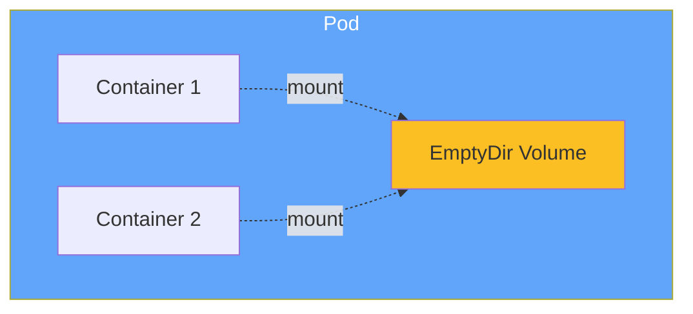

</div>

<div v-click="2" class="mt-8 text-center text-lg">
Pod-level storage, survives container restarts
</div>

<div class="grid grid-cols-3 gap-4 mt-6 text-sm">
<div v-click="3" class="text-center">
<carbon-restart class="text-3xl text-green-400 mb-2" />
<strong>Survives</strong><br/>
Container restarts
</div>
<div v-click="4" class="text-center">
<carbon-network-overlay class="text-3xl text-blue-400 mb-2" />
<strong>Shared</strong><br/>
Multi-container Pods
</div>
<div v-click="5" class="text-center">
<carbon-close class="text-3xl text-red-400 mb-2" />
<strong>Lost</strong><br/>
Pod deletion
</div>
</div>

<div v-click="6" class="mt-6 text-center text-sm opacity-80">
Can be backed by disk (default) or memory
</div>

---
layout: center
---

# The Need for Persistent Storage

<div v-click="1">

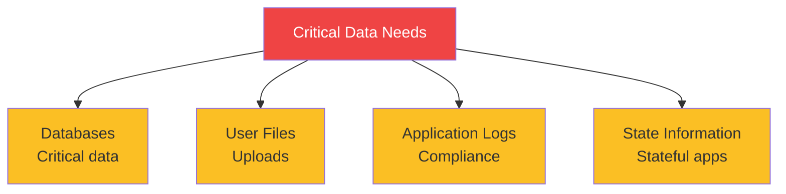

</div>

<div v-click="2" class="mt-8 text-center text-lg">
Data that must survive Pod deletions and node failures
</div>

<div v-click="3" class="mt-6 text-center text-xl">
<carbon-data-volume class="inline-block text-3xl text-green-400" /> PersistentVolumes have independent lifecycle
</div>

---
layout: center
---

# Storage Abstraction

<div v-click="1">

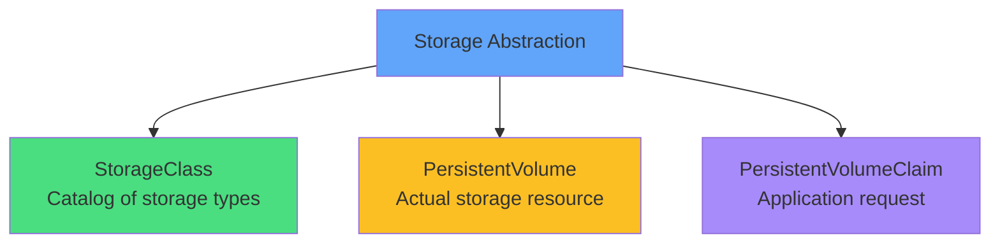

</div>

<div v-click="2" class="mt-8 text-center text-lg">
Separate infrastructure details from application needs
</div>

---
layout: center
---

# StorageClasses

<div v-click="1">

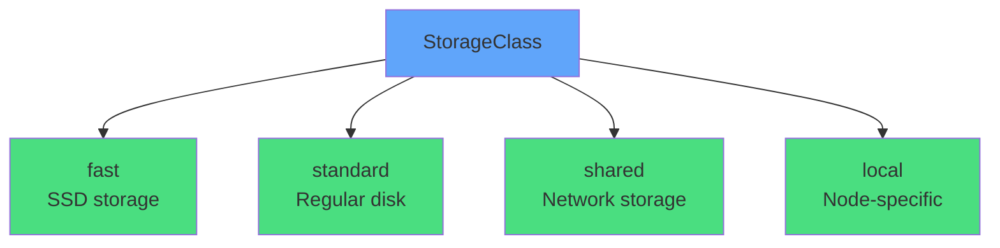

</div>

<div v-click="2" class="mt-8 text-center text-lg">
Catalog of storage types available in cluster
</div>

<div class="grid grid-cols-2 gap-6 mt-6 text-sm">
<div v-click="3">
<carbon-settings class="text-3xl text-blue-400 mb-2" />
<strong>Provisioner</strong><br/>
Creates actual storage
</div>
<div v-click="4">
<carbon-rule class="text-3xl text-green-400 mb-2" />
<strong>Parameters</strong><br/>
Performance, backup policies
</div>
</div>

<div v-click="5" class="mt-6 text-center text-sm opacity-80">
Examples: AWS EBS, Azure Disk, NFS, local volumes
</div>

---
layout: center
---

# PersistentVolumeClaim (PVC)

<div v-click="1" class="mb-4">

```yaml
apiVersion: v1
kind: PersistentVolumeClaim
metadata:
  name: data-claim
spec:
  accessModes:
  - ReadWriteOnce
  resources:
    requests:
      storage: 5Gi
  storageClassName: fast
```

</div>

<div v-click="2" class="mt-6 text-center text-lg">
Application's request for storage
</div>

<div class="grid grid-cols-3 gap-4 mt-6 text-sm">
<div v-click="3" class="text-center">
<carbon-network-3 class="text-3xl text-blue-400 mb-2" />
<strong>Access Mode</strong><br/>
RWO, ROX, RWX
</div>
<div v-click="4" class="text-center">
<carbon-dashboard class="text-3xl text-green-400 mb-2" />
<strong>Size</strong><br/>
Storage amount
</div>
<div v-click="5" class="text-center">
<carbon-tag class="text-3xl text-purple-400 mb-2" />
<strong>StorageClass</strong><br/>
Storage type
</div>
</div>

---
layout: center
---

# Access Modes

<div v-click="1">

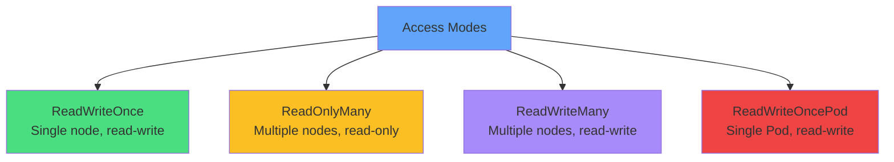

</div>

<div class="grid grid-cols-2 gap-4 mt-6 text-xs">
<div v-click="2">
<carbon-checkmark class="inline-block text-2xl text-green-400" /> <strong>RWO:</strong> Most common, single node (AWS EBS, Azure Disk)
</div>
<div v-click="3">
<carbon-view class="inline-block text-2xl text-yellow-400" /> <strong>ROX:</strong> Read-only sharing, multiple nodes
</div>
<div v-click="4">
<carbon-network-3 class="inline-block text-2xl text-purple-400" /> <strong>RWX:</strong> Requires network storage (NFS, CephFS)
</div>
<div v-click="5">
<carbon-rule class="inline-block text-2xl text-red-400" /> <strong>RWOP:</strong> Single Pod only (K8s 1.22+)
</div>
</div>

<div v-click="6" class="mt-6 text-center text-sm text-red-400">
<carbon-warning class="inline-block text-2xl" /> Common pitfall: RWX with RWO-only storage!
</div>

---
layout: center
---

# PersistentVolume (PV)

<div v-click="1">

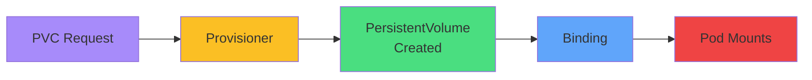

</div>

<div v-click="2" class="mt-8 text-center text-lg">
Actual storage resource in the cluster
</div>

<div class="grid grid-cols-2 gap-6 mt-6">
<div v-click="3" class="text-center">
<carbon-settings class="text-4xl text-green-400 mb-2" />
<strong>Dynamic Provisioning</strong><br/>
<span class="text-sm opacity-80">Auto-created by provisioner</span>
</div>
<div v-click="4" class="text-center">
<carbon-edit class="text-4xl text-blue-400 mb-2" />
<strong>Static Provisioning</strong><br/>
<span class="text-sm opacity-80">Pre-created by admin</span>
</div>
</div>

---
layout: center
---

# Binding Process

<div v-click="1">

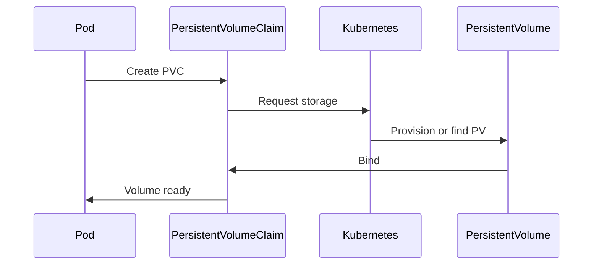

</div>

<div v-click="2" class="mt-6 text-center text-lg">
Kubernetes matches PVCs to PVs
</div>

<div class="grid grid-cols-3 gap-4 mt-6 text-xs">
<div v-click="3">
<carbon-dashboard class="inline-block text-2xl text-blue-400" /> Size match
</div>
<div v-click="4">
<carbon-network-3 class="inline-block text-2xl text-green-400" /> Access mode match
</div>
<div v-click="5">
<carbon-tag class="inline-block text-2xl text-purple-400" /> StorageClass match
</div>
</div>

<div v-click="6" class="mt-6 text-center text-sm opacity-80">
One PVC → One PV (exclusive relationship)
</div>

---
layout: center
---

# Volume Lifecycle

<div v-click="1">

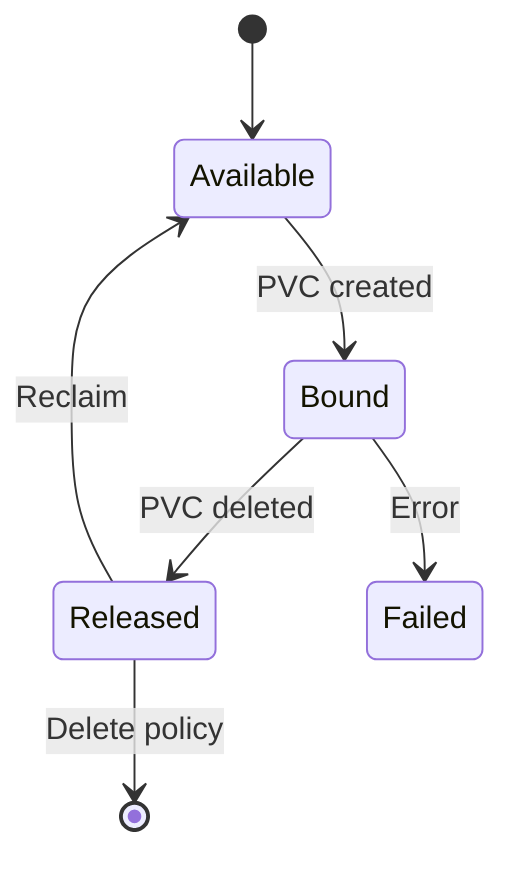

</div>

<div class="grid grid-cols-2 gap-4 mt-6 text-sm">
<div v-click="2">
<carbon-checkmark class="inline-block text-2xl text-green-400" /> <strong>Available:</strong> Free, ready to claim
</div>
<div v-click="3">
<carbon-locked class="inline-block text-2xl text-blue-400" /> <strong>Bound:</strong> In use by PVC
</div>
<div v-click="4">
<carbon-unlocked class="inline-block text-2xl text-yellow-400" /> <strong>Released:</strong> PVC deleted, not reclaimed
</div>
<div v-click="5">
<carbon-close class="inline-block text-2xl text-red-400" /> <strong>Failed:</strong> Reclamation failed
</div>
</div>

---
layout: center
---

# Reclaim Policies

<div v-click="1">

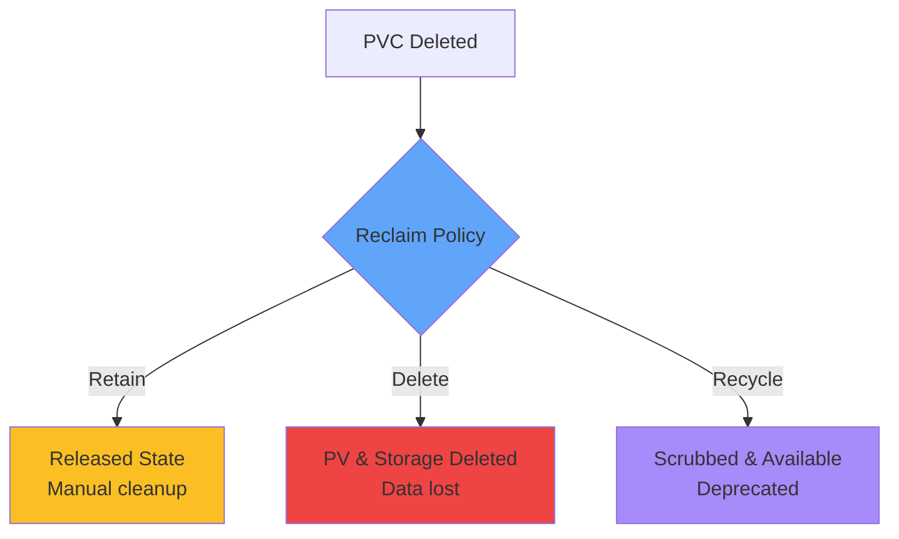

</div>

<div class="grid grid-cols-2 gap-6 mt-6">
<div v-click="2">
<carbon-save class="text-4xl text-yellow-400 mb-2" />
<strong>Retain</strong><br/>
<span class="text-sm opacity-80">Data preserved, manual cleanup</span>
</div>
<div v-click="3">
<carbon-close class="text-4xl text-red-400 mb-2" />
<strong>Delete</strong><br/>
<span class="text-sm opacity-80">Automatic deletion, data lost</span>
</div>
</div>

<div v-click="4" class="mt-6 text-center text-sm opacity-80">
Production: Use Retain for safety
</div>

---
layout: center
---

# Complete Flow

<div v-click="1">

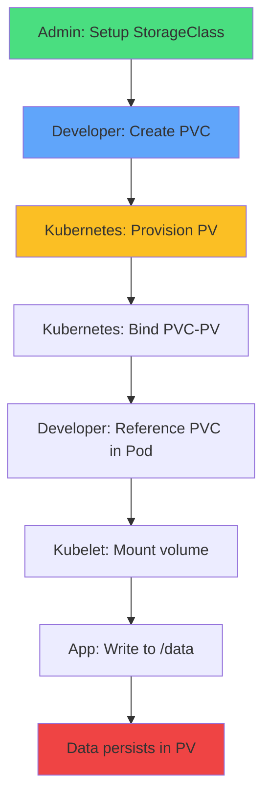

</div>

<div v-click="2" class="mt-6 text-center text-lg">
Abstraction enables portability and simplicity
</div>

---
layout: center
---

# Mounting PVCs in Pods

<div v-click="1" class="mb-4">

```yaml
apiVersion: v1
kind: Pod
metadata:
  name: app
spec:
  containers:
  - name: app
    image: nginx
    volumeMounts:
    - name: data
      mountPath: /data
  volumes:
  - name: data
    persistentVolumeClaim:
      claimName: data-claim
```

</div>

<div v-click="2" class="mt-6 text-center text-sm">
Reference PVC by name, mount at path
</div>

---
layout: center
---

# Summary

<div v-click="1">

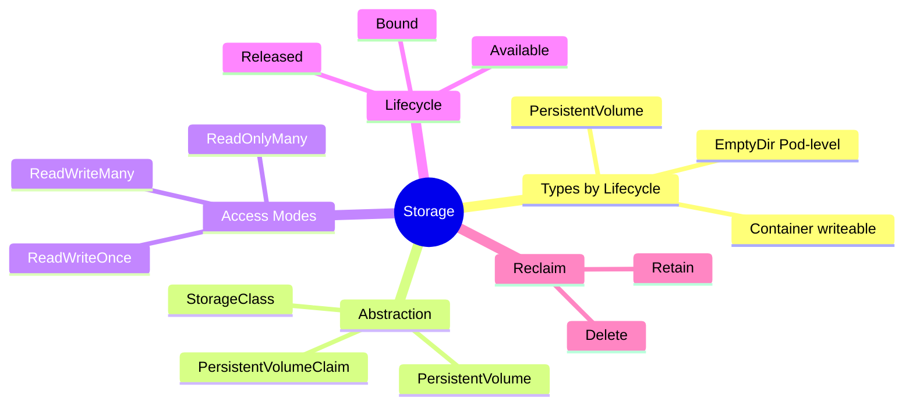

</div>

---
layout: center
---

# Key Takeaways

<div class="grid grid-cols-2 gap-6 mt-6">
<div v-click="1">
<carbon-data-volume class="text-4xl text-blue-400 mb-2" />
<strong>Storage types</strong><br/>
<span class="text-sm opacity-80">Container, EmptyDir, PersistentVolume</span>
</div>
<div v-click="2">
<carbon-settings class="text-4xl text-green-400 mb-2" />
<strong>Abstraction layers</strong><br/>
<span class="text-sm opacity-80">StorageClass, PV, PVC</span>
</div>
<div v-click="3">
<carbon-network-3 class="text-4xl text-purple-400 mb-2" />
<strong>Access modes</strong><br/>
<span class="text-sm opacity-80">RWO, ROX, RWX, RWOP</span>
</div>
<div v-click="4">
<carbon-rule class="text-4xl text-yellow-400 mb-2" />
<strong>Reclaim policies</strong><br/>
<span class="text-sm opacity-80">Retain (safe) vs Delete (auto)</span>
</div>
</div>

<div v-click="5" class="mt-8 text-center text-lg">
<carbon-education class="inline-block text-3xl text-blue-400" /> CKAD focus: Create PVCs, mount in Pods, troubleshoot!
</div>
