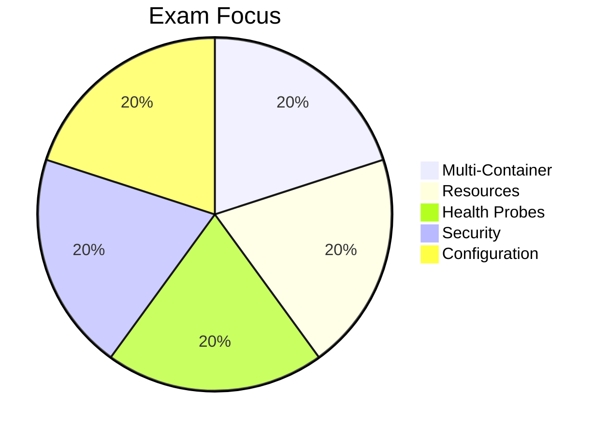

# CKAD Reality

<carbon-timer class="text-5xl text-red-400 mb-4" />

## 2 Hours
15-20 practical tasks

<carbon-terminal class="text-5xl text-green-400 mb-4 mt-8" />

## Performance-Based
Real clusters, real kubectl

::right::

