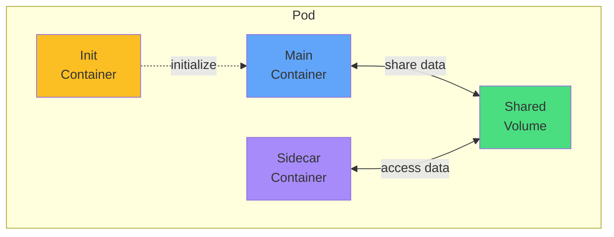

# Multi-Container Patterns

```mermaid
graph TB
    subgraph Pod
        I[<carbon-document/> Init<br/>Container]
        M[<carbon-application/> Main<br/>Container]
        S[<carbon-side-panel-open/> Sidecar<br/>Container]
        V[<carbon-data-volume/> Shared<br/>Volume]
    end
    I -.->|initialize| M
    M <-->|share data| V
    S <-->|access data| V
    style I fill:#fbbf24
    style M fill:#60a5fa
    style S fill:#a78bfa
    style V fill:#4ade80
```

Containers collaborate within a Pod

