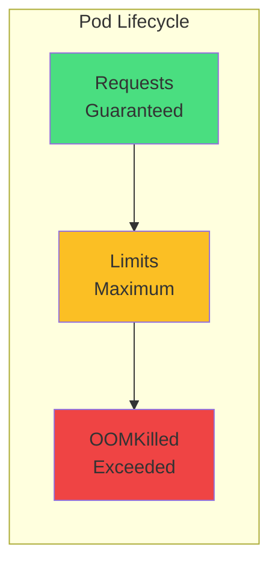

# Resource Management

```mermaid
graph LR
    subgraph Pod Lifecycle
        R[<carbon-request-quote/> Requests<br/>Guaranteed] --> L[<carbon-threshold-limit/> Limits<br/>Maximum]
        L --> O[<carbon-warning/> OOMKilled<br/>Exceeded]
    end
    style R fill:#4ade80
    style L fill:#fbbf24
    style O fill:#ef4444
```

## Requests
<carbon-arrow-down class="text-2xl text-green-400" />

Scheduling guarantee

## Limits
<carbon-arrow-up class="text-2xl text-yellow-400" />

Upper boundary

