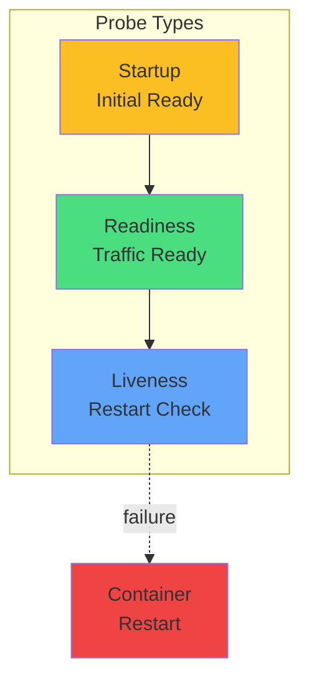

# Health Probes

```mermaid
graph TB
    subgraph Probe Types
        S[<carbon-power/> Startup<br/>Initial Ready]
        R[<carbon-checkmark/> Readiness<br/>Traffic Ready]
        L[<carbon-restart/> Liveness<br/>Restart Check]
    end
    S --> R
    R --> L
    L -.->|failure| RESTART[<carbon-renew/> Container<br/>Restart]
    style S fill:#fbbf24
    style R fill:#4ade80
    style L fill:#60a5fa
    style RESTART fill:#ef4444
```

<carbon-http class="text-3xl mb-2" />
HTTP

<carbon-network-3 class="text-3xl mb-2" />
TCP

<carbon-terminal class="text-3xl mb-2" />
Exec

