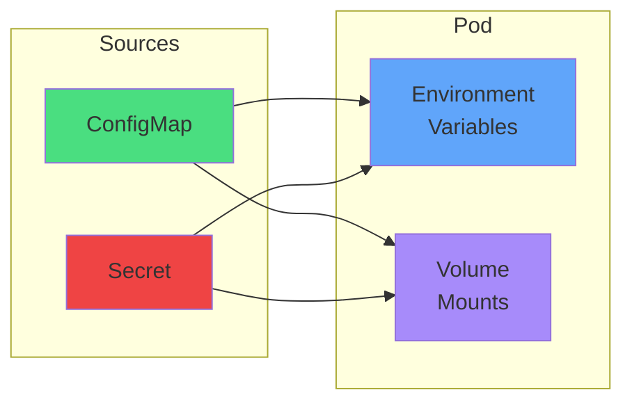

# Configuration Management

```mermaid
graph LR
    subgraph Sources
        CM[<carbon-settings/> ConfigMap]
        S[<carbon-password/> Secret]
    end
    subgraph Pod
        E[<carbon-code/> Environment<br/>Variables]
        V[<carbon-data-volume/> Volume<br/>Mounts]
    end
    CM --> E
    CM --> V
    S --> E
    S --> V
    style CM fill:#4ade80
    style S fill:#ef4444
    style E fill:#60a5fa
    style V fill:#a78bfa
```

Separate configuration from specification

