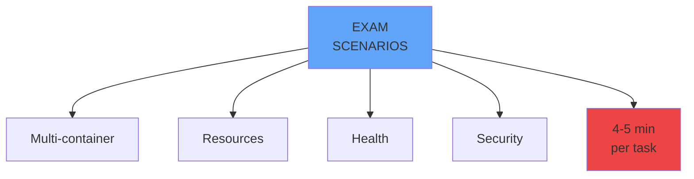

# What's Coming

<carbon-education class="text-5xl text-blue-400 mb-4" />

## Practical Scenarios
- Multi-container Pods
- Resource configurations
- Health probe implementation
- Security hardening

<carbon-terminal class="text-5xl text-green-400 mb-4 mt-8" />

## Time-Saving Techniques
- kubectl shortcuts
- YAML templates
- Quick troubleshooting

::right::

