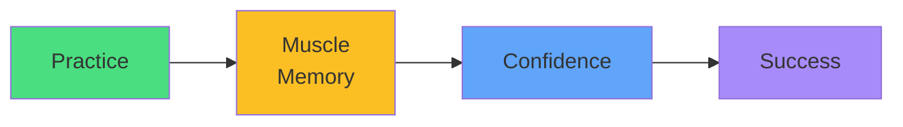

# Exam Mindset

```mermaid
graph LR
    P[<carbon-practice/> Practice] --> M[<carbon-flash/> Muscle<br/>Memory] --> C[<carbon-checkmark-filled/> Confidence] --> S[<carbon-trophy/> Success]
    style P fill:#4ade80
    style M fill:#fbbf24
    style C fill:#60a5fa
    style S fill:#a78bfa
```

<carbon-lightbulb class="text-yellow-400 text-4xl inline-block" />

### The exam tests realistic scenarios
### Build patterns through repetition
### Speed comes from practice

