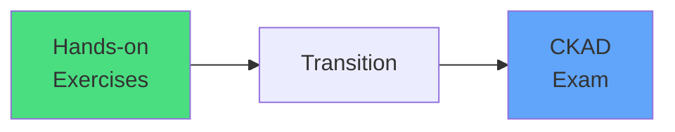
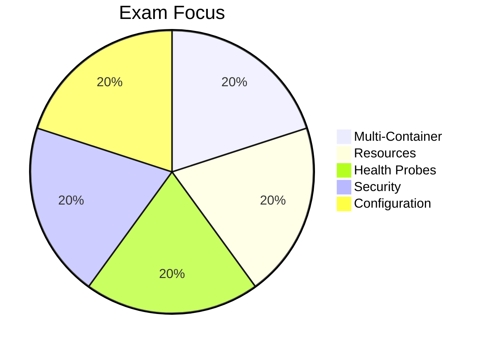
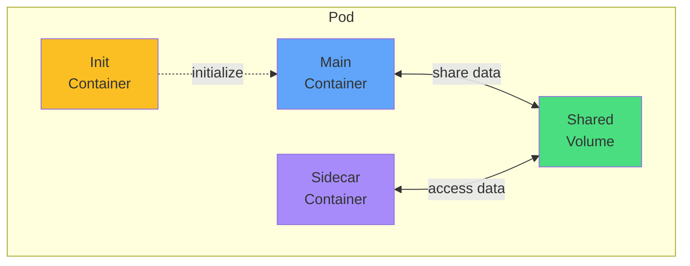
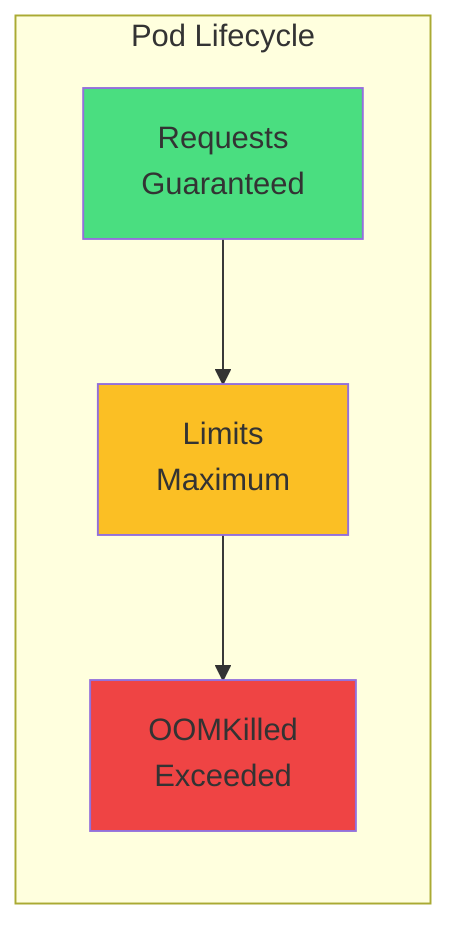
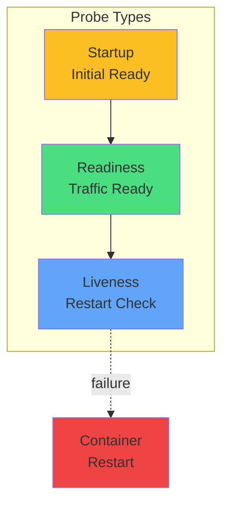
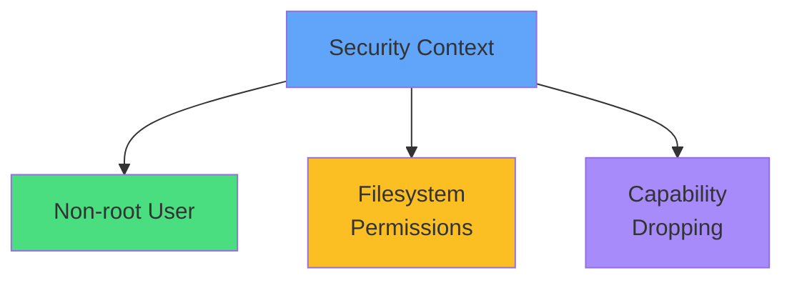
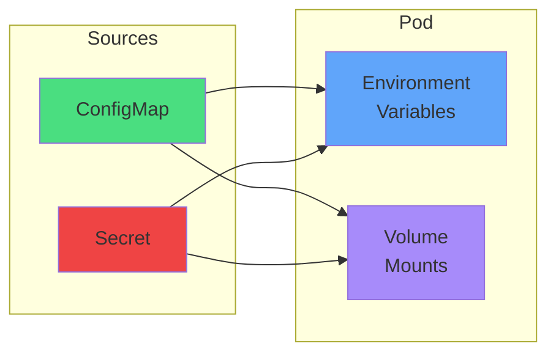
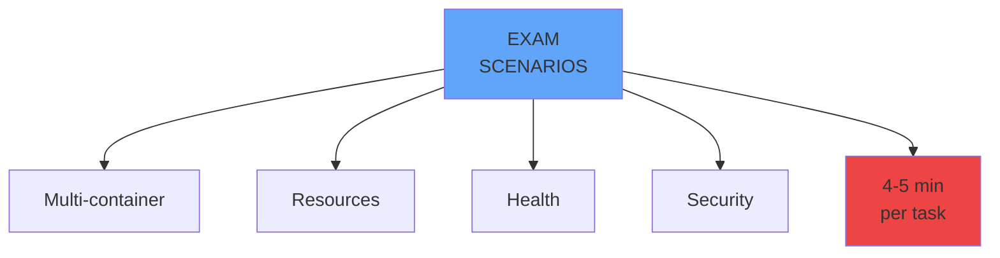
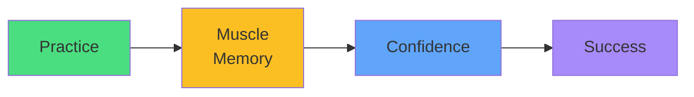

# Pods
## CKAD Exam Preparation

  <carbon-kubernetes class="text-6xl text-blue-400" />

---
layout: center
---

# From Practice to Performance

You've mastered the fundamentals 
Now it's time to prepare for exam scenarios

---
layout: two-cols
---

# CKAD Reality

<carbon-timer class="text-5xl text-red-400 mb-4" />

## 2 Hours
15-20 practical tasks

<carbon-terminal class="text-5xl text-green-400 mb-4 mt-8" />

## Performance-Based
Real clusters, real kubectl

::right::

---
layout: center
---

# Multi-Container Patterns

Containers collaborate within a Pod

---
layout: center
---

# Resource Management

## Requests
<carbon-arrow-down class="text-2xl text-green-400" />

Scheduling guarantee

## Limits
<carbon-arrow-up class="text-2xl text-yellow-400" />

Upper boundary

---
layout: center
---

# Health Probes

<carbon-http class="text-3xl mb-2" />
HTTP

<carbon-network-3 class="text-3xl mb-2" />
TCP

<carbon-terminal class="text-3xl mb-2" />
Exec

---
layout: center
---

# Security Contexts

<carbon-security class="text-4xl text-blue-400 inline-block mb-2" />
 
Principle of least privilege

---
layout: center
---

# Configuration Management

Separate configuration from specification

---
layout: two-cols
---

# What's Coming

<carbon-education class="text-5xl text-blue-400 mb-4" />

## Practical Scenarios
- Multi-container Pods
- Resource configurations
- Health probe implementation
- Security hardening

<carbon-terminal class="text-5xl text-green-400 mb-4 mt-8" />

## Time-Saving Techniques
- kubectl shortcuts
- YAML templates
- Quick troubleshooting

::right::

---
layout: center
---

# Exam Mindset

<carbon-idea class="text-yellow-400 text-4xl inline-block" />

### The exam tests realistic scenarios
### Build patterns through repetition
### Speed comes from practice

