# Kubernetes Pods

<div class="abs-br m-6 flex gap-2">
  <carbon-kubernetes class="text-6xl text-blue-400" />
</div>

<!--
METADATA:
sentence: Pods are the foundational building block of Kubernetes, and understanding them is absolutely essential for the CKAD exam.
search_anchor: foundational building block of Kubernetes
-->
<div v-click class="mt-8 text-xl opacity-80">
The foundational building block of Kubernetes
</div>

---
layout: center
---

# What is a Pod?

<!--
METADATA:
sentence: Let's start with the basics. A Pod is the smallest deployable unit in Kubernetes.
search_anchor: smallest deployable unit in Kubernetes
-->
<div v-click="1">

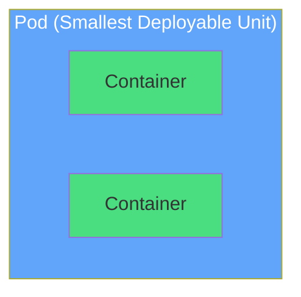

</div>

<!--
METADATA:
sentence: While Docker runs containers directly, Kubernetes runs Pods, which then run your containers.
search_anchor: Docker runs containers directly
-->
<div v-click="2" class="mt-8 text-center text-lg opacity-80">
<carbon-container-software class="inline-block text-3xl text-blue-400" /> Docker runs containers
</div>

<!--
METADATA:
sentence: While Docker runs containers directly, Kubernetes runs Pods, which then run your containers.
search_anchor: Kubernetes runs Pods
-->
<div v-click="3" class="text-center text-lg opacity-80">
<carbon-kubernetes class="inline-block text-3xl text-purple-400" /> Kubernetes runs Pods
</div>

<!--
METADATA:
sentence: The key thing to understand is that a Pod represents a single instance of your application.
search_anchor: single instance of your application
-->
<div v-click="4" class="mt-4 text-center text-xl font-semibold">
Pod = single instance of your application
</div>

---
layout: center
---

# Why Pods?

<!--
METADATA:
sentence: You might be wondering - why do we need Pods? Why not just run containers directly?
search_anchor: why do we need Pods
-->
<div v-click="1" class="mb-4">

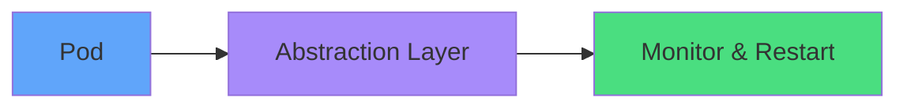

</div>

<!--
METADATA:
sentence: The Pod monitors your container and ensures it keeps running. If your container crashes, the Pod restarts it automatically.
search_anchor: Pod restarts it automatically
-->
<div v-click="2" class="flex justify-around mt-8">
<div class="text-center">
<carbon-restart class="text-5xl text-green-400 mb-2" />
<div class="text-sm">Auto-restart<br/>containers</div>
</div>
<!--
METADATA:
sentence: Second, Pods can run multiple containers that need to work together.
search_anchor: run multiple containers that need to work together
-->
<div v-click="3" class="text-center">
<carbon-category-and class="text-5xl text-blue-400 mb-2" />
<div class="text-sm">Multi-container<br/>patterns</div>
</div>
<!--
METADATA:
sentence: Third, Pods are the unit of scheduling in Kubernetes. When you scale your application, you're actually creating or destroying Pods, not individual containers.
search_anchor: unit of scheduling in Kubernetes
-->
<div v-click="4" class="text-center">
<carbon-partition-auto class="text-5xl text-purple-400 mb-2" />
<div class="text-sm">Unit of<br/>scheduling</div>
</div>
</div>

---
layout: center
---

# Pod Lifecycle

<!--
METADATA:
sentence: Let's talk about the Pod lifecycle. A Pod goes through several phases.
search_anchor: Pod lifecycle
-->
<div v-click="1">

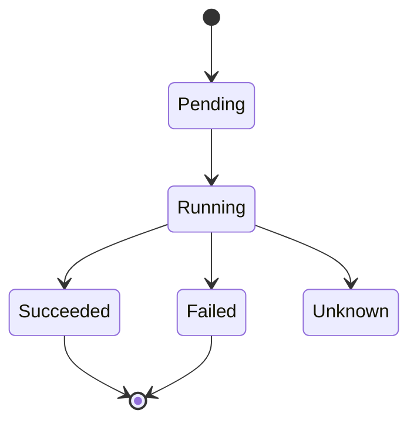

</div>

<div class="grid grid-cols-2 gap-4 mt-8 text-sm">
<!--
METADATA:
sentence: Pending - The Pod has been created but isn't running yet. Kubernetes is scheduling it and pulling container images.
search_anchor: Pending - The Pod has been created
-->
<div v-click="2">
<carbon-time class="inline-block text-2xl text-yellow-400" /> <strong>Pending:</strong> Scheduling & pulling images
</div>
<!--
METADATA:
sentence: Running - The Pod has been bound to a node and all containers have been created. At least one container is running.
search_anchor: Running - The Pod has been bound to a node
-->
<div v-click="3">
<carbon-play class="inline-block text-2xl text-green-400" /> <strong>Running:</strong> At least one container running
</div>
<!--
METADATA:
sentence: Succeeded - All containers in the Pod have terminated successfully and won't be restarted.
search_anchor: Succeeded - All containers in the Pod
-->
<div v-click="4">
<carbon-checkmark class="inline-block text-2xl text-blue-400" /> <strong>Succeeded:</strong> All containers terminated successfully
</div>
<!--
METADATA:
sentence: Failed - All containers have terminated, and at least one failed with an error.
search_anchor: Failed - All containers have terminated
-->
<div v-click="5">
<carbon-close class="inline-block text-2xl text-red-400" /> <strong>Failed:</strong> At least one container failed
</div>
</div>

---
layout: center
---

# Pod Anatomy

<!--
METADATA:
sentence: Every Kubernetes resource, including Pods, is defined using YAML.
search_anchor: defined using YAML
-->
<div v-click="1" class="mb-4">

```yaml
apiVersion: v1
kind: Pod
metadata:
  name: my-pod
spec:
  containers:
  - name: app
    image: nginx
```

</div>

<div class="grid grid-cols-2 gap-4">
<!--
METADATA:
sentence: apiVersion - This tells Kubernetes which version of the API to use. For Pods, it's "v1".
search_anchor: apiVersion - This tells Kubernetes
-->
<div v-click="2">
<carbon-api class="inline-block text-3xl text-blue-400" />
<strong>apiVersion:</strong> API version (v1)
</div>
<!--
METADATA:
sentence: kind - This specifies the type of resource. In this case, "Pod".
search_anchor: kind - This specifies the type of resource
-->
<div v-click="3">
<carbon-document class="inline-block text-3xl text-green-400" />
<strong>kind:</strong> Resource type (Pod)
</div>
<!--
METADATA:
sentence: metadata - This contains identifying information like the Pod's name, labels, and annotations.
search_anchor: metadata - This contains identifying information
-->
<div v-click="4">
<carbon-tag class="inline-block text-3xl text-purple-400" />
<strong>metadata:</strong> Name, labels, annotations
</div>
<!--
METADATA:
sentence: spec - This is where you define what you want the Pod to do. For Pods, the spec includes the list of containers to run.
search_anchor: spec - This is where you define
-->
<div v-click="5">
<carbon-settings class="inline-block text-3xl text-yellow-400" />
<strong>spec:</strong> What the Pod should do
</div>
</div>

---
layout: center
---

# Container Configuration

<!--
METADATA:
sentence: Within the Pod spec, the containers section is where you define your application containers.
search_anchor: containers section is where you define
-->
<div v-click="1">

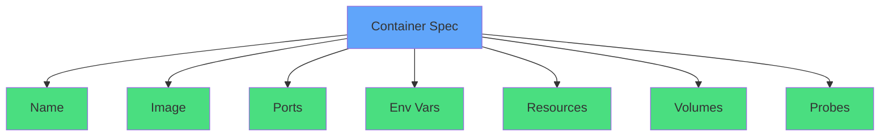

</div>

---
layout: center
---

# Multi-Container Pods

<!--
METADATA:
sentence: One of the most powerful features of Pods is the ability to run multiple containers together.
search_anchor: run multiple containers together
-->
<div v-click="1" class="mb-6">

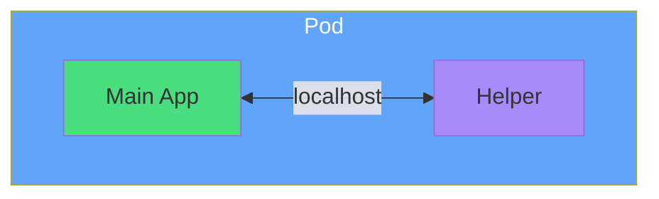

</div>

<div class="grid grid-cols-3 gap-4 text-sm">
<!--
METADATA:
sentence: Sidecar pattern - A helper container runs alongside your main application. For example, a logging agent that collects and forwards logs.
search_anchor: Sidecar pattern - A helper container
-->
<div v-click="2" class="text-center">
<carbon-side-panel-open class="text-4xl text-green-400 mb-2" />
<strong>Sidecar</strong><br/>
Logging agent
</div>
<!--
METADATA:
sentence: Ambassador pattern - A proxy container that simplifies connectivity. For instance, a container that handles connecting to different database environments.
search_anchor: Ambassador pattern - A proxy container
-->
<div v-click="3" class="text-center">
<carbon-connect class="text-4xl text-blue-400 mb-2" />
<strong>Ambassador</strong><br/>
Database proxy
</div>
<!--
METADATA:
sentence: Adapter pattern - A container that transforms data to a standard format. For example, converting custom log formats to a standard format for a monitoring system.
search_anchor: Adapter pattern - A container that transforms
-->
<div v-click="4" class="text-center">
<carbon-arrows-horizontal class="text-4xl text-purple-400 mb-2" />
<strong>Adapter</strong><br/>
Format converter
</div>
</div>

<!--
METADATA:
sentence: All containers in a Pod share the same network namespace, meaning they can communicate over localhost. They can also share storage volumes.
search_anchor: share the same network namespace
-->
<div v-click="5" class="mt-6 text-center text-lg">
<carbon-network-overlay class="inline-block text-2xl text-yellow-400" /> Shared network namespace + storage
</div>

---
layout: center
---

# Pod Networking

<!--
METADATA:
sentence: Let's talk about networking. Every Pod gets its own IP address in the cluster.
search_anchor: Every Pod gets its own IP address
-->
<div v-click="1">

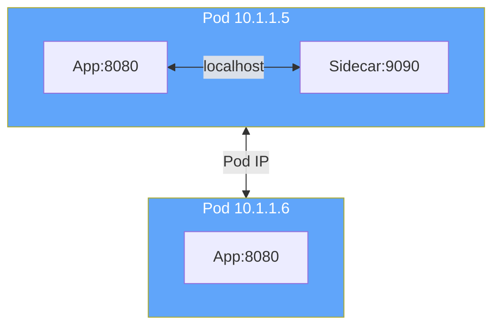

</div>

<div class="grid grid-cols-2 gap-4 mt-8">
<!--
METADATA:
sentence: Containers within a Pod communicate over localhost on different ports.
search_anchor: Containers within a Pod communicate over localhost
-->
<div v-click="2" class="text-center">
<carbon-network-1 class="text-4xl text-green-400 mb-2" />
Within Pod: <strong>localhost</strong>
</div>
<!--
METADATA:
sentence: Pods communicate with each other using their Pod IP addresses.
search_anchor: Pods communicate with each other using their Pod IP addresses
-->
<div v-click="3" class="text-center">
<carbon-network-3 class="text-4xl text-blue-400 mb-2" />
Between Pods: <strong>Pod IP</strong>
</div>
</div>

<!--
METADATA:
sentence: For the CKAD exam, you need to understand that Pod IPs are ephemeral - they change when Pods are recreated.
search_anchor: Pod IPs are ephemeral
-->
<div v-click="4" class="mt-6 text-center text-yellow-400">
<carbon-warning class="inline-block text-2xl" /> Pod IPs are ephemeral!
</div>

---
layout: center
---

# Resource Management

<!--
METADATA:
sentence: Resource management is critical for production workloads and a key CKAD topic.
search_anchor: Resource management is critical
-->
<div v-click="1">

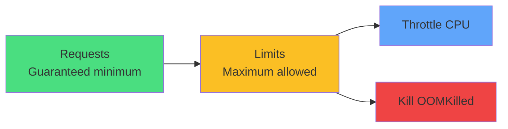

</div>

<div class="grid grid-cols-3 gap-4 mt-8 text-sm">
<!--
METADATA:
sentence: Guaranteed - when requests equal limits for all resources.
search_anchor: Guaranteed - when requests equal limits
-->
<div v-click="2" class="text-center">
<carbon-trophy class="text-4xl text-green-400 mb-2" />
<strong>Guaranteed</strong><br/>
requests = limits
</div>
<!--
METADATA:
sentence: Burstable - when requests are less than limits.
search_anchor: Burstable - when requests are less than limits
-->
<div v-click="3" class="text-center">
<carbon-arrow-up-right class="text-4xl text-yellow-400 mb-2" />
<strong>Burstable</strong><br/>
requests < limits
</div>
<!--
METADATA:
sentence: BestEffort - when no requests or limits are set.
search_anchor: BestEffort - when no requests or limits are set
-->
<div v-click="4" class="text-center">
<carbon-help class="text-4xl text-red-400 mb-2" />
<strong>BestEffort</strong><br/>
no requests/limits
</div>
</div>

<!--
METADATA:
sentence: This determines which Pods get evicted first when a node runs out of resources.
search_anchor: which Pods get evicted first
-->
<div v-click="5" class="mt-6 text-center text-lg opacity-80">
QoS class determines eviction priority
</div>

---
layout: center
---

# Health Probes

<!--
METADATA:
sentence: Kubernetes provides three types of health probes.
search_anchor: three types of health probes
-->
<div v-click="1">

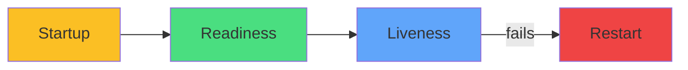

</div>

<div class="grid grid-cols-3 gap-4 mt-8 text-sm">
<!--
METADATA:
sentence: Startup probes provide extra time for slow-starting containers. They delay liveness and readiness checks until the startup probe succeeds.
search_anchor: Startup probes provide extra time
-->
<div v-click="2" class="text-center">
<carbon-power class="text-4xl text-yellow-400 mb-2" />
<strong>Startup</strong><br/>
Slow start protection
</div>
<!--
METADATA:
sentence: Readiness probes check if a container is ready to serve traffic. If a readiness probe fails, the Pod is removed from Service endpoints but isn't restarted.
search_anchor: Readiness probes check if a container is ready
-->
<div v-click="3" class="text-center">
<carbon-traffic-flow class="text-4xl text-green-400 mb-2" />
<strong>Readiness</strong><br/>
Ready for traffic
</div>
<!--
METADATA:
sentence: Liveness probes check if a container is healthy. If a liveness probe fails, Kubernetes restarts the container.
search_anchor: Liveness probes check if a container is healthy
-->
<div v-click="4" class="text-center">
<carbon-activity class="text-4xl text-blue-400 mb-2" />
<strong>Liveness</strong><br/>
Healthy & running
</div>
</div>

<div class="flex justify-around mt-8">
<!--
METADATA:
sentence: Each probe can use HTTP GET requests, TCP socket checks, or exec commands to verify health.
search_anchor: HTTP GET requests
-->
<div v-click="5" class="text-center">
<carbon-http class="text-3xl text-purple-400 mb-1" />
<div class="text-xs">HTTP GET</div>
</div>
<!--
METADATA:
sentence: Each probe can use HTTP GET requests, TCP socket checks, or exec commands to verify health.
search_anchor: TCP socket checks
-->
<div v-click="6" class="text-center">
<carbon-network-3 class="text-3xl text-purple-400 mb-1" />
<div class="text-xs">TCP Socket</div>
</div>
<!--
METADATA:
sentence: Each probe can use HTTP GET requests, TCP socket checks, or exec commands to verify health.
search_anchor: exec commands to verify health
-->
<div v-click="7" class="text-center">
<carbon-terminal class="text-3xl text-purple-400 mb-1" />
<div class="text-xs">Exec Command</div>
</div>
</div>

---
layout: center
---

# Labels & Selectors

<!--
METADATA:
sentence: Labels are key-value pairs attached to objects like Pods. They're used for organizing and selecting subsets of resources.
search_anchor: Labels are key-value pairs
-->
<div v-click="1">

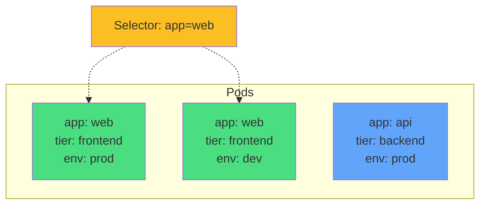

</div>

<!--
METADATA:
sentence: Labels are key-value pairs attached to objects like Pods. They're used for organizing and selecting subsets of resources.
search_anchor: organize resources
-->
<div v-click="2" class="mt-8 text-center">
<carbon-tag class="inline-block text-4xl text-green-400" />
<strong class="ml-2">Labels:</strong> organize resources
</div>

<!--
METADATA:
sentence: Selectors let you query Pods based on labels. This is how Services find their Pods, how Deployments manage their replicas, and how you query resources with kubectl.
search_anchor: Selectors let you query Pods
-->
<div v-click="3" class="mt-4 text-center">
<carbon-filter class="inline-block text-4xl text-blue-400" />
<strong class="ml-2">Selectors:</strong> query by labels
</div>

<!--
METADATA:
sentence: This is how Services find their Pods, how Deployments manage their replicas, and how you query resources with kubectl.
search_anchor: Services, Deployments, and kubectl
-->
<div v-click="4" class="mt-6 text-center text-sm opacity-80">
Services, Deployments, and kubectl use selectors
</div>

---
layout: center
---

# Best Practices

<div class="grid grid-cols-2 gap-6 mt-4">
<!--
METADATA:
sentence: Use higher-level controllers - In production, don't create Pods directly. Use Deployments, StatefulSets, or DaemonSets that manage Pods for you.
search_anchor: Use higher-level controllers
-->
<div v-click="1">
<carbon-flow class="text-4xl text-blue-400 mb-2" />
<strong>Use controllers</strong><br/>
<span class="text-sm opacity-80">Deployments, not bare Pods</span>
</div>
<!--
METADATA:
sentence: Always set resource requests and limits - This ensures proper scheduling and prevents resource exhaustion.
search_anchor: Always set resource requests and limits
-->
<div v-click="2">
<carbon-dashboard class="text-4xl text-green-400 mb-2" />
<strong>Set resources</strong><br/>
<span class="text-sm opacity-80">Always define requests & limits</span>
</div>
<!--
METADATA:
sentence: Implement health probes - Liveness and readiness probes are essential for production reliability.
search_anchor: Implement health probes
-->
<div v-click="3">
<carbon-health-cross class="text-4xl text-purple-400 mb-2" />
<strong>Health probes</strong><br/>
<span class="text-sm opacity-80">Liveness + readiness essential</span>
</div>
<!--
METADATA:
sentence: Use meaningful labels - Good labeling makes management and troubleshooting much easier.
search_anchor: Use meaningful labels
-->
<div v-click="4">
<carbon-tag class="text-4xl text-yellow-400 mb-2" />
<strong>Meaningful labels</strong><br/>
<span class="text-sm opacity-80">Organize for easy management</span>
</div>
<!--
METADATA:
sentence: Follow the single responsibility principle - Each container should do one thing well. Use multi-container Pods only when containers need tight coupling.
search_anchor: single responsibility principle
-->
<div v-click="5">
<carbon-document class="text-4xl text-red-400 mb-2" />
<strong>Single responsibility</strong><br/>
<span class="text-sm opacity-80">One job per container</span>
</div>
<!--
METADATA:
sentence: Run as non-root - Security contexts let you run containers as non-root users for better security.
search_anchor: Run as non-root
-->
<div v-click="6">
<carbon-security class="text-4xl text-orange-400 mb-2" />
<strong>Run as non-root</strong><br/>
<span class="text-sm opacity-80">Use security contexts</span>
</div>
</div>

---
layout: center
---

# CKAD Exam Focus

<!--
METADATA:
sentence: For the CKAD exam, Pods are absolutely fundamental.
search_anchor: CKAD exam, Pods are absolutely fundamental
-->
<div v-click="1" class="text-center mb-6">
<carbon-certificate class="inline-block text-6xl text-blue-400" />
</div>

<div class="grid grid-cols-2 gap-4 text-sm">
<!--
METADATA:
sentence: Create Pods from scratch using YAML.
search_anchor: Create Pods from scratch using YAML
-->
<div v-click="2">
<carbon-edit class="inline-block text-2xl text-green-400" /> Create Pods from YAML
</div>
<!--
METADATA:
sentence: Understand multi-container patterns.
search_anchor: Understand multi-container patterns
-->
<div v-click="3">
<carbon-category-and class="inline-block text-2xl text-green-400" /> Multi-container patterns
</div>
<!--
METADATA:
sentence: Configure resource requests and limits.
search_anchor: Configure resource requests and limits
-->
<div v-click="4">
<carbon-dashboard class="inline-block text-2xl text-green-400" /> Resource requests & limits
</div>
<!--
METADATA:
sentence: Implement liveness and readiness probes.
search_anchor: Implement liveness and readiness probes
-->
<div v-click="5">
<carbon-health-cross class="inline-block text-2xl text-green-400" /> Health probes
</div>
<!--
METADATA:
sentence: Work with environment variables, ConfigMaps, and Secrets.
search_anchor: ConfigMaps, and Secrets
-->
<div v-click="6">
<carbon-settings class="inline-block text-2xl text-green-400" /> ConfigMaps & Secrets
</div>
<!--
METADATA:
sentence: Apply security contexts.
search_anchor: Apply security contexts
-->
<div v-click="7">
<carbon-security class="inline-block text-2xl text-green-400" /> Security contexts
</div>
<!--
METADATA:
sentence: Troubleshoot Pod issues quickly.
search_anchor: Troubleshoot Pod issues quickly
-->
<div v-click="8">
<carbon-debug class="inline-block text-2xl text-green-400" /> Troubleshooting
</div>
<!--
METADATA:
sentence: The exam is time-limited, so practice creating Pods quickly.
search_anchor: exam is time-limited
-->
<div v-click="9">
<carbon-timer class="inline-block text-2xl text-red-400" /> Fast execution
</div>
</div>

<!--
METADATA:
sentence: Learn the kubectl shortcuts and get comfortable with the imperative commands that can generate YAML for you.
search_anchor: kubectl shortcuts
-->
<div v-click="10" class="mt-8 text-center text-lg">
<carbon-terminal class="inline-block text-3xl text-purple-400" /> Practice kubectl shortcuts!
</div>

---
layout: center
---

# Summary

<!--
METADATA:
sentence: Let's recap what we've covered.
search_anchor: Let's recap what we've covered
-->
<div v-click="1">

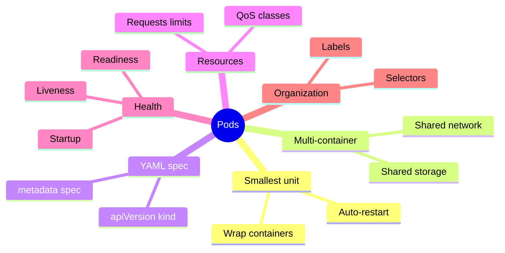

</div>

---
layout: center
---

# Next Steps

<!--
METADATA:
sentence: Now that you understand the concepts, it's time for hands-on practice.
search_anchor: time for hands-on practice
-->
<div v-click="1" class="text-center mb-8">
<carbon-education class="inline-block text-6xl text-blue-400" />
</div>

<!--
METADATA:
sentence: In the next video, we'll work through practical exercises where you'll create Pods, interact with them using kubectl, and see these concepts in action.
search_anchor: practical exercises where you'll create Pods
-->
<div v-click="2">

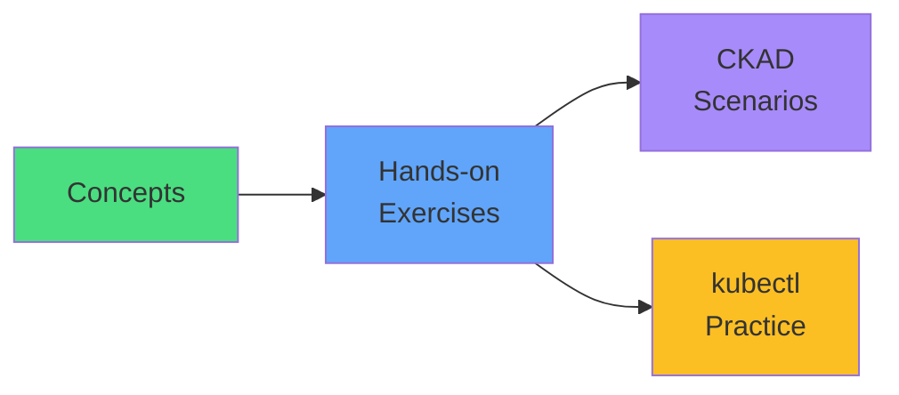

</div>

<!--
METADATA:
sentence: Thank you for watching, and let's move on to the hands-on labs!
search_anchor: let's move on to the hands-on labs
-->
<div v-click="3" class="mt-8 text-center text-xl">
Let's move to the hands-on labs! <carbon-arrow-right class="inline-block text-2xl" />
</div>
