# Kubernetes Pods

<div class="abs-br m-6 flex gap-2">
  <carbon-kubernetes class="text-6xl text-blue-400" />
</div>

<div v-click class="mt-8 text-xl opacity-80">
The foundational building block of Kubernetes
</div>

---
layout: center
---

# What is a Pod?

<div v-click="1">

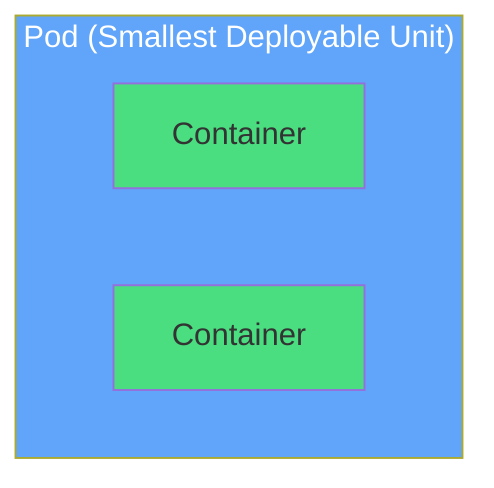

</div>

<div v-click="2" class="mt-8 text-center text-lg opacity-80">
<carbon-container-software class="inline-block text-3xl text-blue-400" /> Docker runs containers
</div>

<div v-click="3" class="text-center text-lg opacity-80">
<carbon-kubernetes class="inline-block text-3xl text-purple-400" /> Kubernetes runs Pods
</div>

<div v-click="4" class="mt-4 text-center text-xl font-semibold">
Pod = single instance of your application
</div>

---
layout: center
---

# Why Pods?

<div v-click="1" class="mb-4">

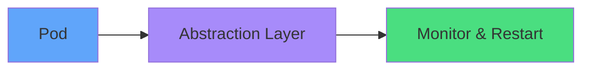

</div>

<div v-click="2" class="flex justify-around mt-8">
<div class="text-center">
<carbon-restart class="text-5xl text-green-400 mb-2" />
<div class="text-sm">Auto-restart<br/>containers</div>
</div>
<div v-click="3" class="text-center">
<carbon-category-and class="text-5xl text-blue-400 mb-2" />
<div class="text-sm">Multi-container<br/>patterns</div>
</div>
<div v-click="4" class="text-center">
<carbon-partition-auto class="text-5xl text-purple-400 mb-2" />
<div class="text-sm">Unit of<br/>scheduling</div>
</div>
</div>

---
layout: center
---

# Pod Lifecycle

<div v-click="1">

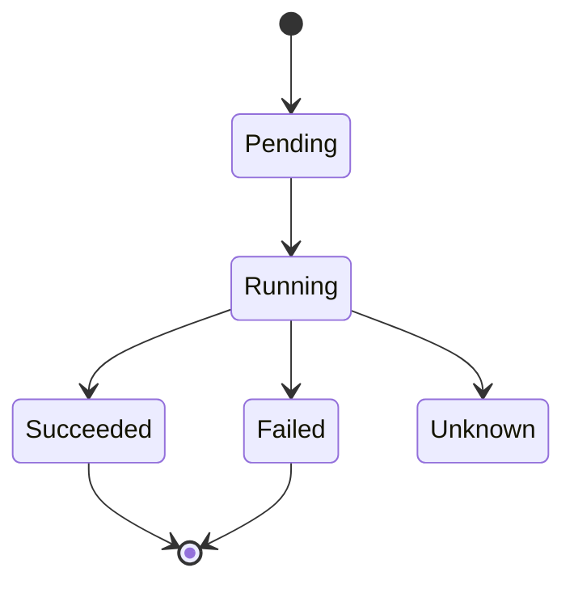

</div>

<div class="grid grid-cols-2 gap-4 mt-8 text-sm">
<div v-click="2">
<carbon-time class="inline-block text-2xl text-yellow-400" /> <strong>Pending:</strong> Scheduling & pulling images
</div>
<div v-click="3">
<carbon-play class="inline-block text-2xl text-green-400" /> <strong>Running:</strong> At least one container running
</div>
<div v-click="4">
<carbon-checkmark class="inline-block text-2xl text-blue-400" /> <strong>Succeeded:</strong> All containers terminated successfully
</div>
<div v-click="5">
<carbon-close class="inline-block text-2xl text-red-400" /> <strong>Failed:</strong> At least one container failed
</div>
</div>

---
layout: center
---

# Pod Anatomy

<div v-click="1" class="mb-4">

```yaml
apiVersion: v1
kind: Pod
metadata:
  name: my-pod
spec:
  containers:
  - name: app
    image: nginx
```

</div>

<div class="grid grid-cols-2 gap-4">
<div v-click="2">
<carbon-api class="inline-block text-3xl text-blue-400" />
<strong>apiVersion:</strong> API version (v1)
</div>
<div v-click="3">
<carbon-document class="inline-block text-3xl text-green-400" />
<strong>kind:</strong> Resource type (Pod)
</div>
<div v-click="4">
<carbon-tag class="inline-block text-3xl text-purple-400" />
<strong>metadata:</strong> Name, labels, annotations
</div>
<div v-click="5">
<carbon-settings class="inline-block text-3xl text-yellow-400" />
<strong>spec:</strong> What the Pod should do
</div>
</div>

---
layout: center
---

# Container Configuration

<div v-click="1">

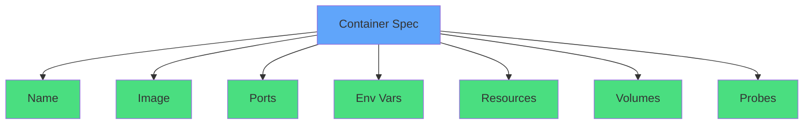

</div>

---
layout: center
---

# Multi-Container Pods

<div v-click="1" class="mb-6">

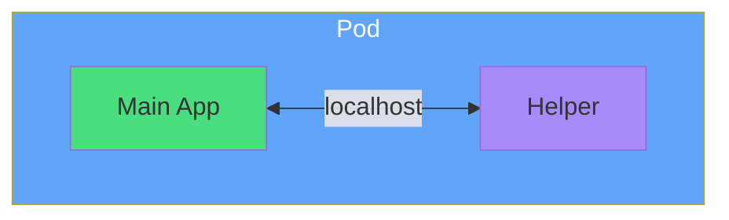

</div>

<div class="grid grid-cols-3 gap-4 text-sm">
<div v-click="2" class="text-center">
<carbon-side-panel-open class="text-4xl text-green-400 mb-2" />
<strong>Sidecar</strong><br/>
Logging agent
</div>
<div v-click="3" class="text-center">
<carbon-connect class="text-4xl text-blue-400 mb-2" />
<strong>Ambassador</strong><br/>
Database proxy
</div>
<div v-click="4" class="text-center">
<carbon-transform class="text-4xl text-purple-400 mb-2" />
<strong>Adapter</strong><br/>
Format converter
</div>
</div>

<div v-click="5" class="mt-6 text-center text-lg">
<carbon-network-overlay class="inline-block text-2xl text-yellow-400" /> Shared network namespace + storage
</div>

---
layout: center
---

# Pod Networking

<div v-click="1">

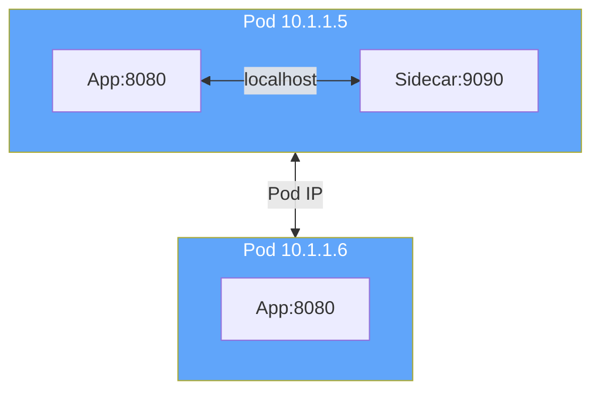

</div>

<div class="grid grid-cols-2 gap-4 mt-8">
<div v-click="2" class="text-center">
<carbon-network-1 class="text-4xl text-green-400 mb-2" />
Within Pod: <strong>localhost</strong>
</div>
<div v-click="3" class="text-center">
<carbon-network-3 class="text-4xl text-blue-400 mb-2" />
Between Pods: <strong>Pod IP</strong>
</div>
</div>

<div v-click="4" class="mt-6 text-center text-yellow-400">
<carbon-warning class="inline-block text-2xl" /> Pod IPs are ephemeral!
</div>

---
layout: center
---

# Resource Management

<div v-click="1">

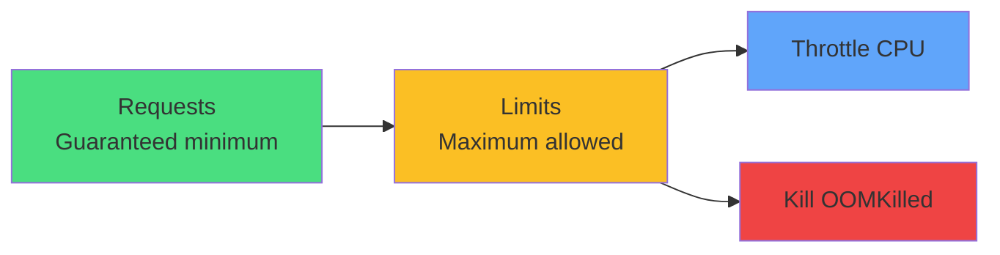

</div>

<div class="grid grid-cols-3 gap-4 mt-8 text-sm">
<div v-click="2" class="text-center">
<carbon-trophy class="text-4xl text-green-400 mb-2" />
<strong>Guaranteed</strong><br/>
requests = limits
</div>
<div v-click="3" class="text-center">
<carbon-arrow-up-right class="text-4xl text-yellow-400 mb-2" />
<strong>Burstable</strong><br/>
requests < limits
</div>
<div v-click="4" class="text-center">
<carbon-help class="text-4xl text-red-400 mb-2" />
<strong>BestEffort</strong><br/>
no requests/limits
</div>
</div>

<div v-click="5" class="mt-6 text-center text-lg opacity-80">
QoS class determines eviction priority
</div>

---
layout: center
---

# Health Probes

<div v-click="1">

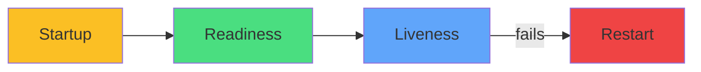

</div>

<div class="grid grid-cols-3 gap-4 mt-8 text-sm">
<div v-click="2" class="text-center">
<carbon-power class="text-4xl text-yellow-400 mb-2" />
<strong>Startup</strong><br/>
Slow start protection
</div>
<div v-click="3" class="text-center">
<carbon-traffic-flow class="text-4xl text-green-400 mb-2" />
<strong>Readiness</strong><br/>
Ready for traffic
</div>
<div v-click="4" class="text-center">
<carbon-activity class="text-4xl text-blue-400 mb-2" />
<strong>Liveness</strong><br/>
Healthy & running
</div>
</div>

<div class="flex justify-around mt-8">
<div v-click="5" class="text-center">
<carbon-http class="text-3xl text-purple-400 mb-1" />
<div class="text-xs">HTTP GET</div>
</div>
<div v-click="6" class="text-center">
<carbon-network-3 class="text-3xl text-purple-400 mb-1" />
<div class="text-xs">TCP Socket</div>
</div>
<div v-click="7" class="text-center">
<carbon-terminal class="text-3xl text-purple-400 mb-1" />
<div class="text-xs">Exec Command</div>
</div>
</div>

---
layout: center
---

# Labels & Selectors

<div v-click="1">

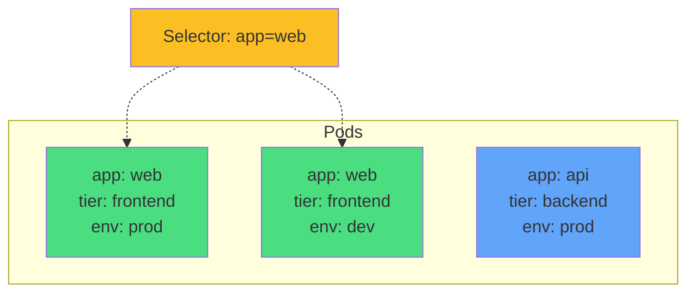

</div>

<div v-click="2" class="mt-8 text-center">
<carbon-tag class="inline-block text-4xl text-green-400" />
<strong class="ml-2">Labels:</strong> organize resources
</div>

<div v-click="3" class="mt-4 text-center">
<carbon-filter class="inline-block text-4xl text-blue-400" />
<strong class="ml-2">Selectors:</strong> query by labels
</div>

<div v-click="4" class="mt-6 text-center text-sm opacity-80">
Services, Deployments, and kubectl use selectors
</div>

---
layout: center
---

# Best Practices

<div class="grid grid-cols-2 gap-6 mt-4">
<div v-click="1">
<carbon-flow class="text-4xl text-blue-400 mb-2" />
<strong>Use controllers</strong><br/>
<span class="text-sm opacity-80">Deployments, not bare Pods</span>
</div>
<div v-click="2">
<carbon-dashboard class="text-4xl text-green-400 mb-2" />
<strong>Set resources</strong><br/>
<span class="text-sm opacity-80">Always define requests & limits</span>
</div>
<div v-click="3">
<carbon-health-cross class="text-4xl text-purple-400 mb-2" />
<strong>Health probes</strong><br/>
<span class="text-sm opacity-80">Liveness + readiness essential</span>
</div>
<div v-click="4">
<carbon-tag class="text-4xl text-yellow-400 mb-2" />
<strong>Meaningful labels</strong><br/>
<span class="text-sm opacity-80">Organize for easy management</span>
</div>
<div v-click="5">
<carbon-document class="text-4xl text-red-400 mb-2" />
<strong>Single responsibility</strong><br/>
<span class="text-sm opacity-80">One job per container</span>
</div>
<div v-click="6">
<carbon-security class="text-4xl text-orange-400 mb-2" />
<strong>Run as non-root</strong><br/>
<span class="text-sm opacity-80">Use security contexts</span>
</div>
</div>

---
layout: center
---

# CKAD Exam Focus

<div v-click="1" class="text-center mb-6">
<carbon-certificate class="inline-block text-6xl text-blue-400" />
</div>

<div class="grid grid-cols-2 gap-4 text-sm">
<div v-click="2">
<carbon-edit class="inline-block text-2xl text-green-400" /> Create Pods from YAML
</div>
<div v-click="3">
<carbon-category-and class="inline-block text-2xl text-green-400" /> Multi-container patterns
</div>
<div v-click="4">
<carbon-dashboard class="inline-block text-2xl text-green-400" /> Resource requests & limits
</div>
<div v-click="5">
<carbon-health-cross class="inline-block text-2xl text-green-400" /> Health probes
</div>
<div v-click="6">
<carbon-settings class="inline-block text-2xl text-green-400" /> ConfigMaps & Secrets
</div>
<div v-click="7">
<carbon-security class="inline-block text-2xl text-green-400" /> Security contexts
</div>
<div v-click="8">
<carbon-debug class="inline-block text-2xl text-green-400" /> Troubleshooting
</div>
<div v-click="9">
<carbon-timer class="inline-block text-2xl text-red-400" /> Fast execution
</div>
</div>

<div v-click="10" class="mt-8 text-center text-lg">
<carbon-terminal class="inline-block text-3xl text-purple-400" /> Practice kubectl shortcuts!
</div>

---
layout: center
---

# Summary

<div v-click="1">

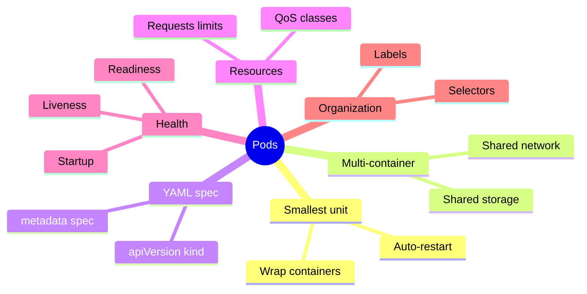

</div>

---
layout: center
---

# Next Steps

<div v-click="1" class="text-center mb-8">
<carbon-education class="inline-block text-6xl text-blue-400" />
</div>

<div v-click="2">

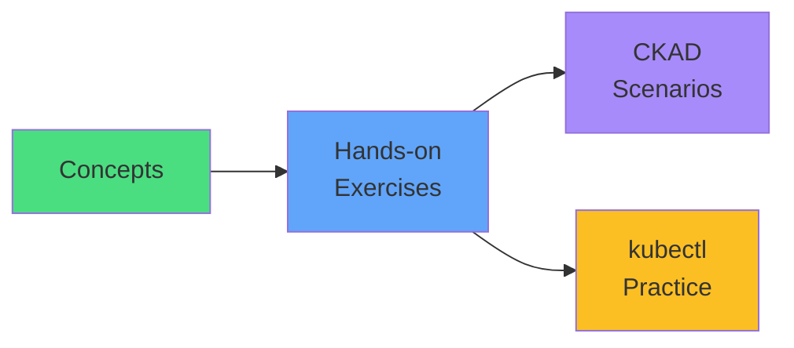

</div>

<div v-click="3" class="mt-8 text-center text-xl">
Let's move to the hands-on labs! <carbon-arrow-right class="inline-block text-2xl" />
</div>
