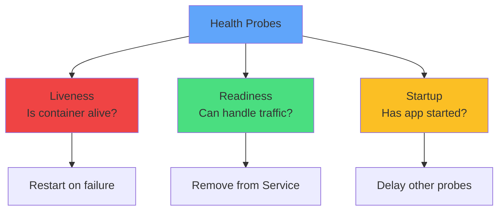

# Health Probes Overview

```mermaid
graph TB
    PROBES[<carbon-cloud-monitoring/> Health Probes]

    PROBES --> LIVENESS[<carbon-renew/> Liveness<br/>Is container alive?]
    PROBES --> READINESS[<carbon-checkmark/> Readiness<br/>Can handle traffic?]
    PROBES --> STARTUP[<carbon-rocket/> Startup<br/>Has app started?]

    LIVENESS --> RESTART[<carbon-reset/> Restart on failure]
    READINESS --> ENDPOINT[<carbon-network-3/> Remove from Service]
    STARTUP --> WAIT[<carbon-time/> Delay other probes]

    style PROBES fill:#60a5fa
    style LIVENESS fill:#ef4444
    style READINESS fill:#4ade80
    style STARTUP fill:#fbbf24
```

Different probes for different purposes

