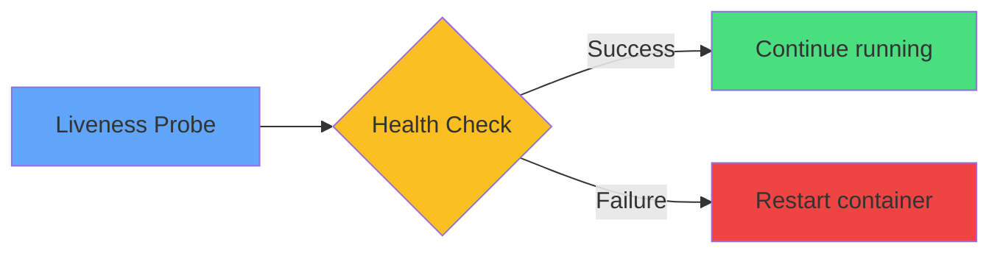

# Liveness Probe



<div class="mt-8 text-center text-sm">

### HTTP Example
```yaml
livenessProbe:
  httpGet:
    path: /health
    port: 8080
  initialDelaySeconds: 10
  periodSeconds: 10
```

<div class="mt-4 opacity-80">
Use for deadlock detection and recovery
</div>

</div>
