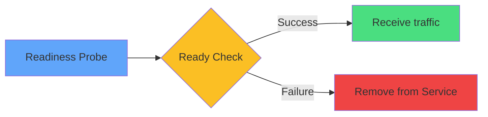

# Readiness Probe



<div class="mt-8 text-center text-sm">

### TCP Example
```yaml
readinessProbe:
  tcpSocket:
    port: 3306
  initialDelaySeconds: 5
  periodSeconds: 5
```

<div class="mt-4 opacity-80">
Critical for zero-downtime deployments
</div>

</div>
