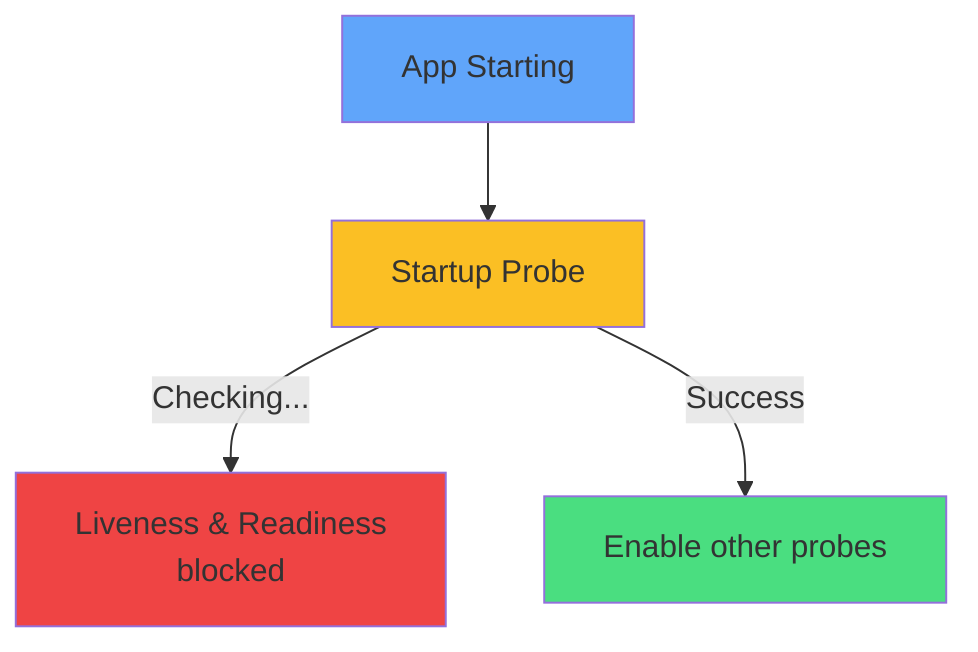

# Startup Probe



<div class="mt-8 text-center text-sm">

### For slow-starting apps
```yaml
startupProbe:
  httpGet:
    path: /started
    port: 8080
  failureThreshold: 30
  periodSeconds: 10
```

<div class="mt-4 opacity-80">
Prevents premature liveness restarts
</div>

</div>
