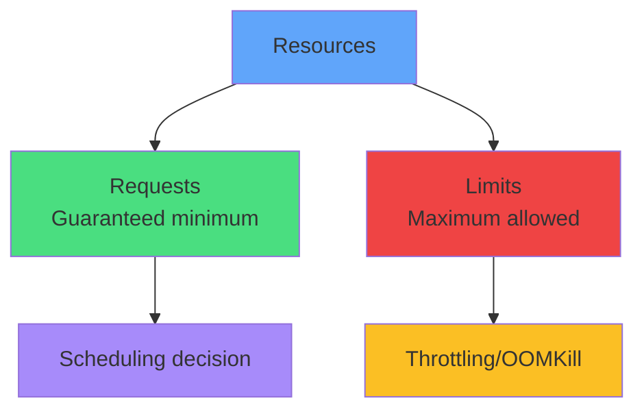

# Resource Requests and Limits


```mermaid
graph TB
    RESOURCES[<carbon-chart-area/> Resources]

    RESOURCES --> REQUESTS[<carbon-arrow-up/> Requests<br/>Guaranteed minimum]
    RESOURCES --> LIMITS[<carbon-arrow-down/> Limits<br/>Maximum allowed]

    REQUESTS --> SCHED[<carbon-calendar/> Scheduling decision]
    LIMITS --> THROTTLE[<carbon-stop/> Throttling/OOMKill]

    style RESOURCES fill:#60a5fa
    style REQUESTS fill:#4ade80
    style LIMITS fill:#ef4444
    style SCHED fill:#a78bfa
    style THROTTLE fill:#fbbf24
```

<div class="mt-4 text-center text-sm">

```yaml
resources:
  requests:
    cpu: 100m
    memory: 128Mi
  limits:
    cpu: 500m
    memory: 512Mi
```

</div>
