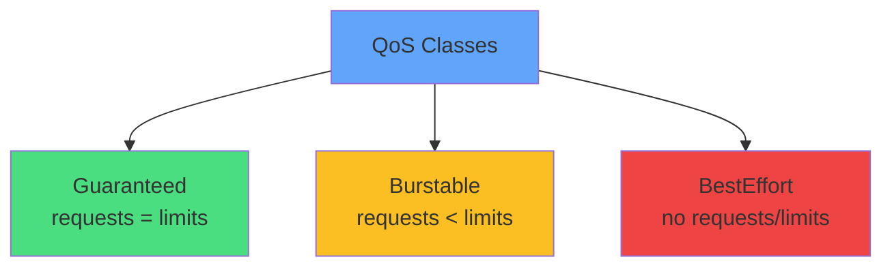

# Quality of Service (QoS)

```mermaid
graph TB
    QOS[<carbon-chart-area/> QoS Classes]

    QOS --> GUARANTEED[<carbon-checkmark-filled/> Guaranteed<br/>requests = limits]
    QOS --> BURSTABLE[<carbon-arrow-up/> Burstable<br/>requests < limits]
    QOS --> BESTEFFORT[<carbon-help/> BestEffort<br/>no requests/limits]

    style QOS fill:#60a5fa
    style GUARANTEED fill:#4ade80
    style BURSTABLE fill:#fbbf24
    style BESTEFFORT fill:#ef4444
```

### Eviction priority (lowest to highest)
1. BestEffort (evicted first)
2. Burstable
3. Guaranteed (evicted last)

Set requests = limits for critical workloads

