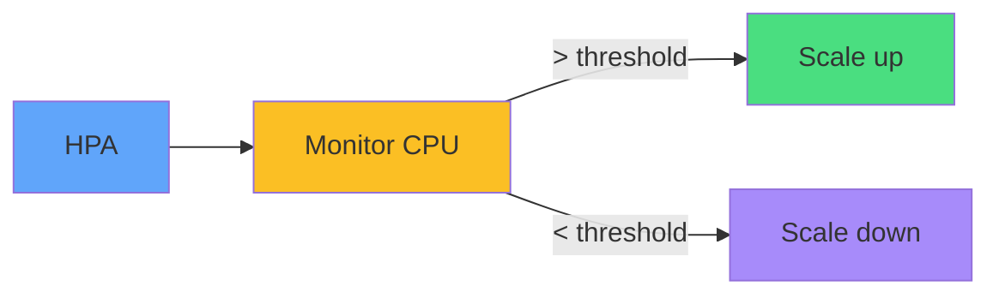

# Horizontal Pod Autoscaler

```mermaid
graph LR
    HPA[<carbon-auto-scroll/> HPA] --> MONITOR[<carbon-chart-line/> Monitor CPU]

    MONITOR -->|> threshold| SCALE_UP[<carbon-arrow-up/> Scale up]
    MONITOR -->|< threshold| SCALE_DOWN[<carbon-arrow-down/> Scale down]

    style HPA fill:#60a5fa
    style MONITOR fill:#fbbf24
    style SCALE_UP fill:#4ade80
    style SCALE_DOWN fill:#a78bfa
```

### `kubectl autoscale deployment app --min=2 --max=10 --cpu-percent=80`

Requires resource requests and metrics-server

