# Production Readiness

<div class="abs-br m-6 flex gap-2">
  <carbon-health-cross class="text-6xl text-blue-400" />
</div>

<div v-click class="mt-8 text-xl opacity-80">
Making Kubernetes applications production-grade
</div>

---
layout: center
---

# The Production Gap

<div v-click="1">

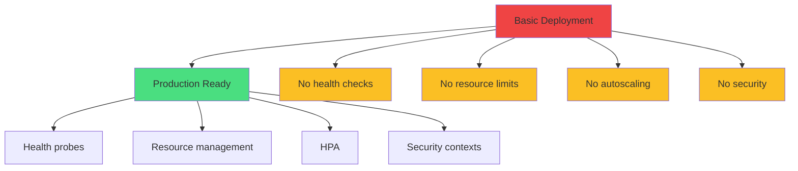

</div>

<div class="grid grid-cols-2 gap-6 mt-8">
<div v-click="2">
<carbon-close class="inline-block text-3xl text-red-400" />
<strong>Basic:</strong> Works but fragile
</div>
<div v-click="3">
<carbon-checkmark class="inline-block text-3xl text-green-400" />
<strong>Production:</strong> Reliable & secure
</div>
</div>

---
layout: center
---

# Health Probes Overview

<div v-click="1">

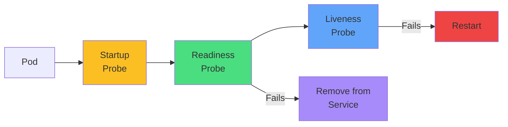

</div>

<div class="grid grid-cols-3 gap-4 mt-8 text-sm">
<div v-click="2" class="text-center">
<carbon-power class="text-5xl text-yellow-400 mb-2" />
<strong>Startup</strong><br/>
Slow initialization
</div>
<div v-click="3" class="text-center">
<carbon-traffic-flow class="text-5xl text-green-400 mb-2" />
<strong>Readiness</strong><br/>
Ready for traffic
</div>
<div v-click="4" class="text-center">
<carbon-activity class="text-5xl text-blue-400 mb-2" />
<strong>Liveness</strong><br/>
Healthy & running
</div>
</div>

---
layout: center
---

# Probe Mechanisms

<div v-click="1">

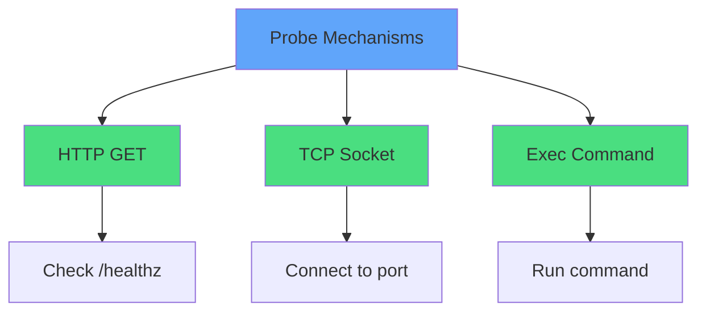

</div>

<div class="mt-8 text-sm">
<div v-click="2">

```yaml
# HTTP GET - most common
httpGet:
  path: /healthz
  port: 8080
```

</div>
<div v-click="3">

```yaml
# TCP Socket - non-HTTP apps
tcpSocket:
  port: 5432
```

</div>
</div>

---
layout: center
---

# Readiness vs Liveness

<div v-click="1">

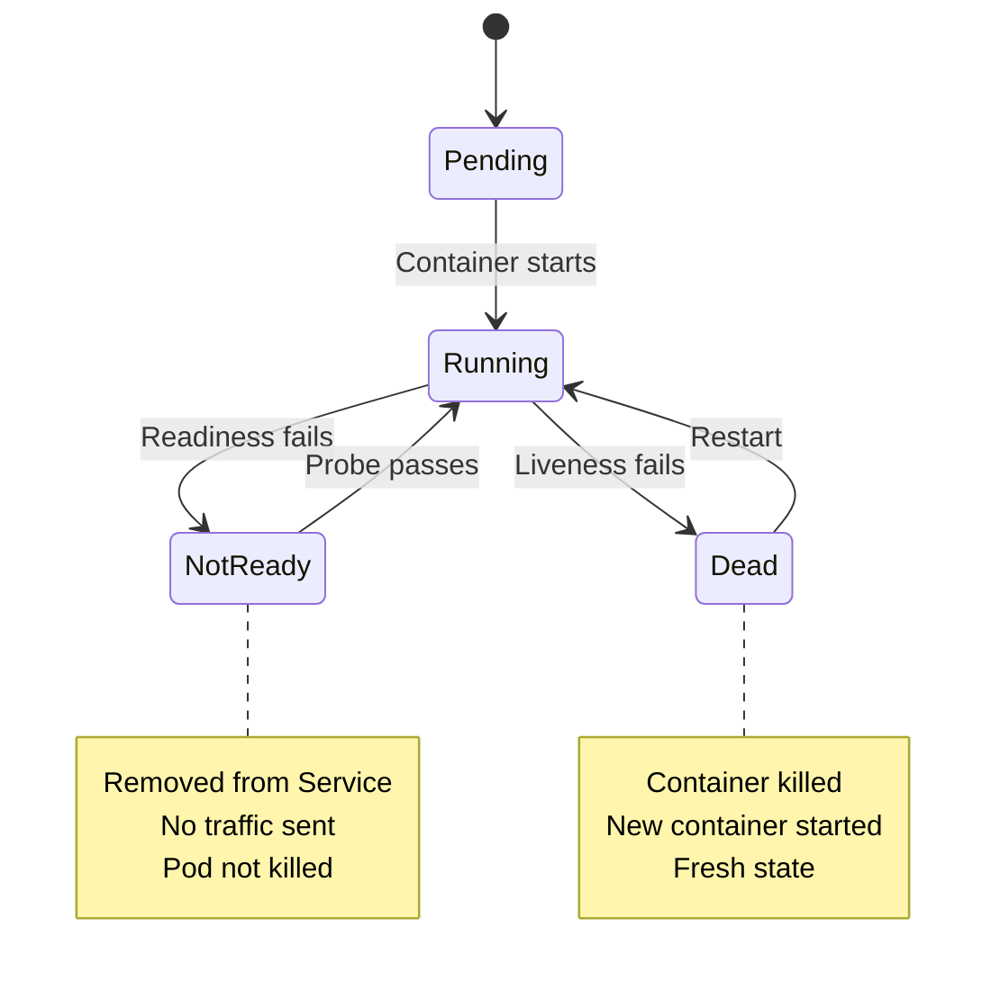

</div>

<div class="grid grid-cols-2 gap-6 mt-8">
<div v-click="2">
<carbon-network-3 class="text-4xl text-green-400 mb-2" />
<strong>Readiness:</strong> Traffic routing
</div>
<div v-click="3">
<carbon-restart class="text-4xl text-blue-400 mb-2" />
<strong>Liveness:</strong> Container lifecycle
</div>
</div>

---
layout: center
---

# Probe Configuration

<div v-click="1" class="mb-4">

```yaml
livenessProbe:
  httpGet:
    path: /healthz
    port: 8080
  initialDelaySeconds: 30   # Wait before first check
  periodSeconds: 10         # How often to check
  timeoutSeconds: 5         # Request timeout
  failureThreshold: 3       # Failures before action
  successThreshold: 1       # Successes to be healthy
```

</div>

<div v-click="2">

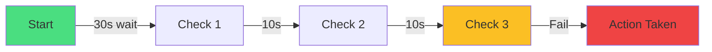

</div>

<div v-click="3" class="mt-6 text-center text-yellow-400">
<carbon-warning class="inline-block text-2xl" /> Configure carefully to avoid false positives!
</div>

---
layout: center
---

# Resource Management

<div v-click="1">

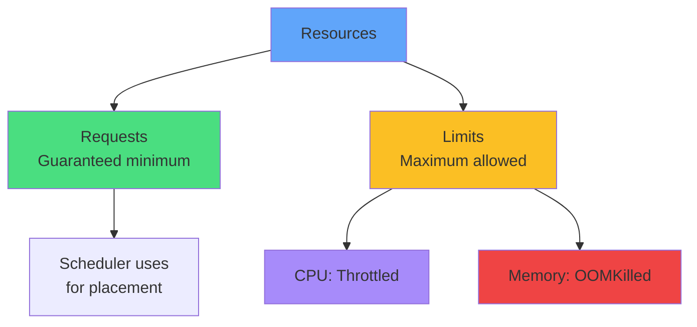

</div>

<div v-click="2" class="mt-6">

```yaml
resources:
  requests:
    cpu: 100m        # Guaranteed
    memory: 128Mi
  limits:
    cpu: 500m        # Maximum
    memory: 256Mi
```

</div>

---
layout: center
---

# Quality of Service Classes

<div v-click="1">

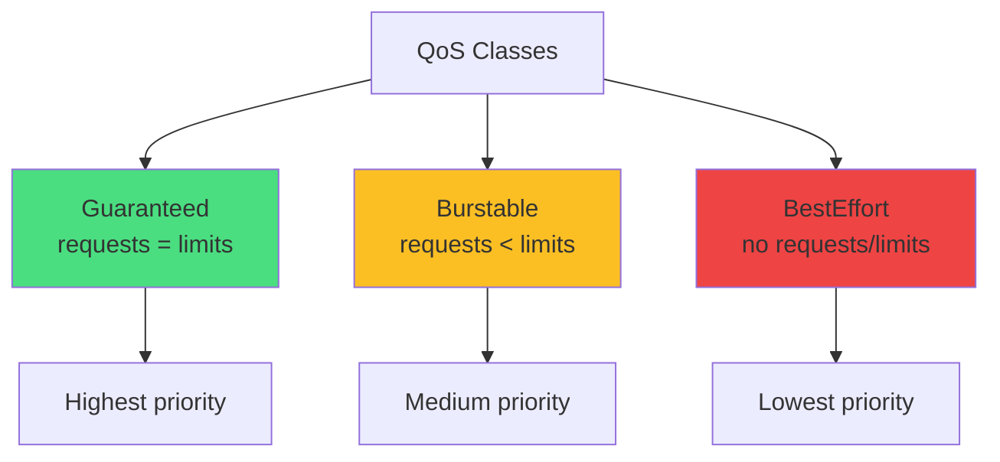

</div>

<div class="grid grid-cols-3 gap-4 mt-8 text-sm">
<div v-click="2" class="text-center">
<carbon-trophy class="text-5xl text-green-400 mb-2" />
<strong>Guaranteed</strong><br/>
Last to evict
</div>
<div v-click="3" class="text-center">
<carbon-arrow-up-right class="text-5xl text-yellow-400 mb-2" />
<strong>Burstable</strong><br/>
Can use extra
</div>
<div v-click="4" class="text-center">
<carbon-help class="text-5xl text-red-400 mb-2" />
<strong>BestEffort</strong><br/>
First to evict
</div>
</div>

---
layout: center
---

# Horizontal Pod Autoscaler

<div v-click="1">

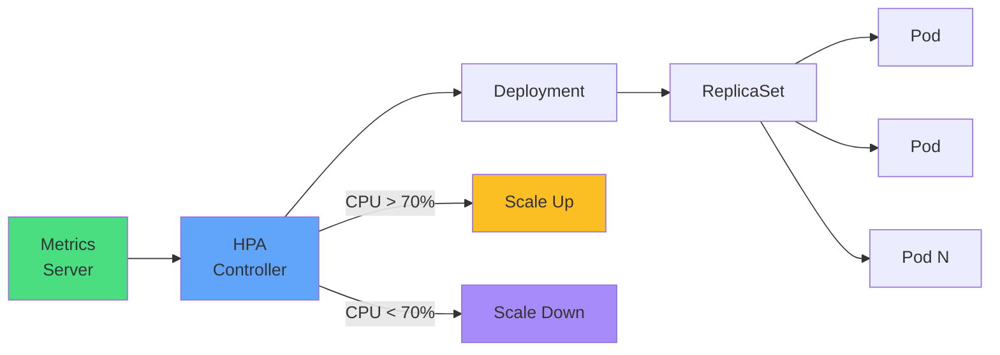

</div>

<div v-click="2" class="mt-6">

```yaml
apiVersion: autoscaling/v2
kind: HorizontalPodAutoscaler
spec:
  minReplicas: 2
  maxReplicas: 10
  metrics:
  - type: Resource
    resource:
      name: cpu
      target:
        averageUtilization: 70
```

</div>

---
layout: center
---

# HPA Requirements

<div class="grid grid-cols-2 gap-6 mt-8">
<div v-click="1">
<carbon-checkmark class="text-5xl text-green-400 mb-2" />
<strong>Prerequisites</strong><br/>
<div class="text-sm opacity-80 mt-2">
• Metrics Server installed<br/>
• Resource requests set<br/>
• Scalable target
</div>
</div>
<div v-click="2">
<carbon-warning class="text-5xl text-yellow-400 mb-2" />
<strong>Limitations</strong><br/>
<div class="text-sm opacity-80 mt-2">
• Can't scale below min<br/>
• Cooldown periods<br/>
• Average across pods
</div>
</div>
</div>

<div v-click="3" class="mt-8">

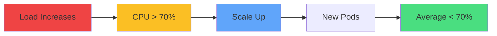

</div>

---
layout: center
---

# Security Contexts

<div v-click="1">

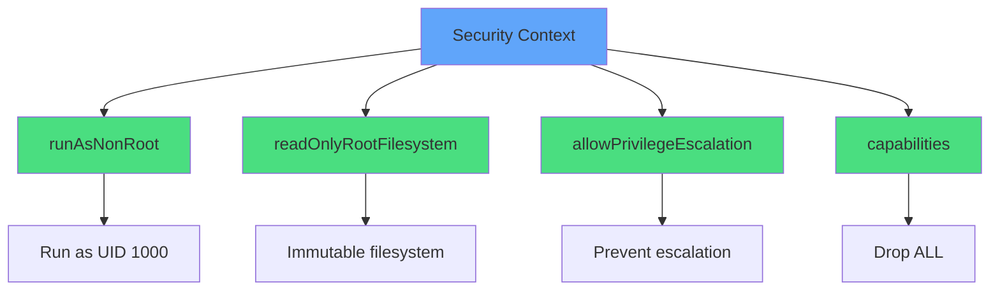

</div>

<div v-click="2" class="mt-6 text-sm">

```yaml
securityContext:
  runAsNonRoot: true
  runAsUser: 1000
  readOnlyRootFilesystem: true
  allowPrivilegeEscalation: false
  capabilities:
    drop: ["ALL"]
```

</div>

---
layout: center
---

# Security Best Practices

<div class="grid grid-cols-2 gap-6 mt-4">
<div v-click="1">
<carbon-user class="text-5xl text-blue-400 mb-2" />
<strong>Run as non-root</strong><br/>
<span class="text-sm opacity-80">Never run as UID 0</span>
</div>
<div v-click="2">
<carbon-locked class="text-5xl text-green-400 mb-2" />
<strong>Read-only filesystem</strong><br/>
<span class="text-sm opacity-80">Use emptyDir for writes</span>
</div>
<div v-click="3">
<carbon-rule class="text-5xl text-purple-400 mb-2" />
<strong>Drop capabilities</strong><br/>
<span class="text-sm opacity-80">Start with drop: ["ALL"]</span>
</div>
<div v-click="4">
<carbon-security class="text-5xl text-yellow-400 mb-2" />
<strong>Prevent escalation</strong><br/>
<span class="text-sm opacity-80">allowPrivilegeEscalation: false</span>
</div>
</div>

<div v-click="5" class="mt-8 text-center text-lg">
<carbon-shield-security class="inline-block text-3xl text-blue-400" /> Principle of least privilege
</div>

---
layout: center
---

# Production Checklist

<div class="grid grid-cols-2 gap-4 text-sm">
<div v-click="1">
<carbon-checkmark class="inline-block text-2xl text-green-400" /> Readiness probe configured
</div>
<div v-click="2">
<carbon-checkmark class="inline-block text-2xl text-green-400" /> Liveness probe configured
</div>
<div v-click="3">
<carbon-checkmark class="inline-block text-2xl text-green-400" /> Resource requests set
</div>
<div v-click="4">
<carbon-checkmark class="inline-block text-2xl text-green-400" /> Resource limits set
</div>
<div v-click="5">
<carbon-checkmark class="inline-block text-2xl text-green-400" /> HPA configured
</div>
<div v-click="6">
<carbon-checkmark class="inline-block text-2xl text-green-400" /> Multiple replicas (min 2)
</div>
<div v-click="7">
<carbon-checkmark class="inline-block text-2xl text-green-400" /> Run as non-root
</div>
<div v-click="8">
<carbon-checkmark class="inline-block text-2xl text-green-400" /> Security context applied
</div>
<div v-click="9">
<carbon-checkmark class="inline-block text-2xl text-green-400" /> Logging configured
</div>
<div v-click="10">
<carbon-checkmark class="inline-block text-2xl text-green-400" /> Graceful shutdown
</div>
</div>

---
layout: center
---

# Common Anti-Patterns

<div class="grid grid-cols-2 gap-6 mt-6">
<div v-click="1">
<carbon-close class="text-5xl text-red-400 mb-2" />
<strong>No health probes</strong><br/>
<span class="text-sm opacity-80">Can't detect failures</span>
</div>
<div v-click="2">
<carbon-close class="text-5xl text-red-400 mb-2" />
<strong>Aggressive liveness</strong><br/>
<span class="text-sm opacity-80">Restart loops</span>
</div>
<div v-click="3">
<carbon-close class="text-5xl text-red-400 mb-2" />
<strong>No resource limits</strong><br/>
<span class="text-sm opacity-80">Noisy neighbors</span>
</div>
<div v-click="4">
<carbon-close class="text-5xl text-red-400 mb-2" />
<strong>Running as root</strong><br/>
<span class="text-sm opacity-80">Security risk</span>
</div>
<div v-click="5">
<carbon-close class="text-5xl text-red-400 mb-2" />
<strong>Single replica</strong><br/>
<span class="text-sm opacity-80">No high availability</span>
</div>
<div v-click="6">
<carbon-close class="text-5xl text-red-400 mb-2" />
<strong>No monitoring</strong><br/>
<span class="text-sm opacity-80">Blind to issues</span>
</div>
</div>

---
layout: center
---

# CKAD Exam Focus

<div v-click="1" class="text-center mb-6">
<carbon-certificate class="inline-block text-6xl text-blue-400" />
</div>

<div class="grid grid-cols-2 gap-4 text-sm">
<div v-click="2">
<carbon-health-cross class="inline-block text-2xl text-green-400" /> Configure all probe types
</div>
<div v-click="3">
<carbon-dashboard class="inline-block text-2xl text-green-400" /> Set requests and limits
</div>
<div v-click="4">
<carbon-rule class="inline-block text-2xl text-green-400" /> Create HPA
</div>
<div v-click="5">
<carbon-security class="inline-block text-2xl text-green-400" /> Apply security contexts
</div>
<div v-click="6">
<carbon-debug class="inline-block text-2xl text-green-400" /> Troubleshoot OOMKilled
</div>
<div v-click="7">
<carbon-debug class="inline-block text-2xl text-green-400" /> Debug CrashLoopBackOff
</div>
</div>

<div v-click="8" class="mt-8 text-center text-lg">
<carbon-timer class="inline-block text-3xl text-red-400" /> Practice for speed!
</div>

---
layout: center
---

# Summary

<div v-click="1">

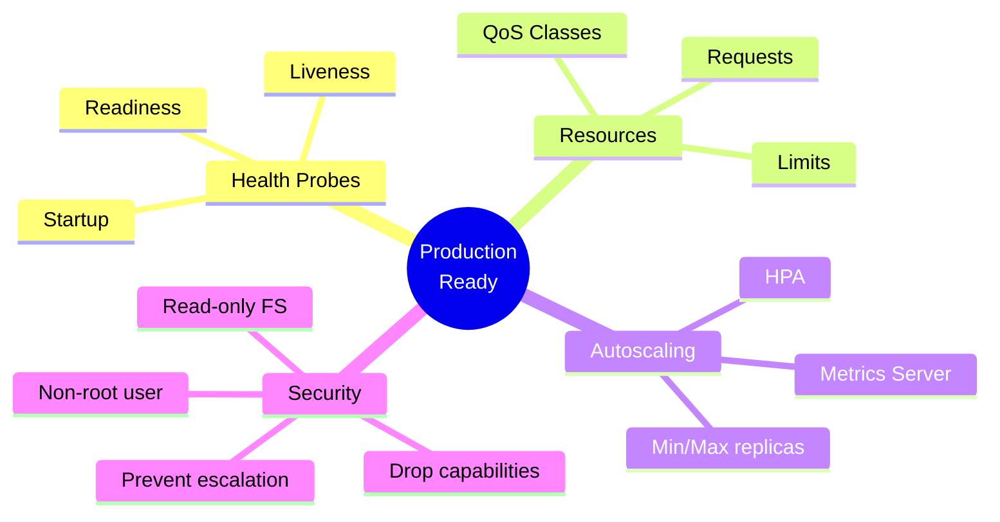

</div>

---
layout: center
---

# Key Takeaways

<div class="grid grid-cols-2 gap-6 mt-6">
<div v-click="1">
<carbon-health-cross class="text-4xl text-blue-400 mb-2" />
<strong>Health probes</strong><br/>
<span class="text-sm opacity-80">Essential for reliability</span>
</div>
<div v-click="2">
<carbon-dashboard class="text-4xl text-green-400 mb-2" />
<strong>Resource management</strong><br/>
<span class="text-sm opacity-80">Protect the cluster</span>
</div>
<div v-click="3">
<carbon-rule class="text-4xl text-purple-400 mb-2" />
<strong>Autoscaling</strong><br/>
<span class="text-sm opacity-80">Handle variable load</span>
</div>
<div v-click="4">
<carbon-security class="text-4xl text-yellow-400 mb-2" />
<strong>Security contexts</strong><br/>
<span class="text-sm opacity-80">Reduce attack surface</span>
</div>
</div>

<div v-click="5" class="mt-8 text-center text-xl">
Production readiness is about reliability, security, and observability
</div>

---
layout: center
---

# Next Steps

<div v-click="1" class="text-center mb-8">
<carbon-education class="inline-block text-6xl text-blue-400" />
</div>

<div v-click="2">

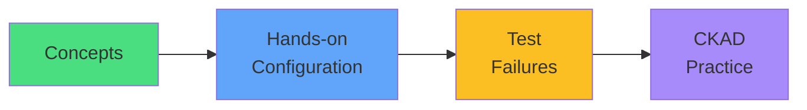

</div>

<div v-click="3" class="mt-8 text-center text-xl">
Let's configure production-ready apps! <carbon-arrow-right class="inline-block text-2xl" />
</div>
