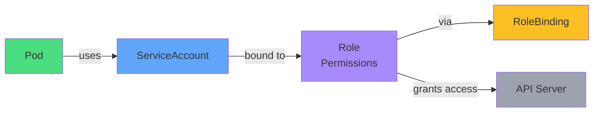

# RBAC Chain

```mermaid
graph LR
    POD[<carbon-container-software/> Pod] -->|uses| SA[<carbon-user/> ServiceAccount]
    SA -->|bound to| ROLE[<carbon-rule/> Role<br/>Permissions]
    ROLE -->|via| RB[<carbon-link/> RoleBinding]
    ROLE -->|grants access| API[<carbon-api/> API Server]

    style POD fill:#4ade80
    style SA fill:#60a5fa
    style ROLE fill:#a78bfa
    style RB fill:#fbbf24
    style API fill:#9ca3af
```

ServiceAccount → Role → RoleBinding → API Access

