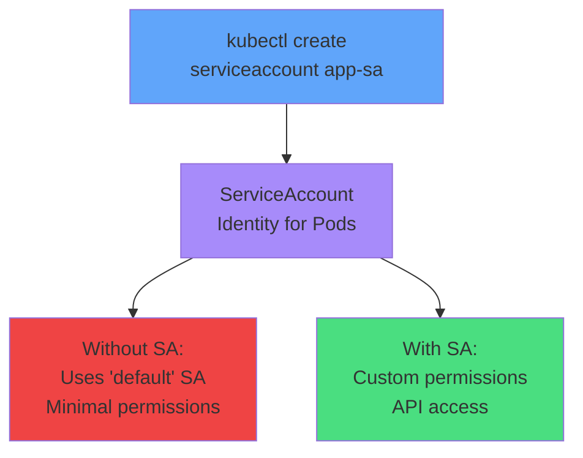

# ServiceAccount Creation

```mermaid
graph TB
    CREATE[<carbon-terminal/> kubectl create serviceaccount app-sa]

    CREATE --> SA[<carbon-user/> ServiceAccount<br/>Identity for Pods]

    SA --> DEFAULT[<carbon-close/> Without SA:<br/>Uses 'default' SA<br/>Minimal permissions]
    SA --> CUSTOM[<carbon-checkmark-filled/> With SA:<br/>Custom permissions<br/>API access]

    style CREATE fill:#60a5fa
    style SA fill:#a78bfa
    style DEFAULT fill:#ef4444
    style CUSTOM fill:#4ade80
```

Always create custom ServiceAccounts for apps needing API access

