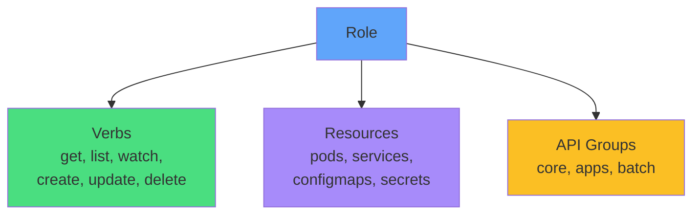

# Role Permissions

```mermaid
graph TB
    ROLE[<carbon-rule/> Role]

    ROLE --> VERBS[<carbon-list/> Verbs<br/>get, list, watch,<br/>create, update, delete]
    ROLE --> RESOURCES[<carbon-cube/> Resources<br/>pods, services,<br/>configmaps, secrets]
    ROLE --> APIGROUPS[<carbon-api/> API Groups<br/>core, apps, batch]

    style ROLE fill:#60a5fa
    style VERBS fill:#4ade80
    style RESOURCES fill:#a78bfa
    style APIGROUPS fill:#fbbf24
```

### `kubectl create role pod-reader --verb=get,list --resource=pods`
Fast creation for simple permissions

