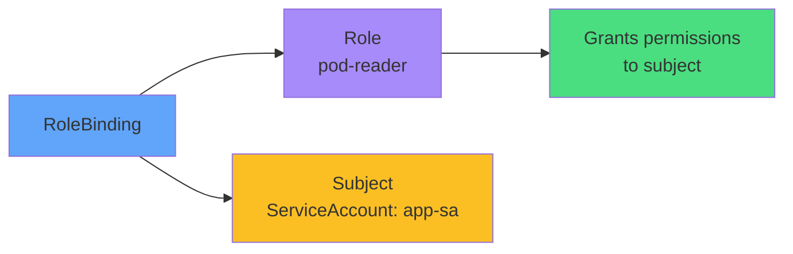

# RoleBinding



<div class="mt-8 text-center">

### Connects Role to ServiceAccount

```bash
kubectl create rolebinding app-binding \
  --role=pod-reader \
  --serviceaccount=default:app-sa
```

</div>
