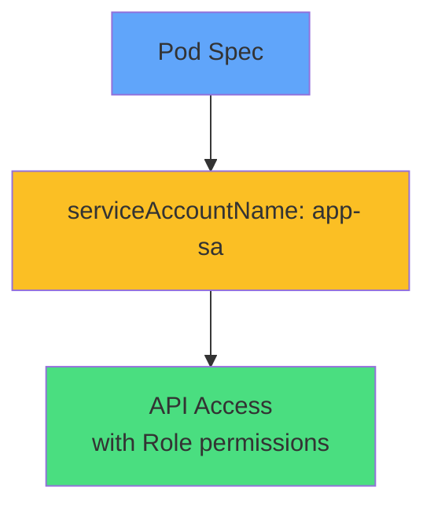

# Pod Configuration



<div class="mt-8 text-center">

### Add to Pod spec:

```yaml
spec:
  serviceAccountName: app-sa
  containers:
  - name: app
    image: myapp:1.0
```

<div class="mt-4 opacity-80 text-sm">
Without this field, Pod uses 'default' ServiceAccount
</div>

</div>
